# anish-projects

A monorepo of things I'm building — AI infrastructure, fintech tools, and the product thinking behind them.

I'm a Product Lead at Microsoft, working on Microsoft AI Gateway to handle orchestratation for tools, models and agents in Microsoft and Azure products. This repo is where I prototype ideas, and ship side projects.

---

## 🔧 Live Projects

### [AI Gateway](./ai/ai-gateway/)
A working prototype of an AI governance gateway — rate limiting, content safety, semantic caching, PII detection, MCP tool routing, and load balancing across model deployments. Node.js + Express backend with a 23-page dashboard.

| Discover — Model & tool catalog | Operate — Governance dashboard |
|:---:|:---:|
| 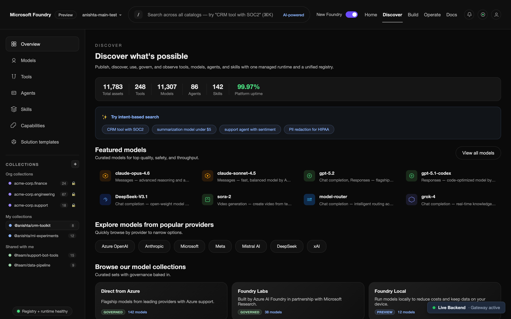 | 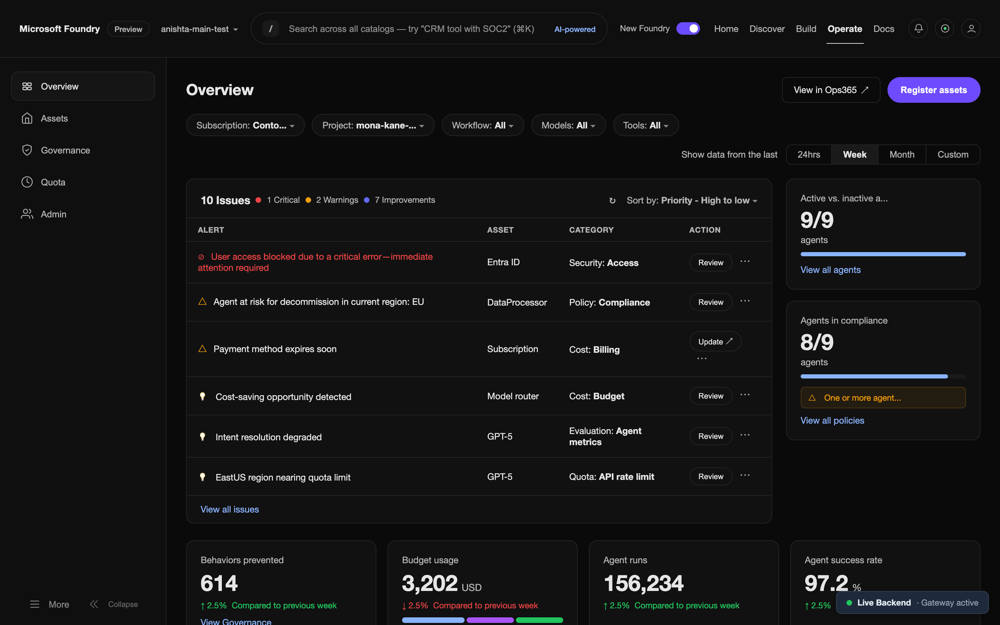 |
| **Build — Agent management** | **Models — Catalog browse** |
| 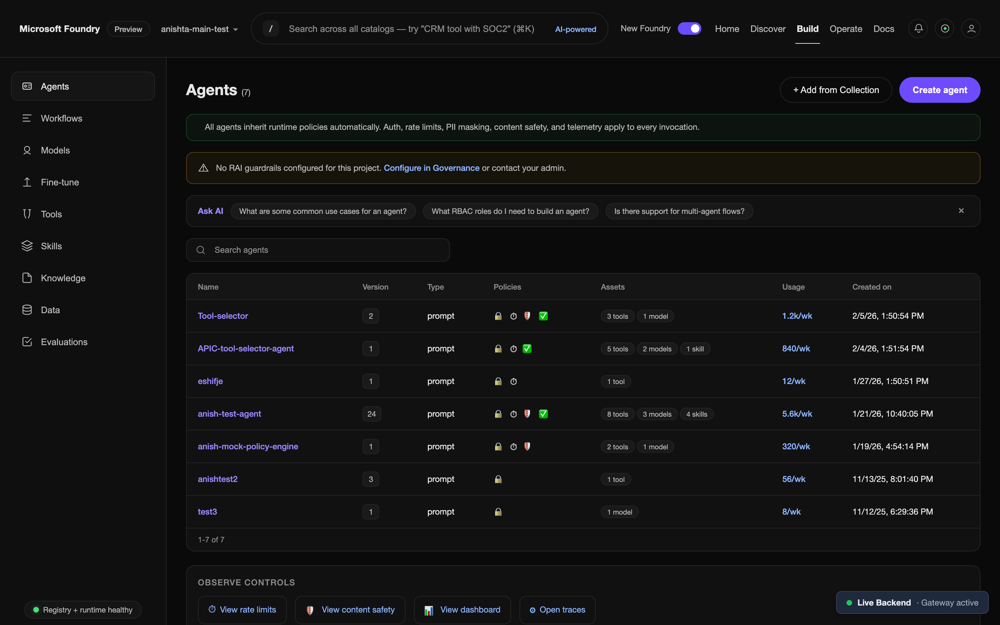 | 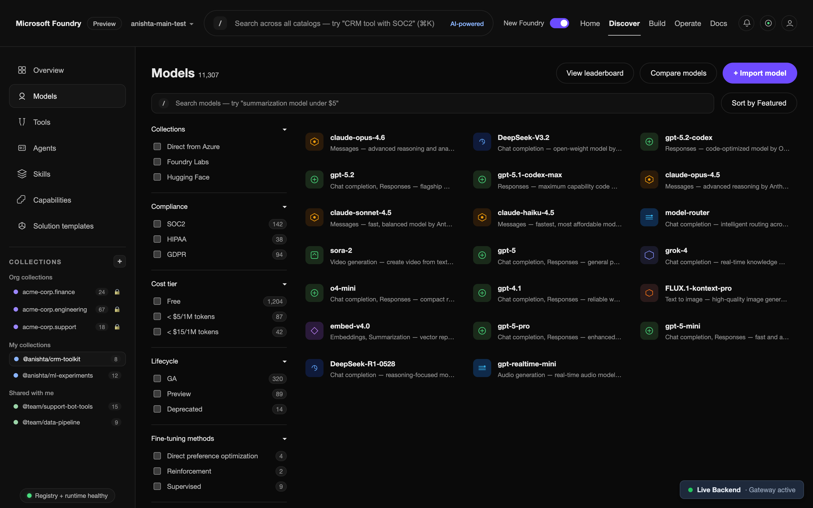 |

```bash
cd ai/ai-gateway && npm install && npm start
```

### [Cost Segregation](./consumer/cost-segregation/)
A fintech SaaS that generates IRS-compliant cost segregation reports for residential properties. Automates what CPAs charge $5K–$15K for. Next.js + TypeScript + SQLite.

| Landing page | Pricing tiers |
|:---:|:---:|
| 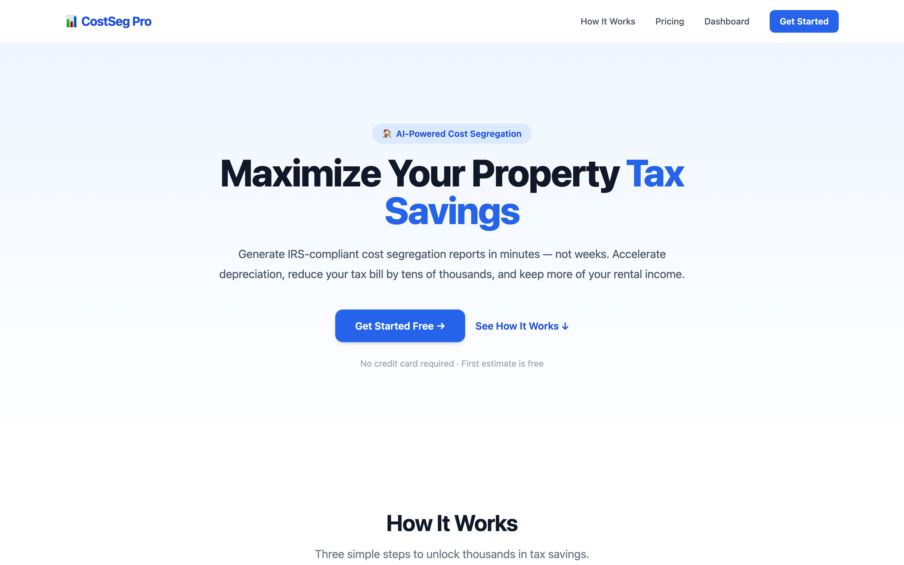 | 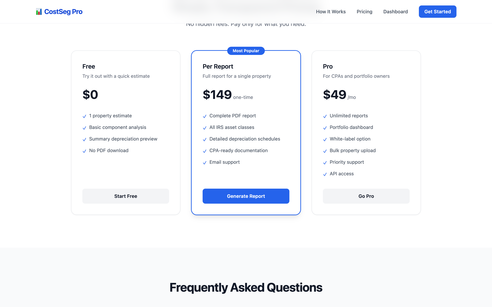 |
| **Property input wizard** | **Dashboard** |
| 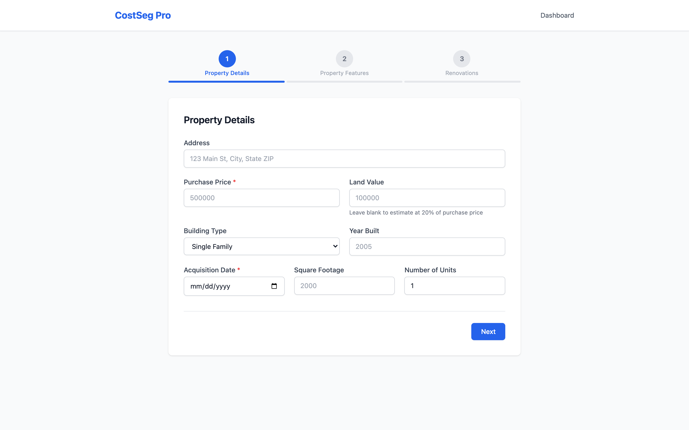 | 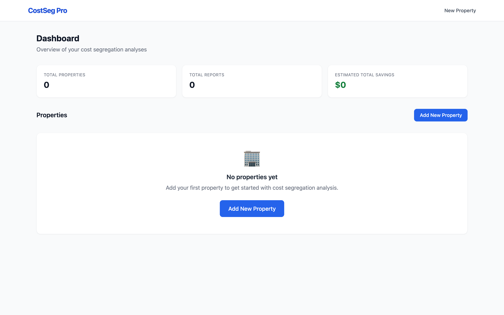 |

```bash
cd consumer/cost-segregation && npm install && npm run dev
```

### [DFW CRE Investment Analyzer](./consumer/dfw-cre-analyzer/)
A data-driven dashboard that ingests live LoopNet listings across the Dallas–Fort Worth metro, scores each property on underpricing signals, and surfaces the best commercial real estate deals — ranked, mapped, and filterable. LoopNet API integration with 500+ live DFW properties.

| Top Deals — Scored & ranked | Map — Color-coded DFW markers |
|:---:|:---:|
| 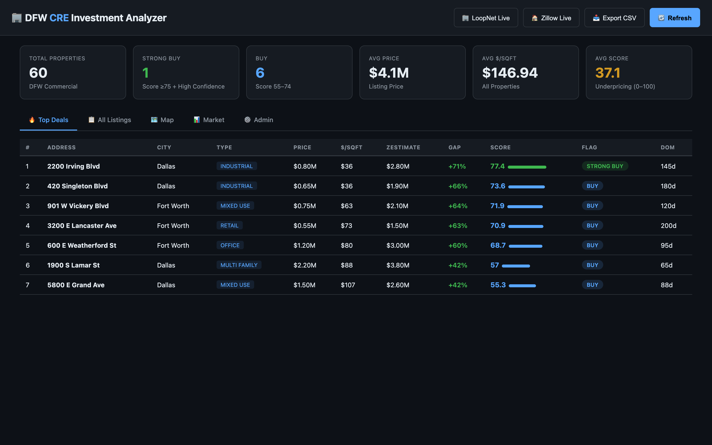 | 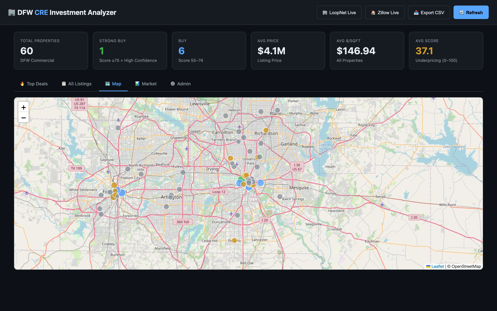 |

```bash
cd consumer/dfw-cre-analyzer && npm install && npm start
```

### [WheelAlpha — Stock Wheel Strategy Screener](./consumer/stock-wheel-strategy-screener/)
A multi-agent investing tool that screens stocks for wheel strategy income (cash-secured puts + covered calls), identifies undervalued long-term holds, and recommends ETF core allocations. Produces daily insights and **draft orders only** — human-in-the-loop, no execution. 8 sub-agents with config-driven risk gating.

| Opportunities dashboard | Draft orders with approve/reject |
|:---:|:---:|
| 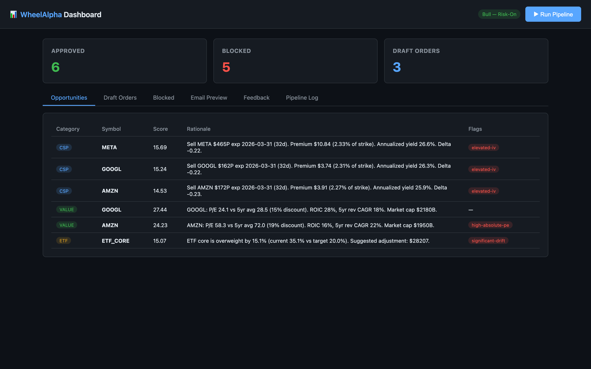 | 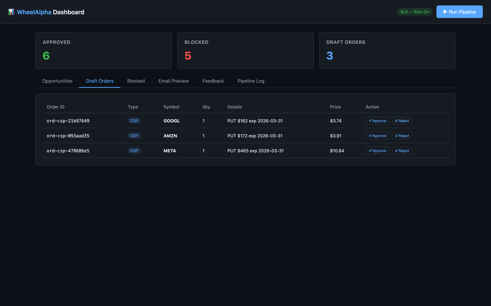 |

```bash
cd consumer/stock-wheel-strategy-screener && npm install && npm start
```

→ [Agent specs](./consumer/stock-wheel-strategy-screener/agents/) · [Orchestrator design](./consumer/stock-wheel-strategy-screener/agents/orchestrator.md) · [Risk limits](./consumer/stock-wheel-strategy-screener/agents/configs/risk_limits.yaml)

---

## 📋 Product Work

Each project has full PM documentation — PRDs, decision logs, metrics plans, rollout strategies. This is how I think through products, not just build them.

| Project | What it is | Docs |
|---------|-----------|------|
| **AI Gateway Governance** | System design for a unified AI governance layer — models, tools (MCP), and agents | [PRD](./pm-portfolio/projects/01-ai-gateway-governance/prd.md) · [Architecture](./pm-portfolio/projects/01-ai-gateway-governance/architecture.md) · [Decisions](./pm-portfolio/projects/01-ai-gateway-governance/decision-log.md) · [What I cut](./pm-portfolio/projects/01-ai-gateway-governance/kill-list.md) |
| **Cost Segregation SaaS** | 0→1 product spec for IRS-compliant tax automation | [PRD](./pm-portfolio/projects/02-cost-segregation-saas/README.md) · [Scenarios](./pm-portfolio/projects/02-cost-segregation-saas/user-scenarios.md) · [Rollout](./pm-portfolio/projects/02-cost-segregation-saas/rollout-plan.md) |
| **MCP Tool Catalog** | Customer discovery for enterprise AI tool governance | [Interviews](./pm-portfolio/projects/03-tool-catalog-discovery/interview-guide.md) · [Insights](./pm-portfolio/projects/03-tool-catalog-discovery/insights.md) · [PRD](./pm-portfolio/projects/03-tool-catalog-discovery/prd.md) |
| **AI Observability & Cost Controls** | Experiment-driven approach to AI cost attribution | [Experiment](./pm-portfolio/projects/04-observability-cost-controls/experiment-plan.md) · [Results](./pm-portfolio/projects/04-observability-cost-controls/experiment-results.md) |
| **Gateway Pricing Tiers** | Usage-based pricing model with competitive analysis | [Pricing Model](./pm-portfolio/projects/05-gateway-pricing-tiers/pricing-model.md) · [GTM Plan](./pm-portfolio/projects/05-gateway-pricing-tiers/gtm-plan.md) |
| **DFW CRE Analyzer** | Live CRE deal-scoring engine with LoopNet integration | [PRD](./consumer/dfw-cre-analyzer/README.md) |

**More:** [3-Year Platform Vision](./pm-portfolio/vision.md) · [Stakeholder Alignment Case Study](./pm-portfolio/case-studies/ai-gateway-stakeholder-alignment.md) · [PM Templates](./pm-portfolio/templates/)

---

## 📁 Repo Structure

```
anish-projects/
├── ai/                            # AI & platform projects
│   └── ai-gateway/                # Live prototype — gateway + dashboard
├── consumer/                      # Consumer & fintech projects
│   ├── cost-segregation/          # Live MVP — tax report generator
│   ├── dfw-cre-analyzer/         # Live — CRE deal scoring + LoopNet integration
│   └── stock-wheel-strategy-screener/  # Multi-agent investing tool (WheelAlpha)
├── pm-portfolio/
│   ├── vision.md                  # 3-year strategy
│   ├── about/                     # Bio, resume, principles
│   ├── projects/                  # PM docs for each project
│   ├── case-studies/              # Cross-org alignment
│   └── templates/                 # Reusable PM frameworks
└── README.md
```

---

[GitHub](https://github.com/anishtallapureddy) · [LinkedIn](https://linkedin.com/in/anishtallapureddy)
