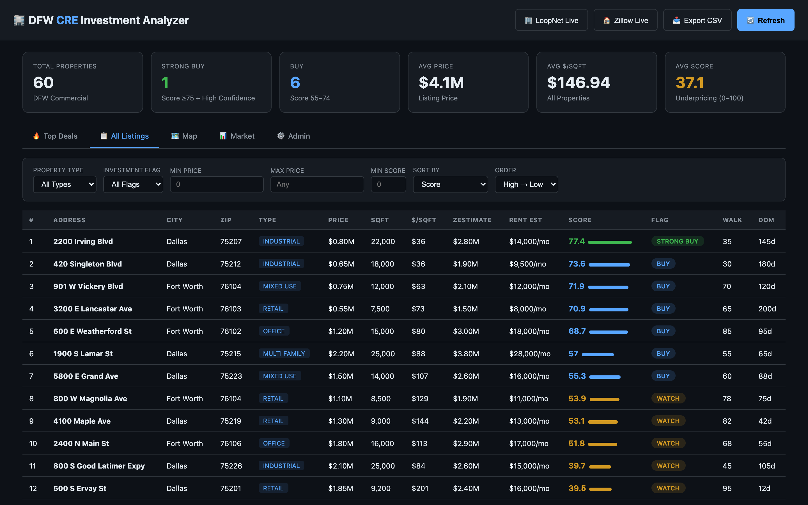

# DFW Commercial Real Estate Investment Analyzer

A data-driven dashboard that ingests live LoopNet listings across the Dallas–Fort Worth metro, scores each property on underpricing signals, and surfaces the best commercial real estate opportunities — ranked, mapped, and filterable.

Built as a PM prototype to explore CRE data pipelines, scoring algorithms, and investment signal UX.

| 🔥 Top Deals — Scored & ranked | 📋 All Listings — 7-dimension filters |
|:---:|:---:|
|  |  |
| **🗺️ Map — Color-coded DFW markers** | **📊 Market Summary — Distribution & trends** |
|  |  |

## Quick Start

```bash
cd consumer/dfw-cre-analyzer
npm install
npm start                    # Mock data → http://localhost:4002
npm run start:live           # LoopNet live data (requires API key)
```

## Live Data — LoopNet Integration

In **live mode**, the analyzer connects to the LoopNet API via RapidAPI to ingest real commercial listings across DFW:

- **500+ properties per page** from LoopNet's `searchByCity` endpoint
- **Full property enrichment** via `SaleDetails` — price, size, class, year built, zoning, parking, lot size
- **DFW bounding box filter** (lat 32.2–33.5, lng −98.0 to −96.2) ensures only metro-area properties
- **Automatic scoring** on ingestion — every property gets a composite investment score

```bash
# Set your RapidAPI key
export RAPIDAPI_KEY=your_key_here
npm run start:live
```

## Scoring Algorithm

```
compGap    = (compAvgPpsf - listingPpsf) / compAvgPpsf     × 40%
zestGap    = (zestimate - listingPrice)  / zestimate        × 35%
rentYield  = (rentEstimate × 12 / listingPrice) / 0.08      × 25%
```

| Flag | Score | Confidence |
|------|-------|------------|
| STRONG_BUY | ≥ 75 | Not LOW |
| BUY | 55–74 | Any |
| WATCH | 35–54 | Any |
| PASS | < 35 | Any |

## Dashboard Features

- **🔥 Top Deals** — KPI cards + ranked STRONG_BUY and BUY opportunities with score breakdown
- **📋 All Listings** — Filterable, paginated table with 7 filter dimensions (flag, type, ZIP, price, size, year, score)
- **🗺️ Map** — Interactive Leaflet.js map with color-coded markers by investment flag
- **📊 Market** — Flag distribution, property type breakdown, top ZIP codes by avg score
- **⚙️ Admin** — API quota tracking, ingestion controls, usage monitoring
- **Property Detail** — Click any row for full score breakdown, comps table, price history


## API Endpoints

| Endpoint | Description |
|----------|-------------|
| `GET /api/v1/properties` | Filtered, paginated property list |
| `GET /api/v1/properties/:id` | Property detail with comps + history |
| `GET /api/v1/properties/map` | GeoJSON for map rendering |
| `GET /api/v1/properties/export` | CSV download |
| `GET /api/v1/market/summary` | KPI aggregates |
| `GET /api/v1/admin/quota` | API quota stats |
| `POST /api/v1/ingest/loopnet` | Trigger live LoopNet ingestion |

## Architecture

```
┌─────────────────────────────────────────────────────┐
│              Express Server (:4002)                  │
├──────────┬──────────┬───────────────────────────────┤
│  Routes  │  Scoring │  Data Providers               │
│  (REST)  │  Engine  │  ├─ Mock (60 properties)      │
│          │          │  ├─ LoopNet API (live CRE)     │
│          │          │  └─ Zillow API (residential)   │
├──────────┴──────────┴───────────────────────────────┤
│              SQLite Database                         │
│  properties │ comps │ price_history │ quota          │
└─────────────────────────────────────────────────────┘
```

## Tech Stack

TypeScript · Node.js · Express · SQLite (better-sqlite3) · Leaflet.js · LoopNet API (RapidAPI) · Vanilla HTML/CSS/JS

## Project Structure

```
dfw-cre-analyzer/
├── src/
│   ├── server.ts              # Express server + API routes
│   ├── scoring/               # Underpricing algorithm
│   ├── data/
│   │   ├── mock-provider.ts   # 60 realistic mock properties
│   │   ├── loopnet-provider.ts # LoopNet API integration
│   │   └── zillow-provider.ts # Zillow enrichment (planned)
│   └── types.ts               # TypeScript interfaces
├── public/
│   └── index.html             # Dashboard (single-page app)
├── screenshots/               # Dashboard screenshots
├── package.json
└── tsconfig.json
```
