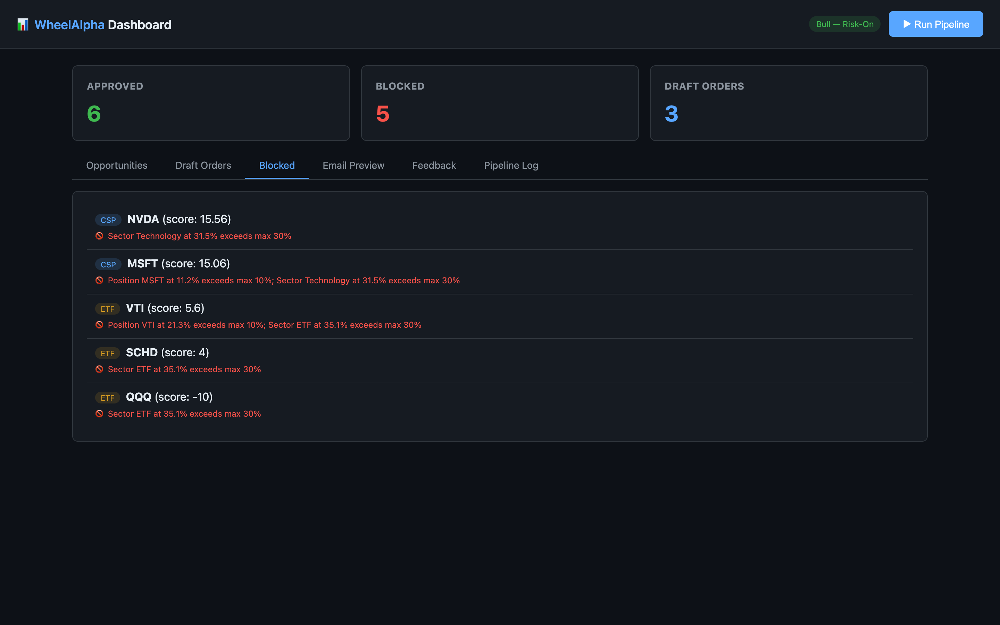

# Stock Wheel Strategy Screener (WheelAlpha)

A multi-agent investing tool that generates daily insights and **draft orders** (non-executing) for:
- **Wheel income** — cash-secured puts + covered calls on high-quality large caps
- **Long-term value** — fundamentally undervalued stocks (ROIC, CAGR, FCF screening)
- **ETF core allocation** — drift detection and rebalancing recommendations

Human-in-the-loop: all orders are drafts requiring explicit approval. No broker integration — this is a decision-support tool.


| Draft Orders | Blocked by Risk Gatekeeper |
|:---:|:---:|
|  |  |

## Quick Start

```bash
npm install
npm start                 # Launch web dashboard → http://localhost:4001
npm run run:cli           # CLI-only pipeline (no UI)
npm run run:feedback      # Interactive feedback CLI
```

## Sample Output

```
🚀 WheelAlpha Daily Pipeline — 2026-02-27
📊 [1/7] Market Regime Agent...  → Bull (Risk-On)
💰 [2/7] Wheel CSP Agent...     → 5 opportunities, 5 draft orders
📈 [3/7] Covered Call Agent...   → 0 opportunities
🏦 [4/7] Value Agent...         → 2 value picks
🌐 [5/7] ETF Agent...           → 4 ETF insights
🛡️  [6/7] Risk Gatekeeper...    → 6 approved, 5 blocked
📧 [7/7] Report/Email Agent...

✅ Pipeline complete → agents/out/2026-02-27/
```

Daily outputs:
- `daily_report.json` — Structured report with all opportunities and draft orders
- `daily_email.md` — Human-readable markdown (email-ready)
- `order_drafts.json` — Filtered draft orders (approved only)

## Architecture

```
Market Data → [Market Regime Agent] → Risk Posture
                    ↓
          [4 Strategy Agents in parallel]
          ├─ Wheel CSP Agent     → Put opportunities + drafts
          ├─ Covered Call Agent  → Call opportunities + drafts
          ├─ Value Agent         → Long-term picks (insights)
          └─ ETF Agent           → Allocation recommendations
                    ↓
          [Risk Gatekeeper Agent] → Approve / Block
                    ↓
          [Report/Email Agent]   → daily_email.md
```

### Sub-Agents

| Agent | Purpose | Output |
|-------|---------|--------|
| **Market Regime** | SPY vs 200DMA + VIX → Bull/Neutral/Bear | Regime + risk posture |
| **Wheel CSP** | Screen puts: DTE, delta, premium, earnings blackout | Ranked CSP opportunities + draft orders |
| **Covered Call** | Screen calls on held shares: strike ≥ cost basis | Ranked CC opportunities + draft orders |
| **Value** | Fundamentals screen: ROIC, CAGR, FCF, valuation discount | Ranked long-term picks |
| **ETF** | Target allocation vs actual drift detection | Rebalance recommendations |
| **Risk Gatekeeper** | Position/sector/cash limits, regime rules | Approved + blocked with reasons |
| **Report/Email** | Render JSON → markdown email | Daily report |
| **Feedback** | Parse APPROVE/REJECT/SET_RULE commands | Config updates |

## Config-Driven

All strategy parameters, risk limits, and preferences are YAML configs:

```
agents/configs/
├── strategy_rules.yaml      # DTE, deltas, premiums, fundamentals thresholds
├── risk_limits.yaml          # Position %, sector %, cash reserve, regime rules
├── universe.yaml             # Ticker lists + sector mapping
└── user_preferences.yaml     # Allocation targets, style, tone
```

## Project Structure

```
stock-wheel-strategy-screener/
├── src/
│   ├── index.ts              # Entry point — runs daily pipeline
│   ├── orchestrator.ts       # Pipeline wiring (7 steps)
│   ├── feedback-cli.ts       # Interactive feedback input
│   ├── types.ts              # All TypeScript interfaces
│   ├── agents/               # 8 agent implementations
│   ├── config/               # YAML config loader
│   ├── data/                 # Mock market data providers
│   ├── schemas/              # JSON Schema validator (Ajv)
│   └── utils/                # ID generation
├── agents/
│   ├── configs/              # YAML strategy + risk configs
│   ├── schemas/              # JSON Schema definitions
│   ├── subagents/            # Agent spec documents
│   ├── orchestrator.md       # System design doc
│   └── out/                  # Daily output directory
├── package.json
└── tsconfig.json
```

## Feedback Loop

After reviewing the daily email, reply with commands:

```
APPROVE: ord-csp-abc123, ord-cc-def456
REJECT: ord-csp-xyz789
SET_RULE: wheel.csp_delta_range=[0.18,0.25]
ADD_TO_LIST: watchlists.wheel_universe+=TSM
REMOVE_FROM_LIST: watchlists.wheel_universe-=NVDA
NOTE: Prefer lower delta in current environment
```

## Guardrails

- ✅ **No execution** — all orders are drafts, manual approval required
- ✅ **Position limits** — max 10% per ticker, 30% per sector
- ✅ **Cash reserve** — minimum 15% cash maintained
- ✅ **Regime-aware** — disables CSP in Bear, tightens deltas in Neutral
- ✅ **Earnings blackout** — skips tickers within 7 days of earnings
- ✅ **Daily trade cap** — max 3 new trades per day

## Tech Stack

TypeScript · Node.js · Ajv (JSON Schema) · YAML configs · date-fns

