# Pediatrics Practice Tech Stack — The Athena-Anchored, Zero-Payroll-Billing Build

> A companion deep-dive to [`pediatrics-practice-stack`](../pediatrics-practice-stack/README.md). That report picked the **cheapest serious stack** (eCW + Phreesia + Spruce + Availity) and accepted that you bring your own billing labor. **This report answers a different question:** _what if a solo pediatrician wants the leanest possible **back-office headcount** — zero billers, zero offshore VHA — and is willing to pay a percentage-of-collections premium to get it?_ The answer is an **athenahealth-anchored** stack. Audience: a Microsoft Product Lead (AI Gateway) evaluating a side venture for a friend launching **Luma Pediatrics**. Tone is deliberately operational: %-of-collections fee drag, first-pass acceptance rate (FPAR), denial worklist mechanics, card-on-file micro-balance capture, and the exact revenue milestone where the model stops making sense.

**Last updated:** 2024–2025 vendor data. All factual claims are cited inline and consolidated in the Appendix. **All pricing is illustrative and quote-dependent** — athenahealth, Yosi, and most RCM vendors do not publish list prices.

---

## 🎯 The Decision (Athena-Lean-Final)

**athenaOne (EHR + PM + RCM + native Ambient AI scribe) + Yosi Health (intake + comms) + Spruce Health (phones/fax/text).**

| Metric | Value |
|---|---|
| **Solo fixed software (mo 1+)** | **~$248/mo** flat (Yosi ~$199 + Spruce ~$24–49) |
| **Solo all-in (incl. Athena % fee)** | **~$2,448/mo** at ~$45K/mo collections (Athena @ ~5% = $2,250) |
| **One-time setup** | **$0–3K** target — Athena onboarding/credentialing fees are negotiable to **waived** in exchange for the % contract |
| **Billing payroll** | **$0** — no in-house biller, no outsourced biller, no offshore VHA |
| **Expected FPAR (first-pass clean)** | **95%+** (Athena network-level scrubbing) |
| **Expected total payout / NCR target** | **>98%** of clean claims, with card-on-file closing the patient-responsibility tail |
| **Daily backend supervision** | **~30 min/day** (claim-release + one-click appeals) |
| **Time to launch** | **6–8 weeks** (credentialing-bound, not software-bound) |

| Layer | Vendor | Cost | Role |
|---|---|---|---|
| EHR + PM + RCM + clearinghouse + AI scribe | **athenaOne** | ~5% of collections | Charting, scheduling, **native ambient scribe (Ambient Notes via Suki/Abridge)**, claim submission, network-level scrubbing, payment posting, payer appeals |
| Patient intake + screeners + card-on-file | **Yosi Health** | ~$199/provider/mo | Mobile pre-visit check-in, insurance-card OCR, real-time eligibility, **age-based peds screeners (M-CHAT/ASQ-3/PHQ-9)**, copay + micro-balance collection, two-way YosiChat |
| Phones + fax + missed-call rescue + team chat | **Spruce Health** | ~$24–49/user/mo | VoIP, HIPAA e-fax, **missed-call auto-text-back**, secure two-way SMS, internal chat, Athena demographic sync |

> **Why this stack:** It removes the single most expensive line item in a growing practice — **human billing labor** — by buying it back as a percentage of collections from a vendor whose 160,000-provider network fixes payer-rule changes _before your claim leaves the building_. The premium over eCW (~$1,000–1,500/mo at solo volume) is the price of **zero administrative headcount and same-day FPAR ≥95% from day one**. Athena's native ambient scribe zeroes out the $149/mo Sunoh line; Yosi collapses Phreesia + Weave into one $199 tool; Spruce solves the only thing Yosi can't (live phone hardware + missed-call rescue) for <$50.

> **The honest catch:** Athena's %-fee is a **success tax**. It looks cheap at solo volume and gets expensive fast. The model is mathematically optimal **until ~4–5 providers or ~$200K/mo in collections** — then a flat-fee EHR + in-house billing manager wins. This document treats that tipping point as a _planned migration_, not a surprise. See [§ Growth Trajectory](#-growth-trajectory--where-the-model-breaks).

---

## ⚡ Decision in 60 Seconds

1. **Buy the network, not the software.** athenaOne's value isn't its UI — it's that 160,000 providers share one rules engine. When a payer silently changes a peds immunization-modifier rule on Thursday morning, the first Athena practice that gets denied triggers a **global auto-fix by Thursday afternoon**. eCW's AI learns the same rule only _after **you** eat a few denials._ For a solo doc with no billing staff, that network effect is the whole product.
2. **Collapse the front office into two tools.** Yosi replaces **both** Phreesia (intake/eligibility/screeners/card-on-file) **and** Weave (reminders/two-way text/self-scheduling) because it has a real bidirectional Athena sync. The only gap Yosi can't fill is a physical dial tone and missed-call rescue — so add **Spruce** (or RingCentral) for <$50/mo. Total front-office fixed cost: **~$248/mo**, down from ~$630 (Phreesia $250 + Weave $381) on the legacy plan.
3. **Don't pay for a scribe Athena already includes.** athenaOne ships **native ambient AI notes** (Suki/Abridge embedded) at **no extra cost**. Dropping standalone Sunoh.ai saves **$149/mo/provider** and removes a second login. The only reason to keep Sunoh is if you dislike Athena's native scribe after a trial.
4. **Set your small-balance write-off threshold to $0.00 for the first 60 days.** This forces every $2–8 underpayment onto your screen so you can spot **algorithmic payer underpayment patterns** before they quietly bleed you. Then pair it with **Yosi card-on-file** to auto-sweep those micro-balances — turning what most practices write off into passive revenue.

---

## 💼 Business Plan & Strategy

This isn't just a tool list — it's a **business operating model.** The thesis: a single pediatrician can run a high-margin, high-NPS practice with **near-zero administrative payroll** by renting a billing department as a percentage of collections, then deliberately graduate to a flat-fee model once scale makes the percentage expensive.

### Mission & operating principle
> **Mission:** Deliver outstanding, accessible pediatric care while keeping the practice lean enough that the physician's time goes to children, not paperwork.
>
> **Operating principle:** _Software does the work; the human supervises the exception._ Every workflow is automated by default, with a human touchpoint only where judgment or empathy is required.

### Strategy on a Page — 3 Horizons

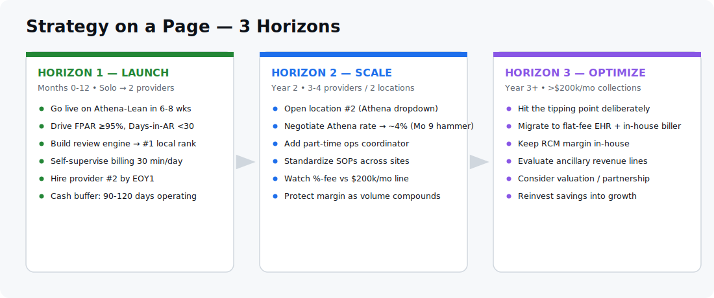

| Horizon | Window | The one job | Exit signal → next horizon |
|---|---|---|---|
| **H1 — Launch** | Mo 0–12, solo → 2 providers | Prove the lean model: FPAR ≥95%, Days-in-AR <30, 5-star review engine, **zero billing staff** | Schedule consistently full → hire provider #2 |
| **H2 — Scale** | Year 2, 3–4 providers / 2 locations | Replicate the playbook at a 2nd site; **negotiate Athena to ~4%** using growth as leverage | Collections approach **$200K/mo** → fee drag turns material |
| **H3 — Optimize** | Year 3+, >$200K/mo | Cross the tipping point on purpose: migrate to **flat-fee EHR + in-house billing manager** to keep RCM margin | Stable, optimized 2-site group; evaluate valuation/partnership |

### Business-Model Canvas

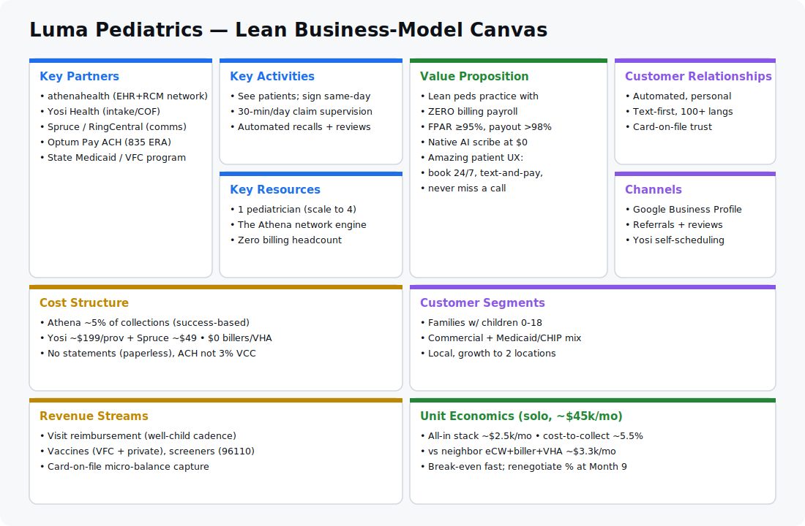

### Market opportunity (why pediatrics, why now)
- **Recurring-revenue clinical model.** Pediatrics runs on a predictable well-child + immunization cadence (newborn → 18yo), producing durable lifetime-value patients and a self-refilling schedule (stage ⑩).
- **Referral-dominant acquisition.** Parents choose pediatricians by word-of-mouth and online reviews — making a strong **Google Business Profile + automated review engine** (stage ⑨) the cheapest, highest-yield growth channel.
- **Administrative cost is the killer, not clinical cost.** Most small practices bleed margin on billing labor and denied low-dollar peds claims. The Athena network attacks exactly that, which is why the percentage fee can still net out cheaper than the neighbor's biller + offshore VHA.

### Financial plan (illustrative; validate against real contracts)

| Phase | Providers / Sites | Collections/mo | Stack cost/mo | Billing payroll | Cost-to-collect |
|---|---|---|---|---|---|
| **Launch (solo)** | 1 / 1 | ~$45K | ~$2,498 | $0 | ~5.5% |
| **EOY1** | 2 / 1 | ~$90K | ~$4,996 | $0 | ~5.5% |
| **Year 2** | 3–4 / 2 | ~$150K | ~$8,150 | $0 (watch) | ~5.4% |
| **Year 3 (post-migration)** | 4 / 2 | ~$200K+ | ~$5–6K flat + ~$5K biller | 1 FTE | ~5.0% trending down |

> **Cash discipline:** pediatric reimbursement ramps over 60–120 days at launch (credentialing + first claim cycles). **Budget 90–120 days of operating cash on hand** before go-live. The %-of-collections model is a natural cash-flow cushion early (you pay Athena only when you get paid), which is a deliberate advantage of choosing it for Horizon 1.

### Key milestones

| When | Milestone |
|---|---|
| Week 0 | Go live on Athena-Lean; first patients via Yosi self-scheduling |
| Day 30 | First clean claim cycle; FPAR baseline measured |
| Day 90 | In-house-vs-outsource billing decision (see [§ 90-Day Plan](#-the-90-day-diy-billing-plan-before-you-hire-anyone)) |
| Month 9 | **Use growth as the contract hammer** — renegotiate Athena toward 4% |
| EOY1 | Provider #2 onboarded |
| Year 2 | Location #2 opened; SOPs standardized across sites |
| Year 3 | Cross tipping point → migrate to flat-fee EHR + in-house biller |

### The moat (why this compounds)
The four-goal flywheel is self-reinforcing: **great experience → 5-star reviews → higher search rank → more families → more data into the Athena network → cleaner claims → more margin to reinvest in experience.** Competitors running a generalist stack with a human billing team can't match the cost structure _or_ the patient UX simultaneously.

---

## 💰 Solo Cost Scenarios — The Lean Launch Budget

All scenarios assume **~$45,000/mo in collections** for a full-time solo pediatrician (the transcript's working assumption; validate against your top-5 payer contracts).

### Scenario S1 — Athena-Lean-Final (RECOMMENDED LAUNCH)

| Component | Cost structure | Monthly | Yearly |
|---|---|---|---|
| athenaOne (EHR + RCM + **native scribe**) | ~5% of $45K collections | **$2,250** | $27,000 |
| Yosi Health (intake + comms + card-on-file) | flat per-provider | **$199** | $2,388 |
| Spruce Health (phones/fax/text) | ~$49/user (start 1 user) | **$49** | $588 |
| **Total** | — | **~$2,498/mo** | **~$29,976/yr** |

> **What this buys:** EHR, practice management, ambient scribe, clearinghouse, claim scrubbing, payment posting, **and payer appeals** — with **zero billing headcount**. At $2,498/mo your entire tech + back-office cost is **~half the salary of a single human medical scribe** ($2,500–3,500/mo), and you've also eliminated the biller and VHA your neighbor pays.

### Scenario S2 — Athena + Yosi + Weave (the "buy Weave back" variant)

Identical to S1 but swap Spruce → **Weave** ($381/mo flat per location). Net: **~$2,830/mo**. Only justified if your phone lines are already ringing off the hook and you want Weave's caller-ID-pops-the-chart hardware integration on day one. **For a launch-phase solo practice, this is ~$330/mo of premature optimization.** Start with Spruce; add Weave when call volume forces it.

### Scenario S3 — Athena + Yosi + RingCentral (cheapest comms)

Swap Spruce → a generic cloud VoIP (**RingCentral / Vonage / Dialpad**, ~$30–50/line) configured with **"Missed Call → Text-Back"** webhooks pointing parents to your Yosi self-scheduling link. Net: **~$2,479–2,499/mo.** Slightly cheaper than Spruce but **loses Spruce's one-click "sync this call/text into the Athena chart"** and its native BAA-backed clinical posture. Pick RingCentral if you only need a dial tone + missed-call rescue; pick Spruce if you want phone events to land in the chart.

### The "and others" fees to budget (one-time + nickel-and-dime)

| Item | Estimate | Notes |
|---|---|---|
| Athena onboarding + credentialing | **$0–3,000 (negotiate to waived)** | Trade the waiver for signing the % contract |
| EPCS identity-proofing token | **~$250/provider/yr** | Required if you e-prescribe controlled substances (ADHD meds) |
| Paper statement fees | **~$0.70–0.85/mailed letter** | **Avoid entirely** with Yosi text-to-pay + card-on-file |
| Optum/UHC Virtual Credit Card "fee" | **3% of every UHC payout** | **A trap — opt out.** See [§ The Optum VCC Trap](#-the-optum-virtual-credit-card-trap-stop-paying-3-to-receive-your-own-money) |

---

## 🧭 Stacks Considered — One Table

Each row is a real candidate evaluated against the goal: **maximum automation, minimum back-office headcount, FPAR ≥95%, payout >98%.**

| # | Stack | Solo monthly | Headcount to run billing | FPAR | Why rejected (or picked) |
|---|---|---|---|---|---|
| 1 | **✅ Athena + Yosi + Spruce** | **~$2,498** | **0** | **95%+** | **Picked.** Network scrubbing + native scribe + zero billing payroll. Premium fee is the cost of peace-of-mind and instant FPAR. |
| 2 | Athena + Yosi + Weave | ~$2,830 | 0 | 95%+ | Same as #1 but +$330/mo for phone hardware you don't need at launch. **Buy Weave back later if call volume demands.** |
| 3 | Athena + Yosi + RingCentral | ~$2,490 | 0 | 95%+ | Marginally cheaper; loses chart-sync on calls. Fine if you only need dial tone + missed-call text. |
| 4 | Athena + Phreesia + Sunoh + Weave | ~$3,030 | 0 | 95%+ | **Redundant.** Yosi replaces Phreesia + Weave; Athena's native scribe replaces Sunoh. Paying 3× for capabilities the lean stack already has. **Rejected.** |
| 5 | eCW + outsourced biller (4.5%) + offshore VHA | ~$3,325 | 1.5 (biller + VHA) | varies | **The neighbor's trap.** "Cheaper" software, but billers only do data entry — denials kick back to a VHA you hire. ~3× the all-in cost of #1. **Rejected for launch.** |
| 6 | eCW + eCW Agentic AI RCM (2.9%) + Yosi + Spruce | ~$2,055+ labor | 0.5 (someone works the AI queue) | ~95% after rule-training | Flat software is cheaper, AI drafts appeals — but **someone still has to approve the AI's queue.** Wins **only above the tipping point.** See [§ eCW Agentic AI RCM](#%EF%B8%8F-athena-network-rcm-vs-ecw-agentic-ai-rcm). |
| 7 | eCW + Phreesia + Spruce + Availity (the sibling doc's pick) | ~$880–1,750 | 0.25 (DIY denials) | 96.5–97.5% | **Cheapest serious stack** — but you own the billing labor. Different objective. See [`pediatrics-practice-stack`](../pediatrics-practice-stack/README.md). |

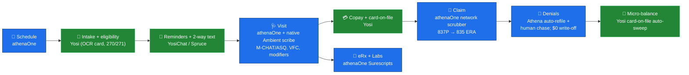

---

## ⚖️ Tradeoffs You're Accepting

| You gain | You give up |
|---|---|
| Zero billing payroll from day one | A flat, predictable software bill (you pay more as you collect more) |
| FPAR ≥95% via network scrubbing, immediately | Control of the clearinghouse choice (Athena's engine is mandatory) |
| Native ambient scribe at $0 | Your favorite standalone scribe (must like Athena's, or pay for Sunoh anyway) |
| Athena's team _chases_ denials, not just submits | Priority on **low-dollar** peds claims (Athena humans naturally favor $10K claims over $110 ones — mitigated, see [§ Low-Dollar Denials](#-low-dollar-peds-denials--forcing-the-100-claim-to-get-worked)) |
| Frictionless multi-location scaling (add "Location B" in a dropdown) | Cost efficiency at scale (the % fee compounds — plan the migration) |
| ~30 min/day of backend supervision | Deep visibility into _how_ each claim was coded (the network does it for you) |

---

## 🚫 What You're Explicitly NOT Buying — And Why

- **No standalone AI scribe (Sunoh.ai).** athenaOne includes native Ambient Notes (Suki/Abridge). Saves $149/mo/provider. Re-add only if you dislike the native engine after a trial.
- **No Phreesia.** Yosi covers intake + eligibility + screeners + card-on-file with a cleaner, **ad-free** interface and a top-rated Athena Marketplace bidirectional sync. Phreesia's enterprise scale isn't needed for a solo/small peds practice.
- **No Weave (at launch).** Yosi handles reminders, two-way text, and self-scheduling. Add Weave back only when phone hardware integration becomes a real bottleneck.
- **No standalone clearinghouse (Waystar/Availity).** Athena's native engine is the clearinghouse. (Keep this in mind for the migration: leaving Athena means re-acquiring a clearinghouse — see sibling doc.)
- **No outsourced biller, no offshore VHA.** This is the entire thesis. The % fee _is_ your billing department.
- **No full-time in-house coder.** You self-supervise a 30-min/day worklist for the first 90 days, then re-evaluate (see [§ The 90-Day DIY Plan](#-the-90-day-diy-billing-plan-before-you-hire-anyone)).

---

## 🧩 Athena Peds Gaps → Mitigation Map

| Gap in the Athena-native experience | Mitigation in this stack |
|---|---|
| Native texting is one-way/clunky (replies confuse the bot) | **YosiChat** live two-way dashboard + **Spruce** for phone-tied threads |
| No native missed-call rescue (Athena/Yosi are software, not a dial tone) | **Spruce "Call Rescue"** or **RingCentral missed-call→text webhook** |
| Ad-cluttered enterprise intake feel (if you'd used Phreesia) | **Yosi** is strictly zero-advertising, branded to the practice |
| Peds developmental screeners not auto-pushed | **Yosi** detects child age from the Athena schedule and auto-texts the right M-CHAT/ASQ-3 48h pre-visit, scores it, writes discrete fields back to Athena |
| Low-dollar ($100–150) peds claims deprioritized by Athena humans | **$0 write-off floor + Yosi front-gate eligibility + rules-engine auto-refile** (see below) |
| UHC pays via 3%-fee Optum Virtual Credit Card | **Opt into free Optum Pay Basic ACH/EFT + 835 ERA auto-reconciliation** |
| Patient-responsibility tail (small balances) | **Yosi card-on-file auto-sweep** with 5-day text notice |

---

## 🛡️ The 4-Gate Clean-Claim Defense (FPAR ≥95%, Payout >98%)

The goal: **never let a flawed claim leave the building.** Payers run "black box" auto-denial on tiny technicalities because they know most solo docs never appeal. The defense is four automated gates.

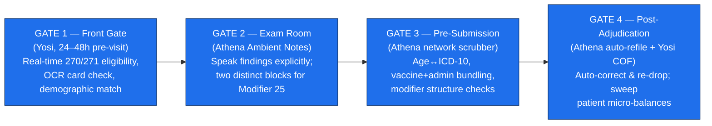

### Gate 1 — Front Gate (Yosi, 24–48h before the visit)
**The #1 cause of first-pass peds denials is bad demographics/eligibility**, not coding — and a child's coverage changes fast (parent-plan switches, newborn not yet added, Medicaid transitions).
- **Rule: no verification, no visit.** Yosi runs automated real-time eligibility 24–48h pre-appointment.
- Yosi OCRs the insurance card, flags inactive coverage or name/subscriber-ID mismatches, and texts the parent to fix it **before the child arrives.** Bad data never enters Athena.

### Gate 2 — Exam Room (Athena Ambient Notes)
Insurers deny peds claims by arguing "not medically necessary."
- **Speak findings explicitly** ("ASQ-3 administered, score normal"; name the vaccine manufacturer).
- **Modifier 25 discipline:** when a well-visit becomes acute (physical + ear infection), the scribe must produce **two distinct documentation blocks** — a preventive exam and a separate H&P — so the multi-issue claim is airtight.

### Gate 3 — Pre-Submission (Athena network scrubber)
Catch coding errors before the payer can weaponize them. Athena's network applies these automatically; verify they're on during onboarding:
- **Age↔diagnosis match:** block well-child ICD-10 (e.g., `Z00.129`) if the birthdate doesn't fit the code parameters.
- **Vaccine bundling:** if a vaccine CPT (e.g., `90670` Prevnar) is present, confirm the matching administration code (`90460`/counseling) is attached.
- **Modifier validation:** any code needing a distinct modifier (e.g., `96110` developmental screen) has its structure checked pre-flight.

### Gate 4 — Post-Adjudication (Athena auto-refile + Yosi card-on-file)
- If a denial is **software-fixable** (omitted modifier, typo), Athena's global engine **auto-corrects and re-drops without a human**.
- If it needs local input, it lands on your **Manager Hold / Claim Action Required** worklist (see below).
- The **patient-responsibility tail** is swept by **Yosi card-on-file** — see [§ Card-on-File](#-card-on-file--turning-write-offs-into-passive-revenue).

### The golden metric
Every Friday, check **First-Pass Acceptance Rate** and **Days in AR** on the Athena dashboard. If FPAR drops <95%, **read the rejection codes**: demographic errors → your Yosi gate is leaking; coding/modifier errors → tighten Gate 3 rules. Days in AR target: **<25–30**.

---

## 🧾 Denial Management Without a Biller

### The two Athena worklist buckets

| Bucket | When a claim lands here | What you see | Daily volume (solo) |
|---|---|---|---|
| **Manager Hold** | Athena halted it **before** sending (obvious data blocker — missing initial, newborn DOB mismatch, "Policy ID Not Found") | Red/orange flag on login; exact error translated in plain English | ~2–5 claims |
| **Claim Action Required (MHO)** | Came back from the payer as a **hard denial** needing local input (e.g., "child already had this physical at urgent care") | Athena pre-tags a tracking note telling you exactly what to add/confirm | ~1–4 claims |

> **The advantage over the neighbor's model:** their outsourced biller sends a clunky monthly Excel/PDF of rejections; their VHA then has to re-open the EHR, find the chart, and reverse-engineer what went wrong. **In Athena, the fix is integrated into the live claim interface** — click the bucket, read the plain-English error, type the missing digit, hit Save, and Athena auto-resubmits.

```
[ LOG INTO ATHENA ]
        ↓
[ VIEW WORKLIST ]  → "Manager Hold: 4 claims"
        ↓
[ LIVE CLAIM INTERFACE ] → fix the typo directly on screen
        ↓
[ ROUTE BACK TO PAYER ] → Athena auto-submits instantly
        ↓
[ COMPLETED ] → disappears from your screen
```

### Low-dollar peds denials — forcing the $100 claim to get worked
Athena humans naturally prioritize a $15,000 ortho denial over a $110 well-check. **Don't rely on a human to argue your $100 claim — force the software layer to fix it first:**
1. **Rules-engine auto-resubmission.** Because Athena processes millions of identical peds claims, a code-fixable denial (omitted vaccine modifier, simple typo) is **auto-corrected and re-dropped** with no human touch.
2. **Set your Small-Balance Write-Off floor low — contractually.** During onboarding (this is a config setting, not a legal fight — Athena calls it your *Small Balance Adjustment Policy*), set the cap to **$10** at most, **$0.00 for the first 60 days.** Tell your implementation manager: *"Anything over $X must be kicked to our internal task queue — it cannot be auto-written-off."*
3. **Stop the denial at Gate 1.** Most $100 denials are eligibility/demographic — and Yosi's 48h pre-visit eligibility scrub kills those at the front gate.

### Why $0 for the first 60 days
With a $10 floor, any residual balance **under $10 is silently auto-adjusted and never hits your worklist.** That's dangerous early: payers run **algorithmic underpayment patterns** (e.g., quietly shorting you $3 on every well-check). Start at **$0.00** to force every micro-discrepancy onto your screen, verify it's just contractual rounding (not a systematic glitch), then raise to $5–10 to clear the noise. Or keep $10 for a clean dashboard and run a monthly **Adjustment Analysis Report** to audit what got written off.

---

## 💳 Card-on-File — Turning Write-Offs Into Passive Revenue

Pair a **$0.00 Athena write-off floor** with **Yosi Card-on-File (COF)** and the leaky pipeline closes completely. Parents sign a digital COF agreement during Yosi check-in; Yosi's bidirectional Athena sync then runs this loop automatically:

```
[ INSURER UNDERPAYS CLAIM BY $6.40 ]
        ↓
[ ATHENA BLOCKS WRITE-OFF (due to $0 rule) ]
        ↓
[ BALANCE SHIFTS TO PATIENT-RESPONSIBILITY LEDGER ]
        ↓
[ YOSI TEXTS PARENT: "$6.40 charge to Visa •1234 in 5 days" ]
        ↓
[ CARD AUTO-CHARGED & PAYMENT POSTED BACK TO ATHENA ]
```

- **100% passive:** no printed statements, no stamps, no front-desk phone collections.
- **Yield lift:** athenahealth data shows strict COF practices lift patient-collection yield by **~9 points (≈64% → 73%+)** and roughly **halve self-pay days in AR**.
- **Parent-friendly framing (in the Yosi onboarding form):** *"To keep Luma Pediatrics lean and accessible, we keep a secure Card on File for micro-balances under $50 (unexpected copays/deductibles). You always get a text 5 days before any charge."* Parents already expect this from Uber/Amazon and prefer a text-and-swipe over a paper bill two months later.

---

## 🏦 The Optum Virtual Credit Card Trap — Stop Paying 3% to Receive Your Own Money

When UnitedHealthcare pays via an **Optum Virtual Credit Card (VCC)**, they send a 16-digit card number; your front desk types it into the terminal, and your **merchant processor skims ~3%** of your own insurance payout. Insurers do this because (a) they get an interchange cash-back cut, and (b) practices are **enrolled by default** and rarely opt out.

**Do not automate the swipe — automate the exit:**
1. **Force Optum to "Basic ACH."** Log into the Optum Pay portal (or call Provider Services) and enroll your business bank account for **EFT/ACH direct deposit**. Decline "Premium Portal Access" (it charges ~0.5% per deposit). Choose **Optum Pay Basic — 100% free, 0% fee.** (The ACA requires insurers to offer standard EFT/ACH.)
2. **Automate reconciliation in Athena.** Turn on **835 ERA** receipt. UHC deposits funds via free ACH; the 835 digital receipt flows to Athena; Athena auto-matches payment to the patient account and marks the claim **Paid** — no credit-card terminal, no 3% skim.

---

## 📡 Staying Current on Payer Rules (Without Paying for It)

Insurers bury rule changes in 100-page bulletins or silently retune their scrubbers. You can't read Aetna/Cigna/UHC/Medicaid bulletins weekly. Use a layered, mostly-free approach:

| Source | Cost | What it covers |
|---|---|---|
| **Athena network auto-updates** | included | Macro-level national rule changes — the network fixes them for everyone automatically |
| **Your internal denial logs ("the sandbox")** | free | Watch for sudden rejection spikes on previously-paid codes — payers test new rules on small batches first. 15 min every Friday. |
| **PayerPolicy.org** | **free tier** | Commercial + CMS policy notices. **Peds falls under the *Primary Care* filter**; also monitor *General / Multi-Specialty* for vaccine/`96110` cross-posts. Covers ~80% of tracking. |
| **PCC Learn (`learn.pcc.com`)** | **free & public** | PCC is a peds-only EHR; their public billing/coding library is one of the best free peds coding cheat-sheets — vaccine code changes, modifier shifts, step-by-step. Covers the peds-specific 20%. |
| **Clearinghouse / Athena "Payer News"** | included | Build keyword alerts (`90460`, `96110`) for free push notifications on policy shifts |
| **State Medicaid bulletins + local AAP chapter** | free | Regional commercial + Medicaid rules tailored to your state |
| AAP Pediatric Coding Newsletter / Coding Alert | ~$200–390/yr | **Skip it** — the free PCC Learn + clearinghouse keyword alerts + state chapter cover the same ground |

**The monthly loop:** Extract (review denial trends + alerts) → Update (adjust rules, or just confirm Athena already did) → Test (submit a small batch to verify first-pass).

---

## 🧑‍⚕️ The 90-Day DIY Billing Plan (Before You Hire Anyone)

Self-managing billing for the first 90 days keeps cash flow close, avoids overpaying a legacy coder, and lets you _see exactly how payers cheat_ before deciding whether to ever outsource. Configure Athena to act as an autonomous backend; your role is **strictly evaluative — you don't code, you gatekeep.**

### The ~30-minute daily routine (months 1–3)

| Cadence | Time | Action |
|---|---|---|
| **Every morning** | 10 min | Open the **Claims-on-Hold / Scrubber Alerts** queue. Fix the flagged typo/checkbox, release the batch. |
| **Every afternoon** | 15 min | Open the **denial worklist**; review Athena's auto-drafted appeal packets, confirm the ambient note proves medical necessity, click **Submit Appeal**. |
| **Every Friday** | 5 min | Check macro metrics: **FPAR ≥95%, Days in AR <30.** |

### The 90-day in-house vs outsourced decision

| Result at Day 90 | What it means | Next move |
|---|---|---|
| **FPAR >95% and Days in AR <25** | Front-end automation (Yosi + Athena scrubber) is working | **Keep it in-house.** No coder, no outsourcer. The software is doing the work. |
| **Tech works, but denials are purely contractual** (payers ignoring clean appeals) | You've hit administrative friction needing human phone follow-up | **Escalate to Athena's co-sourced RCM** / add a part-time human caller on a % model |
| **FPAR <90% from front-office data gaps** | Your front gate is leaking | **Re-train/tighten Yosi eligibility rules** — do *not* hire a coder to fix front-desk errors |

> **The neighbor's "leaky pipeline," quantified.** A practice using an outsourced biller at **4.5% of $45K = $2,025/mo** _plus_ a Philippines VHA at **~$1,300/mo** to fix the kicked-back denials pays **~$3,325/mo** to fight insurers. The Athena-lean stack does the same job for **~$2,498/mo with zero humans.** The biller only does clean data entry; the moment a claim hard-denies, it bounces back to a VHA you hire. You're paying twice.

---

## ⚙️ Athena Network RCM vs eCW Agentic AI RCM

eCW now markets **Agentic AI RCM** (RPA bots that scrub claims, suggest codes from notes, auto-draft appeals). It's genuinely capable — but deployed differently, and the difference matters enormously for a **solo practice with no billing staff.**

| Dimension | **athenahealth Co-Sourced RCM** | **eCW Agentic AI RCM** |
|---|---|---|
| AI model | **Network utility** — runs globally, autocorrects across 160K providers _before the claim leaves_ | **Local copilot** — suggests codes/appeals your staff must review and click-approve |
| Denial handling | Athena's **human teams chase the payer** on your behalf | AI drafts the appeal packet, but **your staff/VHA must review, print, upload** |
| The "brain" | Collective live data of millions of daily national claims — adapts to hidden rule changes instantly | Primarily **your** practice's historical data + broad rules — learns a new rule **after you eat denials** |
| Pricing | Strictly **% of collections** (no pay unless you get paid) | Flat software fee **+** a % if you use their human billing service |
| Who runs the queue? | **Athena** | **You** (or the VHA you hire) |

> **The crux:** eCW's AI makes a billing team _faster_; Athena's network _replaces_ the billing team. eCW's Agentic AI is built for Central Billing Offices and groups with dedicated billers. If eCW's AI flags a denial and drafts a beautiful appeal, **who on a solo staff reviews and submits it?** That question routes you straight back to hiring a VHA. **Choose Athena to launch hands-off; choose eCW's heavy machinery once you're big enough to staff an in-house billing manager.**

---

## 📈 Growth Trajectory — Where the Model Breaks

Your plan: **2 providers by end of Year 1; a 2nd location with 1–2 more providers in Year 2.** That trajectory drives you **straight through the Athena tipping point.** Assume ~$45K/mo collections per FT provider.

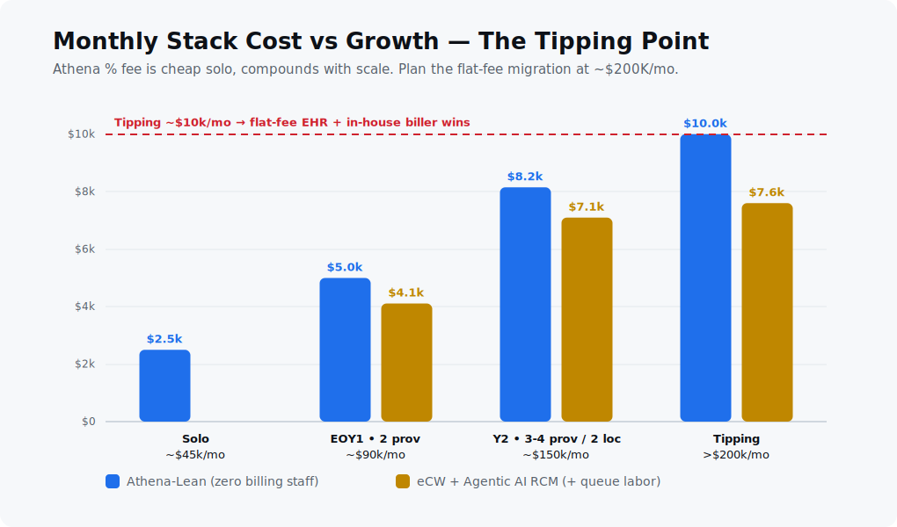

### Year 1 — 2 providers, 1 location (~$90K/mo, ~$1.08M/yr)

| Stack | Components | Monthly | Yearly |
|---|---|---|---|
| **Athena-Lean** | Athena 5% ($4,500) + Yosi×2 ($398) + Spruce ($98) | **~$4,996** | ~$59,952 |
| eCW AI RCM | eCW sw 2×$599 ($1,198) + eCW AI RCM 2.9% ($2,610) + Yosi/Spruce (~$300) | **~$4,108** | ~$49,296 |

> **Year-1 verdict:** Athena runs ~$900/mo more, but you carry **zero billing headcount** while recruiting provider #2. The premium buys operational calm during the most fragile phase. **Stay on Athena.**

### Year 2 — 3–4 providers, 2 locations (~$150K/mo, ~$1.8M/yr)

| Stack | Components | Monthly | Yearly |
|---|---|---|---|
| **Athena-Lean** | Athena 5% ($7,500) + Yosi/Spruce scaled (~$650) | **~$8,150** | ~$97,800 |
| eCW AI RCM | eCW sw (~$2,096) + eCW AI RCM 2.9% ($4,350) + Yosi/Spruce (~$650) | **~$7,096** | ~$85,152 |

> **Year-2 verdict:** Athena now costs **~$12,600/yr more.** The % fee compounds with success. Even adding a part-time admin supervisor (~$2,500/mo) to run an eCW queue, the math starts favoring the flat-fee path. **This is the planned-migration zone.**

### The tipping point + the negotiation hammer
- **The math crosses over around 4–5 providers or ~$200K/mo collections.** At $200K/mo, a 5% Athena fee = **$10,000/mo just for software + billing** — at which point a flat-fee EHR + a dedicated in-house billing manager (~$5,000/mo) is cheaper _and_ keeps the margin in-house.
- **Use growth as a contract hammer at ~Month 9.** Before signing provider #2, call your Athena AE:
  > *"We're adding our 2nd provider now and a 2nd location next year, pushing collections past $1.5M. We're evaluating a flat-fee EHR and eCW's 2.9% RCM tier. To stay on Athena we need our rate at **4% or a tiered volume discount.**"*
  Athena routinely cuts high-growth multi-site practices to **~3.8–4.2%.**
- **The Year-3 pivot.** If Athena won't drop toward 4%, your now-predictable revenue and 2 sites can absorb a migration to a **flat-fee EHR (e.g., eCW ~$599/provider) + in-house billing manager** to maximize margin. (Migration cost + clearinghouse re-acquisition are real — see sibling doc's migration section.)

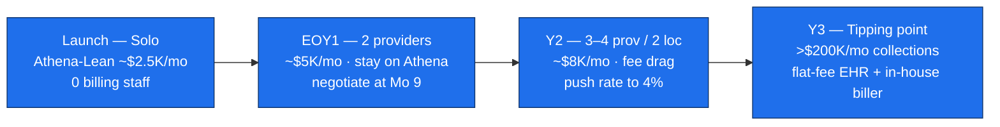

---

## 🧠 Ease of Use — Who Touches What

| Persona | Daily reality |
|---|---|
| **Provider** | Open Athena app → tap record → ambient scribe writes the note. ~30 min/day on the denial/appeal worklist during the DIY phase. No coding. |
| **Front desk** | Keep **YosiChat** open for live parent texts; keep **Spruce** for phone calls/missed-call rescue. Clear the **Manager Hold** bucket each morning (2–5 claims). Card-on-file means no statement-stuffing or phone collections. |
| **Parents** | One mobile flow via Yosi: OCR insurance card, eligibility check, age-based screener, copay, card-on-file. Text the office line → lands in YosiChat. 100+ language auto-translation. |
| **Multi-location ops** | Add "Location B" in an Athena dropdown; Yosi auto-routes reminders to the right address from the Athena calendar. **Zero new billing infrastructure.** |

> **The texting division of labor (so you don't double-pay or confuse parents):** **Yosi = clinical & forms** (screeners, OCR cards, pre-visit check-in, self-scheduling links, copays). **Spruce = front-office lifeline** (live calls, voicemail, missed-call auto-text, internal team chat, e-fax). Athena native texting is one-way only — don't rely on it for conversations.

---

## 🗺️ End-to-End Workflow Atlas

This is the operational heart of the practice: **every stage from "stranger sees an ad" to "loyal family refers three neighbors,"** drawn as a visual workflow. Each stage is tagged with its four levers:

> 💰 **Revenue lever** · 💸 **Cost lever** · 😊 **Patient experience** · 🧑‍💼 **Staff-overhead reduction**

The design principle throughout: **the software does the work, the human supervises the exception.** No stage requires a dedicated employee until the practice crosses the [tipping point](#-growth-trajectory--where-the-model-breaks).

### The Master Journey (one picture)

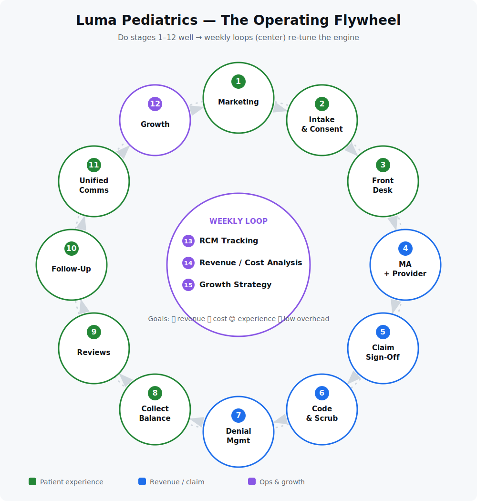

<details>
<summary>Same flywheel as a text diagram (for accessibility / quick edits)</summary>

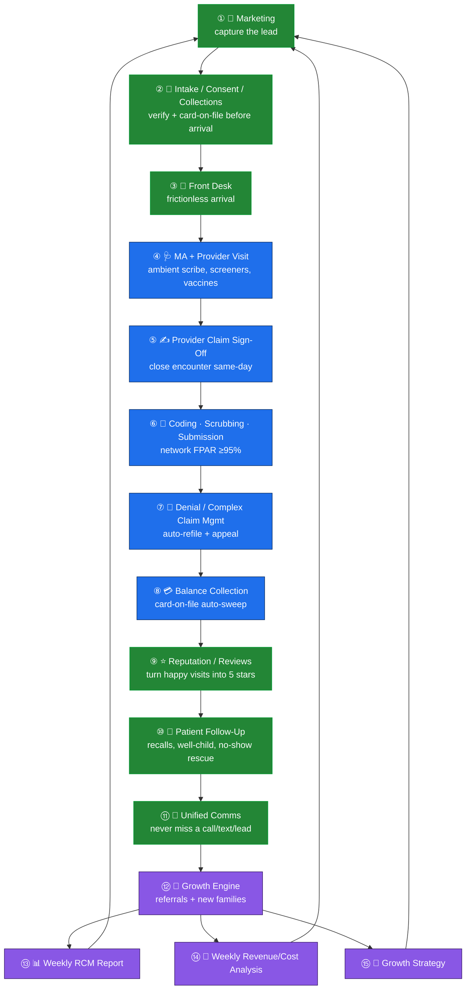

</details>

> **Read it as a flywheel, not a line.** Stages ①–⑧ run every visit; ⑨–⑫ compound loyalty and volume; ⑬–⑮ are the weekly loop that tunes the whole machine and feeds better marketing back into stage ①.

---

### ① 📣 Patient Marketing — Capture the Lead

> 💰 More new-patient visits · 💸 Organic/referral-led (low paid-ad spend) · 😊 Easy to find & book · 🧑‍💼 Self-scheduling = zero phone tag

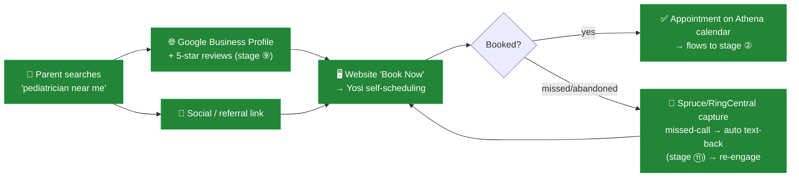

- **Engine:** A strong **Google Business Profile** fed by automated 5-star reviews (stage ⑨) is the #1 free acquisition channel for local peds. Every happy visit becomes marketing.
- **No lead lost:** any inbound call that isn't answered is auto-texted back within seconds (stage ⑪), and every web visitor gets a one-tap **Yosi self-scheduling** link — booking happens 24/7 with **zero front-desk phone time.**
- **Cost discipline:** lead with organic + referral; treat paid ads as a measured supplement tracked in the weekly analysis (stage ⑭).

---

### ② 📝 Patient Intake / Consent / Collections — Verify Before They Arrive

> 💰 Kills eligibility denials at the source · 💸 No printed forms/statements · 😊 5-min phone check-in, no clipboard · 🧑‍💼 Front desk does ~0 data entry

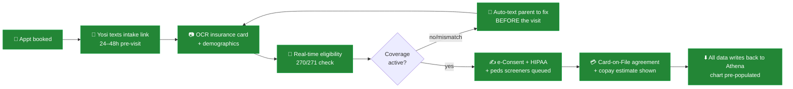

- **This is Gate 1 of the [claim defense](#%EF%B8%8F-the-4-gate-clean-claim-defense-fpar-95-payout-98).** Bad demographics never enter the system → the single biggest source of peds denials is eliminated before the child walks in.
- **Collections start here:** the **card-on-file** agreement and copay estimate are captured during digital check-in, so money is secured before the visit, not chased after.
- **Consent paperless:** HIPAA, financial policy, and treatment consents are e-signed in the Yosi flow and stored against the Athena chart.

---

### ③ 🏢 In-Clinic Front Desk — Frictionless Arrival

> 💰 More visits/day (faster throughput) · 💸 Smaller/zero front-desk overtime · 😊 Walk-in-and-sit-down · 🧑‍💼 Exceptions-only desk

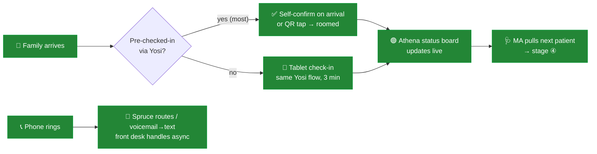

- Because ~most families completed intake from home (stage ②), the desk's job shrinks to **confirm + room**, not collect-clipboard-and-copy-card.
- **Phones don't block the lobby:** Spruce queues calls and converts voicemails to text so the desk works them asynchronously instead of making waiting parents watch them juggle a phone.

---

### ④ 🩺 MA + Provider Visit — The Clinical Core

> 💰 Captures every billable service + screener · 💸 No scribe salary (native ambient) · 😊 Doctor faces the child, not a keyboard · 🧑‍💼 Note writes itself

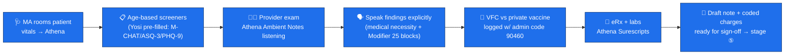

- **Gate 2 of the claim defense.** Speaking findings explicitly ("ASQ-3 normal," vaccine manufacturer, two distinct blocks for a sick+well visit) makes the eventual claim bulletproof — **and the native ambient scribe writes it at $0**, replacing a $149/mo Sunoh line and a human scribe salary.
- Screeners arrive **pre-completed** (parent did them via Yosi pre-visit), so `96110` developmental-screen revenue is captured without burning exam-room time.

---

### ⑤ ✍️ Provider Claim Sign-Off — Close Same-Day

> 💰 Faster cash (no lag) · 💸 No back-coding labor · 😊 — · 🧑‍💼 ~2 min/encounter, end of day

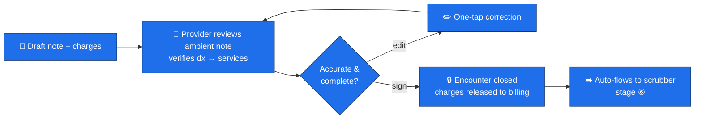

- **Discipline that protects cash flow:** sign off the same day. A signed encounter is a released charge; an unsigned one is **money stuck in limbo.** The provider's only job here is to confirm the AI-drafted note matches reality and hit sign.

---

### ⑥ 🧮 Coding · Scrubbing · Claim Submission — The Network Does It

> 💰 FPAR ≥95% on first pass · 💸 Zero coder/clearinghouse labor · 😊 — · 🧑‍💼 Auto; human only clears held claims

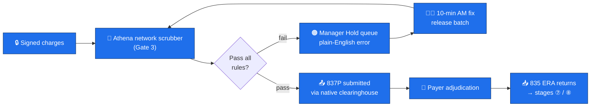

- **Gate 3.** The scrubber checks age↔ICD-10, vaccine+admin bundling, and modifier structure **before** the claim leaves — and because 160K providers share the rules engine, payer-rule changes are patched network-wide automatically. Your only touch is the **10-minute morning Manager-Hold sweep** (2–5 claims).

---

### ⑦ 🔁 Denial / Complex / Pushed-Back Claim Management — Maximize Revenue

> 💰 Recovers revenue most solo docs abandon · 💸 No VHA/biller to chase · 😊 — · 🧑‍💼 15-min PM appeal review

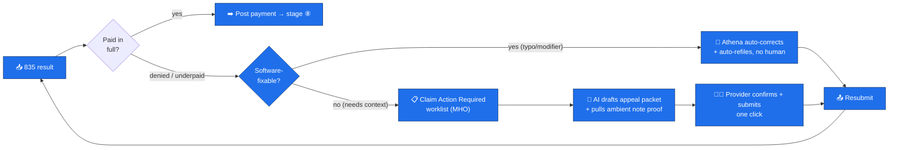

- The revenue you'd otherwise lose lives here. **Low-dollar peds claims are forced to get worked** via the rules-engine auto-refile + a **$0 write-off floor** so nothing slips through silently ([details](#-low-dollar-peds-denials--forcing-the-100-claim-to-get-worked)). Human time: **15 min/day** confirming AI-drafted appeals.

---

### ⑧ 💳 Collect Pending Balances — Card-on-File Auto-Sweep

> 💰 Patient-collection yield ~64% → 73%+ · 💸 No statements/stamps/collections calls · 😊 Text-and-done · 🧑‍💼 Fully passive

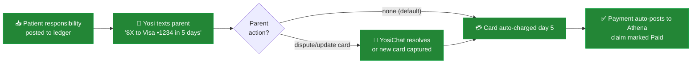

- Pairs with the **$0 write-off floor**: micro-balances that most practices write off become passive revenue. No paper, no phone collections, no awkward front-desk conversations. ([Card-on-File detail](#-card-on-file--turning-write-offs-into-passive-revenue).)

---

### ⑨ ⭐ Reputation Management — Turn Visits Into 5-Star Reviews

> 💰 Fuels stage ① acquisition · 💸 Automated (no marketing hire) · 😊 Feels cared-for · 🧑‍💼 Zero manual ask

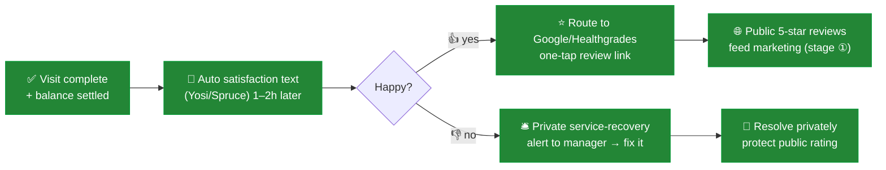

- The **smart routing** is the trick: happy families are nudged to public review sites; unhappy ones are intercepted into **private service recovery** before they post — raising the star average that powers free acquisition.

---

### ⑩ 📲 Patient Follow-Up — Recalls, Well-Child, No-Show Rescue

> 💰 Fills the schedule (recurring well-child revenue) · 💸 Automated recalls · 😊 "They remember my kid" · 🧑‍💼 Set-and-forget

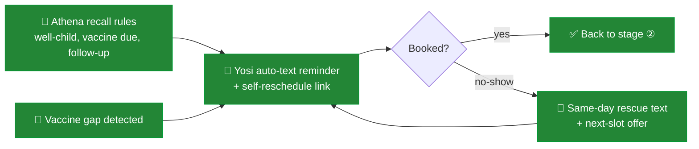

- Pediatrics lives on **recurring well-child + immunization cadence.** Automated recalls turn a one-time sick visit into a lifelong patient relationship — and **no-show rescue** recaptures revenue the same day instead of leaving a hole in the schedule.

---

### ⑪ 💬 Unified Communications — Never Miss a Call, Text, or Lead

> 💰 Every lead converts · 💸 One comms stack, no missed-revenue · 😊 Texts back like a friend · 🧑‍💼 One inbox, async

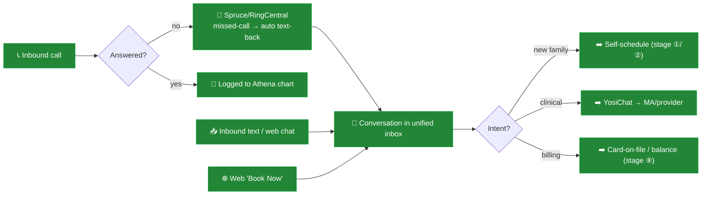

- **The anti-leak layer.** A missed call at a solo practice is a lost family. Spruce/RingCentral converts every missed call to an instant text-back; Yosi + Spruce share a unified, **100+ language** thread so nothing — a new lead, a refill, a balance question — falls through. Division of labor: **Yosi = clinical/forms, Spruce = phone/front-office.**

---

### ⑫ 🚀 Growth Engine — Compounding New Families

> 💰 Volume growth · 💸 Referral-led (cheapest CAC) · 😊 Word-of-mouth · 🧑‍💼 Scales without new admin

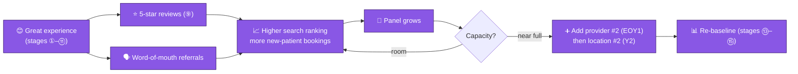

- Growth is an **output of doing ①–⑪ well**, not a separate ad budget. The same stack scales: adding a provider or a second location is a **dropdown change in Athena + a Yosi seat**, with **zero new billing infrastructure** — until the [tipping point](#-growth-trajectory--where-the-model-breaks).

---

### ⑬ 📊 Weekly RCM Tracking Report

> The 15-minute Friday scorecard. Pulled straight from the Athena dashboard — no analyst needed.

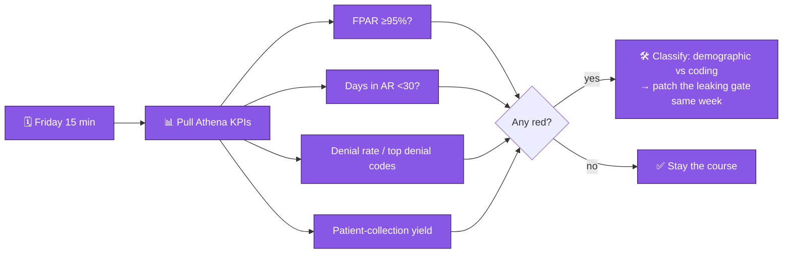

| KPI | Target | If off-target → action |
|---|---|---|
| First-Pass Acceptance Rate | ≥ 95% | Pull rejection codes; demographic → fix Yosi gate; coding → tighten Gate 3 |
| Days in AR | < 30 | Check held-claim backlog + denial age |
| Net Collection Rate | ≥ 98% | Audit underpayments via Adjustment Analysis Report |
| Patient-collection yield | ≥ 90% | Verify card-on-file enrollment rate |
| Top 5 denial reasons | trending ↓ | Patch the responsible gate |

---

### ⑭ 🔬 Weekly Revenue-Maximization / Cost-Mitigation Analysis

> The strategic counterpart to ⑬: not "are claims clean?" but "are we leaving money on the table or overspending?"

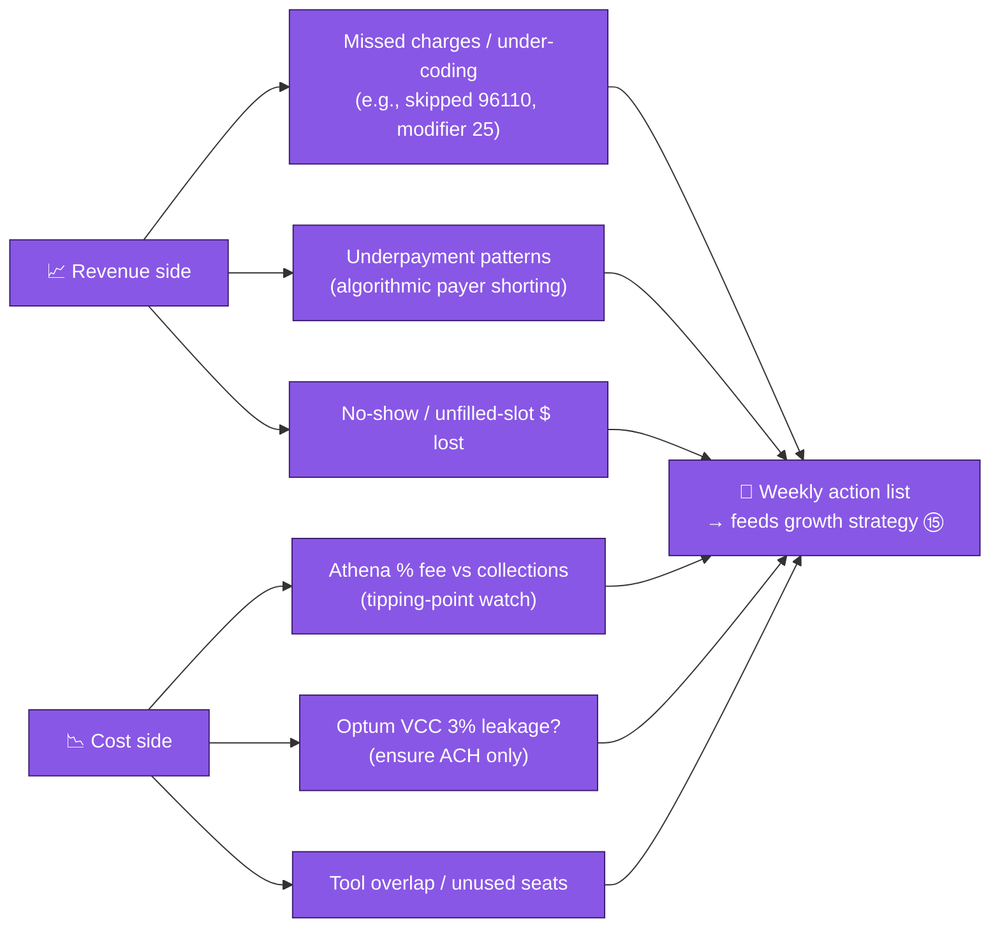

- **Revenue maximization:** hunt missed/under-coded charges, algorithmic underpayments (caught by the $0 write-off floor), and lost-slot dollars.
- **Cost mitigation:** track the **Athena %-fee against collections** so the tipping point never surprises you; confirm **zero Optum VCC 3% leakage** (ACH only); kill overlapping tools and unused seats.

---

### ⑮ 🧭 Growth Strategy — Steer the Flywheel

> Monthly/quarterly zoom-out that turns the weekly data into decisions.

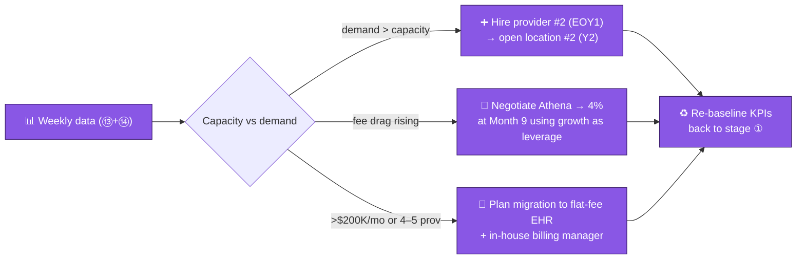

- The growth strategy is **explicitly tied to the economics**: grow on Athena while the % fee is cheap, **use growth as a Month-9 negotiation hammer**, and **pre-plan the flat-fee migration** at the tipping point so scale never quietly erodes margin. ([Full trajectory + math](#-growth-trajectory--where-the-model-breaks).)

---

### How the Atlas maximizes the four goals (at a glance)

| Goal | Where it's won |
|---|---|
| **💰 Maximize revenue** | Gate-1 eligibility (②), full charge capture + screeners (④), same-day sign-off (⑤), FPAR ≥95% (⑥), aggressive denial recovery + $0 write-off (⑦), card-on-file yield (⑧), recall/no-show rescue (⑩), referral flywheel (⑨⑫), weekly leak-hunt (⑭) |
| **💸 Lower costs** | Zero billing payroll (⑥⑦), native scribe vs Sunoh (④), Yosi replacing Phreesia+Weave (②⑪), paperless statements (⑧), ACH vs 3% VCC (⑭), organic/referral CAC (①⑨⑫) |
| **😊 Patient experience** | Book 24/7 (①), 5-min home check-in (②), walk-in-and-sit (③), doctor faces the child (④), text-and-done payments (⑧), proactive recalls (⑩), never-miss-a-text comms (⑪) |
| **🧑‍💼 Less staff overhead** | Self-scheduling (①), no clipboard/data entry (②③), self-writing notes (④), 2-min sign-off (⑤), 10-min AM scrub + 15-min PM appeals (⑥⑦), passive collections (⑧), automated reviews/recalls (⑨⑩), one async inbox (⑪) |

---

## 📒 Operational Playbooks — Per-Workflow SOPs

Each playbook is a standard operating procedure you can hand to a new hire. Format: **Owner · Trigger · Steps · Tool · KPI · Failure-mode escape.** Owners use RACI shorthand: **Dr** = physician, **MA** = medical assistant, **FD** = front desk, **Auto** = software-automated.

### SOP-1 · Marketing & Lead Capture
- **Owner:** Auto (FD on exceptions) · **Trigger:** any prospective family interaction (search, call, click)
- **Steps:** (1) Maintain Google Business Profile + review feed. (2) Every web visitor sees a Yosi "Book Now" link. (3) Any missed call auto-texts back within seconds (SOP-11). (4) Tag lead source for weekly analysis (SOP-14).
- **Tool:** Google Business Profile · Yosi self-scheduling · Spruce/RingCentral
- **KPI:** new-patient bookings/wk; lead→booking conversion; cost per acquisition
- **Escape:** conversion dips → audit booking-link friction + review velocity

### SOP-2 · Intake, Consent & Pre-Visit Collections
- **Owner:** Auto (FD on exceptions) · **Trigger:** appointment booked (fires 24–48h pre-visit)
- **Steps:** (1) Yosi texts intake link. (2) Parent OCRs insurance card + demographics. (3) Real-time 270/271 eligibility. (4) On mismatch → auto-text parent to fix **before arrival**. (5) e-Consent (HIPAA + financial). (6) Capture **card-on-file** + show copay estimate. (7) Data writes back to Athena.
- **Tool:** Yosi Health · **KPI:** % pre-checked-in; eligibility-verified rate; COF enrollment %
- **Escape:** eligibility failures rising → tighten Yosi rules; this is **Gate 1** of the claim defense

### SOP-3 · Front Desk / Arrival
- **Owner:** FD · **Trigger:** family arrives
- **Steps:** (1) Confirm pre-check-in (most) or hand tablet (3-min Yosi flow). (2) Update Athena status board. (3) Route phones to Spruce; work voicemail-to-text async — never make the lobby wait on a call.
- **Tool:** Athena · Yosi tablet · Spruce · **KPI:** check-in time; lobby wait
- **Escape:** wait times climb → push more intake upstream to SOP-2

### SOP-4 · MA + Provider Visit
- **Owner:** MA + Dr · **Trigger:** patient roomed
- **Steps:** (1) MA logs vitals; confirms pre-filled screeners. (2) Dr exam with **Athena Ambient Notes** listening. (3) Speak findings explicitly (medical necessity; two blocks for sick+well = Modifier 25). (4) Log VFC vs private vaccine + admin code. (5) eRx/labs via Surescripts.
- **Tool:** athenaOne + native ambient scribe · **KPI:** charge capture/visit; screener completion; note turnaround
- **Escape:** under-coding shows in SOP-14 → coach explicit dictation; this is **Gate 2**

### SOP-5 · Provider Claim Sign-Off
- **Owner:** Dr · **Trigger:** end of each encounter (same-day)
- **Steps:** (1) Review AI-drafted note vs reality. (2) Verify dx ↔ services. (3) One-tap edits. (4) Sign → charges release.
- **Tool:** athenaOne · **KPI:** % encounters signed same-day; unsigned-charge age
- **Escape:** backlog of unsigned notes = trapped cash → end-of-day sign-off block, non-negotiable

### SOP-6 · Coding, Scrubbing & Submission
- **Owner:** Auto (Dr/FD clears holds) · **Trigger:** charges released
- **Steps:** (1) Athena network scrubber checks age↔ICD-10, vaccine+admin bundling, modifiers (**Gate 3**). (2) Pass → 837P submitted via native clearinghouse. (3) Fail → Manager Hold queue. (4) **10-min AM sweep** fixes + releases.
- **Tool:** athenaOne network engine · **KPI:** FPAR ≥95%; held-claim count
- **Escape:** FPAR <95% → classify demographic (fix SOP-2) vs coding (fix SOP-4)

### SOP-7 · Denial & Complex-Claim Management
- **Owner:** Auto + Dr · **Trigger:** 835 returns denied/underpaid
- **Steps:** (1) Software-fixable → Athena auto-corrects + auto-refiles, no human. (2) Needs context → Claim Action Required (MHO) worklist. (3) AI drafts appeal + pulls ambient-note proof. (4) **15-min PM review** → confirm + one-click submit. (5) Low-dollar claims forced via rules-engine + $0 write-off floor.
- **Tool:** athenaOne · **KPI:** denial rate; appeal win %; recovered $/wk
- **Escape:** systematic denials by one payer → escalate via SOP-14 + payer-rep call

### SOP-8 · Balance Collection (Card-on-File Auto-Sweep)
- **Owner:** Auto · **Trigger:** patient-responsibility balance posts
- **Steps:** (1) Yosi texts "$X to card •1234 in 5 days." (2) No action → auto-charge day 5. (3) Dispute → YosiChat resolves / new card. (4) Payment auto-posts to Athena.
- **Tool:** Yosi card-on-file · **KPI:** patient-collection yield ≥90%; self-pay Days-in-AR
- **Escape:** yield <90% → check COF enrollment % at SOP-2

### SOP-9 · Reputation & Reviews
- **Owner:** Auto (manager on negative) · **Trigger:** visit complete + balance settled
- **Steps:** (1) Auto satisfaction text 1–2h post-visit. (2) Happy → one-tap Google/Healthgrades link. (3) Unhappy → **private** service-recovery alert to manager. (4) Resolve privately before it goes public.
- **Tool:** Yosi/Spruce · **KPI:** reviews/mo; avg star rating; recovery resolution time
- **Escape:** rating slips → tighten recovery routing + root-cause the dissatisfaction

### SOP-10 · Patient Follow-Up & Recalls
- **Owner:** Auto · **Trigger:** Athena recall rule (well-child due, vaccine gap, follow-up) or no-show
- **Steps:** (1) Auto-text reminder + self-reschedule link. (2) Booked → SOP-2. (3) No-show → same-day rescue text + next-slot offer.
- **Tool:** Athena recall + Yosi · **KPI:** well-child adherence; no-show rate; reactivation %
- **Escape:** no-show rate climbs → add deposit-on-file or tighter reminder cadence

### SOP-11 · Unified Communications (Never Miss a Lead)
- **Owner:** Auto (FD/MA triage) · **Trigger:** any inbound call/text/web chat
- **Steps:** (1) Unanswered call → auto text-back. (2) All threads land in one unified inbox. (3) Triage: new family → SOP-1/2; clinical → YosiChat→MA/Dr; billing → SOP-8. (4) 100+ language auto-translation.
- **Tool:** Spruce/RingCentral + YosiChat · **KPI:** missed-call recovery %; first-response time
- **Escape:** leads slipping → confirm missed-call webhook + inbox coverage hours

### SOP-12 · Growth Engine
- **Owner:** Dr + manager · **Trigger:** capacity nearing full
- **Steps:** (1) Sustain SOP-1/9/10 to compound referrals. (2) Monitor capacity vs demand (SOP-13/14). (3) Near full → add provider/location (Athena dropdown + Yosi seat). (4) Re-baseline KPIs.
- **Tool:** all of the above · **KPI:** panel growth; utilization; referral share
- **Escape:** growth stalls → revisit marketing + experience scores

### SOP-13 · Weekly RCM Tracking (Friday, 15 min)
- **Owner:** Dr/manager · **Trigger:** every Friday
- **Steps:** Pull Athena KPIs → FPAR, Days-in-AR, denial rate + top codes, patient-collection yield. Any red → classify + patch the leaking gate **same week**.
- **Tool:** athenaOne dashboard · **KPI:** see [§ KPI dashboard](#kpi-dashboard-targets)
- **Escape:** persistent red → escalate to SOP-14 deep analysis

### SOP-14 · Weekly Revenue-Max / Cost-Mitigation Analysis
- **Owner:** Dr/manager · **Trigger:** weekly (pairs with SOP-13)
- **Steps:** Revenue side → hunt missed/under-coded charges, algorithmic underpayments, lost-slot $. Cost side → Athena %-fee vs collections (tipping watch), confirm zero Optum VCC 3% leakage, kill tool overlap/unused seats. Output a weekly action list → SOP-15.
- **Tool:** Athena reports + Adjustment Analysis Report · **KPI:** net collection rate; cost-to-collect; leakage $ found
- **Escape:** crossing $150K/mo → open Athena rate renegotiation + build migration model

### SOP-15 · Growth Strategy (Monthly/Quarterly)
- **Owner:** Dr/manager · **Trigger:** monthly review (quarterly deep-dive)
- **Steps:** Read SOP-13/14 trends → decide: demand>capacity → hire/expand; fee drag rising → negotiate to 4% at Month 9; >$200K/mo or 4–5 providers → plan flat-fee migration. Re-baseline.
- **Tool:** strategy-on-a-page + financial trajectory · **KPI:** margin %, growth rate, tipping-point distance
- **Escape:** margin compression from fee drag → execute the Horizon-3 migration

### RACI quick-reference

| Workflow | Dr | MA | FD | Auto |
|---|---|---|---|---|
| Marketing / Comms (1, 11) | C | I | R | **A** |
| Intake / Front desk (2, 3) | I | C | R | **A** |
| Visit / Sign-off (4, 5) | **R/A** | R | I | C |
| Coding / Denials (6, 7) | **A** | I | C | R |
| Collections (8) | I | I | C | **R/A** |
| Reviews / Recalls (9, 10) | I | C | C | **R/A** |
| Growth / Reporting (12–15) | **A** | I | I | R |

> _R = Responsible, A = Accountable, C = Consulted, I = Informed. The pattern: **Auto runs the routine, the Dr is accountable for clinical + financial outcomes, MA/FD handle exceptions.**_

---

## 🚀 Implementation Roadmap (6–8 Weeks, Credentialing-Bound)

| Phase | Window | Actions |
|---|---|---|
| **Core EHR + contracting** | Days 1–15 | Sign athenaOne; **negotiate onboarding/credentialing fees waived** in exchange for the % contract. Confirm the native clearinghouse + 835 ERA + **Optum Pay Basic ACH** enrollment. Set **Small-Balance Adjustment Policy = $0.00**. |
| **Front-gate integration** | Days 16–30 | Deploy **Yosi**; wire real-time eligibility (270/271) + OCR card capture; build age-based screener auto-push (M-CHAT/ASQ-3/PHQ-9); turn on **Card-on-File** agreement in the intake form. |
| **Comms + scribe** | Days 31–45 | Stand up **Spruce** (VoIP, e-fax, missed-call rescue, Athena demographic sync) or RingCentral webhook. Verify **Athena Ambient Notes** is enabled (no Sunoh needed). |
| **Peds rules engine + dress rehearsal** | Days 46–60 | Confirm Gate-3 scrubber rules (age↔ICD-10, vaccine+admin bundling, modifier 25/96110). Run **mock claims** to confirm flags fire before submission. Train the 30-min/day worklist routine. |

---

## ⚠️ Risk Matrix

### Top risks

| Risk | Impact | Likelihood | Mitigation |
|---|---|---|---|
| **% fee drag compounds past the tipping point** | High | High (by Y2) | Negotiate to 4% at Mo 9; plan Y3 flat-fee migration; model TCO quarterly |
| **Low-dollar peds claims deprioritized by Athena humans** | Medium | Medium | $0 write-off floor + rules-engine auto-refile + Yosi front-gate eligibility |
| **Optum VCC silently skims 3%** | Medium | High (default-enrolled) | Opt into free Optum Pay Basic ACH + 835 ERA on day one |
| **Algorithmic payer underpayment hidden by write-off floor** | Medium | Medium | Start at $0.00 for 60 days; monthly Adjustment Analysis Report |
| **Front-gate data leak tanks FPAR** | High | Medium | Yosi 48h eligibility; weekly rejection-code audit; tighten rules same-day |
| **Migration lock-in (leaving Athena = re-acquire clearinghouse + remap)** | High | Medium (at Y3) | Budget migration in the Y3 plan; keep clean data hygiene; document payer panel |
| **Dislike Athena's native scribe** | Low | Low | Trial during onboarding; re-add Sunoh ($149/mo) only if needed |

### Top-3 mitigation playbooks
1. **Fee drag:** Track collections monthly; the moment trailing-3-month collections cross **$150K/mo**, open the rate renegotiation and build the flat-fee migration model in parallel.
2. **Low-dollar denials:** Keep the write-off floor at $0–10, audit the Adjustment Analysis Report monthly, and lean on card-on-file so the patient-responsibility tail self-collects.
3. **FPAR leak:** Treat any week with FPAR <95% as a fire — pull rejection codes, classify demographic vs coding, and patch the responsible gate within 24h.

---

## 📋 Operational Playbooks (Steady-State)

**Daily (front desk, ~20–30 min):** Clear Manager Hold bucket; monitor YosiChat + Spruce; release scrubber-held claims.
**Daily (provider, ~15 min during DIY phase):** Review + submit auto-drafted appeals.
**Weekly (~20 min):** FPAR + Days-in-AR check; Friday denial-code scan for new payer patterns; PayerPolicy/PCC Learn skim.
**Monthly (~30 min):** Adjustment Analysis Report (audit micro-write-offs); card-on-file yield review; collections trend vs tipping-point thresholds.
**Quarterly:** TCO model refresh (Athena % vs flat-fee crossover); contract-rate review against growth.
**Annual:** Re-credentialing; EPCS token renewal; renegotiate Athena rate at each provider add.

### KPI dashboard (targets)

| KPI | Target |
|---|---|
| First-Pass Acceptance Rate | ≥ 95% |
| Net Collection Rate | ≥ 98% |
| Days in AR | < 25–30 |
| Patient-balance collection yield | ≥ 90% (with card-on-file) |
| Daily backend supervision | ≤ 30 min |
| Billing headcount | 0 (until tipping point) |

---

## 10. Appendix

### Glossary

- **835 / ERA** — Electronic Remittance Advice; the EDI payment receipt the payer returns. Drives Athena's auto-reconciliation.
- **837P** — Professional EDI claim sent EHR → clearinghouse → payer.
- **270/271** — Eligibility request (270) / response (271). Yosi runs these pre-visit.
- **AR** — Accounts Receivable. "Days in AR" = avg days from date-of-service to payment.
- **BAA** — Business Associate Agreement (HIPAA).
- **COF** — Card-on-File; stored payment method for auto-charging micro-balances.
- **EFT / ACH** — Electronic Funds Transfer / Automated Clearing House; free bank-to-bank deposit (the alternative to the 3% Optum VCC).
- **EPCS** — Electronic Prescribing of Controlled Substances (DEA-regulated; ~$250/provider/yr token).
- **FPAR** — First-Pass Acceptance Rate (a.k.a. clean-claim rate); % of claims accepted on first submission.
- **MHO** — "Claim Action Required" / Manager-Hold-Output worklist bucket in Athena.
- **NCR** — Net Collection Rate = payments / (charges − contractual adjustments).
- **RCM** — Revenue Cycle Management.
- **RPA** — Robotic Process Automation (the bot layer in eCW's Agentic AI RCM).
- **VCC** — Virtual Credit Card (Optum's 3%-fee payout mechanism).
- **VFC** — Vaccines for Children (federal free-vaccine program; separate inventory accounting).
- **Small Balance Adjustment Policy** — Athena config setting capping auto-write-offs (set to $0–10).

### Peds CPT/ICD-10 quick reference (cited in the defense gates)

| Code | Meaning |
|---|---|
| `Z00.129` | Well-child exam (child >28 days), no abnormal findings |
| `90460` | Immunization administration with counseling (first component) |
| `90670` | Pneumococcal conjugate (Prevnar) vaccine |
| `96110` | Developmental screening (e.g., ASQ-3) |
| `99173` | Visual acuity screening |
| Modifier 25 | Significant, separately identifiable E/M on the same day as another service (well-visit + acute) |

### Vendor URLs (consolidated, alphabetical)

| Vendor | URL |
|---|---|
| athenahealth (athenaOne) | https://www.athenahealth.com/ |
| athenahealth developer portal | https://www.athenahealth.com/developer-portal |
| Abridge (Athena ambient partner) | https://www.abridge.com/ |
| Availity | https://www.availity.com/ |
| Dialpad | https://www.dialpad.com/ |
| eClinicalWorks | https://www.eclinicalworks.com/ |
| Optum Pay | https://www.optum.com/en/business/providers/optum-pay.html |
| PayerPolicy | https://www.payerpolicy.com/ |
| PCC (Physician's Computer Co.) | https://www.pcc.com/ |
| PCC Learn | https://learn.pcc.com/ |
| Phreesia | https://www.phreesia.com/ |
| RingCentral | https://www.ringcentral.com/ |
| Spruce Health | https://sprucehealth.com/ |
| Suki (Athena ambient partner) | https://www.suki.ai/ |
| Sunoh.ai | https://sunoh.ai/ |
| Surescripts | https://surescripts.com/ |
| Vonage Business | https://www.vonage.com/business/ |
| Waystar | https://www.waystar.com/ |
| Weave | https://www.getweave.com/ |
| Yosi Health | https://www.yosicare.com/ |

### References

- athenahealth — athenaOne platform: https://www.athenahealth.com/
- athenahealth — Ambient Notes (AI scribe): https://www.athenahealth.com/resources/blog/ambient-notes
- Software Finder — athenahealth pricing: https://softwarefinder.com/emr-software/athenahealth
- ITQlick — athenaOne vs athenahealth: https://www.itqlick.com/compare/athenahealth/athenaone
- EHR Source — athenahealth first-pass / clean-claim benchmarks: https://ehrsource.com/
- Yosi Health — patient intake & operations suite: https://www.yosicare.com/
- Yosi Health — athenahealth integration (Marketplace): https://www.athenahealth.com/marketplace
- Spruce Health — plans & pricing: https://sprucehealth.com/plans
- Spruce Health — athenahealth integration: https://www.sprucehealth.com/integrations
- Weave — pricing: https://www.getweave.com/pricing/
- RingCentral — missed-call / SMS automation: https://www.ringcentral.com/
- Phreesia — pricing context: https://www.phreesia.com/
- Sunoh.ai — AI medical scribe pricing: https://sunoh.ai/
- Optum Pay — Basic (free ACH) vs Premium portal: https://www.optum.com/en/business/providers/optum-pay.html
- PayerPolicy — payer policy tracking (Primary Care filter): https://www.payerpolicy.com/
- PCC Learn — free pediatric billing/coding library: https://learn.pcc.com/
- AAP — Pediatric Coding Newsletter (paid; free alternatives preferred): https://www.aap.org/
- eClinicalWorks — Agentic AI / RCM services: https://www.eclinicalworks.com/products-services/
- iTech Plus — flat-fee vs %-of-collections EHR economics: https://itechplus.com/
- Sibling report — eCW-anchored cheapest serious stack: [`../pediatrics-practice-stack/README.md`](../pediatrics-practice-stack/README.md)

### Items flagged "needs validation"

1. **Exact athenaOne %-of-collections rate** — published ranges 4–7%; solo peds realistically 5–6%, confirmable only via sales quote.
2. **Yosi Health pricing (~$199/provider/mo)** — vendor quote-based; confirm whether comms + card-on-file are bundled or add-ons.
3. **Spruce per-user pricing ($24–49)** — confirm which tier includes missed-call rescue + Athena sync.
4. **Athena native scribe at $0** — confirm it's included in your tier (Suki/Abridge embedding) vs a paid add-on in some contracts.
5. **eCW Agentic AI RCM at 2.9%** — vendor-reported; get a written quote and confirm what human follow-up is/ isn't included.
6. **Per-provider revenue ($45K/mo)** — pull your top-5 payer contracts; peds reimbursement varies dramatically by state/contract.
7. **Card-on-file yield lift (+9 pts)** — athenahealth-self-reported; treat as directional.
8. **Optum Pay Basic = $0 fee** — confirm at enrollment; decline Premium (~0.5%/deposit).
9. **Tipping point (~$200K/mo or 4–5 providers)** — model-derived; re-run with your actual contracted rate and labor costs.

---

*End of report. This document is a research artifact; it does not constitute legal, regulatory, or financial advice. Validate all vendor terms, pricing, and HIPAA posture with counsel before signing. Pricing is illustrative and quote-dependent.*

---

### One-page TL;DR (for sharing)

- **Stack:** athenaOne (EHR + PM + RCM + **native ambient scribe**) + Yosi Health (intake + screeners + card-on-file + two-way text) + Spruce Health (phones/fax/missed-call rescue). RingCentral is the cheaper comms alternative; Weave is the "buy-back" upgrade.
- **Thesis:** Pay a %-of-collections premium to run a peds practice with **zero billing headcount** — no in-house biller, no outsourced biller, no offshore VHA. Athena's 160K-provider network fixes payer rule changes before your claim leaves the building.
- **Solo economics (~$45K/mo collections):** ~**$2,498/mo** all-in (Athena ~$2,250 + Yosi $199 + Spruce $49). FPAR ≥95%, payout >98%, **~30 min/day** backend supervision.
- **Front-office collapse:** Yosi replaces Phreesia **and** Weave; Athena's native scribe replaces Sunoh ($149/mo saved). Fixed software drops to ~$248/mo vs ~$630 on the legacy plan.
- **Denial defense:** 4 gates → FPAR ≥95%. **$0 write-off floor for 60 days** to catch algorithmic underpayment, then **Yosi card-on-file auto-sweeps** micro-balances. Opt out of the **3% Optum VCC** → free ACH + 835 ERA.
- **The catch (planned, not surprise):** the % fee is a success tax. **Stay on Athena through ~$150K/mo; negotiate to 4% at Month 9; migrate to a flat-fee EHR + in-house biller at the ~$200K/mo (4–5 provider) tipping point.**
- **vs the sibling doc:** that report picks the **cheapest serious stack** (eCW + Phreesia + Spruce + Availity, ~$880–1,750/mo) where **you own the billing labor.** This report picks **zero billing labor at a premium.** Choose by whether your scarcest resource is **cash or time.**
