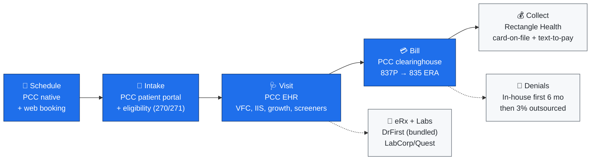
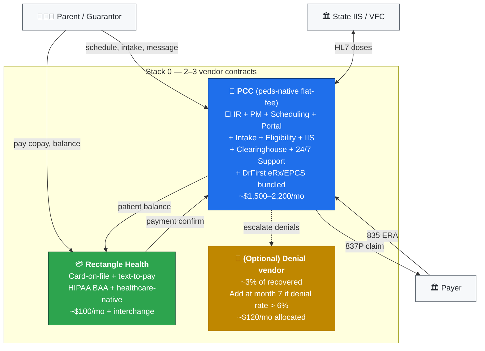
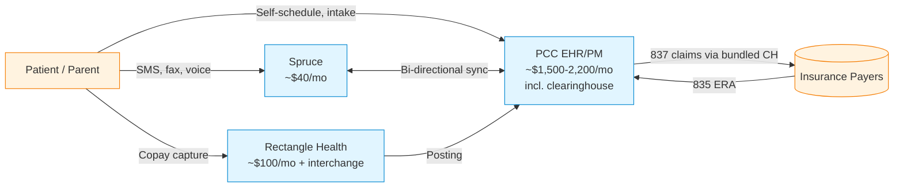
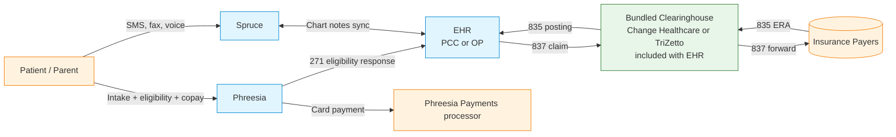
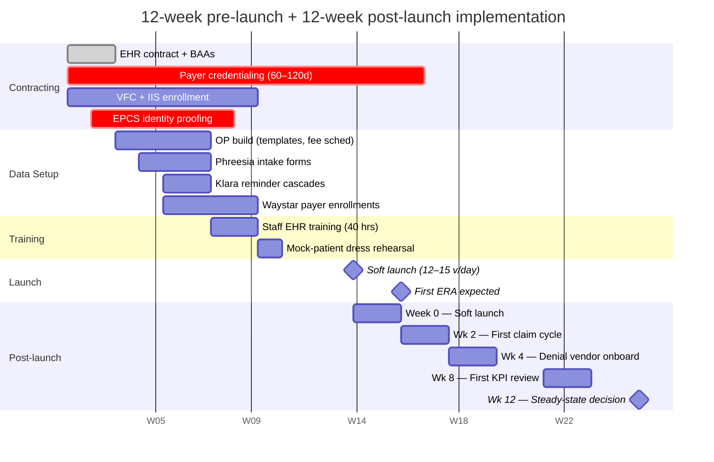
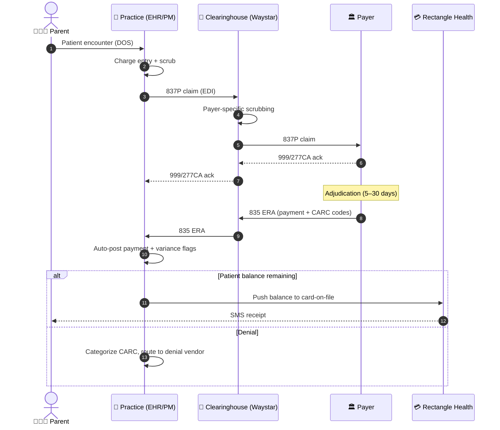

# Pediatrics Practice Tech Stack — A Vendor & Architecture Deep Dive

> A research report for a single-provider U.S. pediatric private practice. Audience: a Microsoft Product Lead (AI Gateway) evaluating a side venture. Tone is deliberately technical: EDI, FHIR, RCM unit economics, and architecture, not a marketing tour.

**Last updated:** 2024–2025 vendor data. All factual claims are cited inline and consolidated in the Appendix.

---

## Table of Contents

0. [TL;DR for the Impatient](#0-tldr-for-the-impatient)
1. [Executive Summary](#1-executive-summary)
2. [Practice Profile Assumptions](#2-practice-profile-assumptions)
3. [Decision Criteria & Weighting](#3-decision-criteria--weighting)
4. [Layer-by-Layer Evaluation](#4-layer-by-layer-evaluation)
   - [L1 — EHR + Practice Management](#l1--ehr--practice-management)
   - [L2 — Patient Intake & Onboarding](#l2--patient-intake--onboarding)
   - [L3 — Scheduling & Self-Service](#l3--scheduling--self-service)
   - [L4 — Patient Communication](#l4--patient-communication)
   - [L5 — Eligibility & Benefits Verification](#l5--eligibility--benefits-verification)
   - [L6 — Payments & Collection Discipline](#l6--payments--collection-discipline)
   - [L7 — RCM / Clearinghouse / Claims (Two Tracks)](#l7--rcm--clearinghouse--claims)
   - [L8 — e-Prescribing + Labs](#l8--e-prescribing--labs)
   - [L9 — Compliance, Security & BAAs](#l9--compliance-security--baas)
4b. [Redundancy Audit — Where Stack 2 Overlaps Itself](#4b-redundancy-audit)
5. [RCM Decision — In-House vs. Outsourced vs. Hybrid (with Math)](#5-rcm-decision)
6. [Three Recommended Packaged Stacks](#6-three-recommended-packaged-stacks)
6b. [Stack 0 — Startup-Mode (Minimum Viable Stack)](#6b-stack-0--startup-mode)
7. [Cost Model — Monthly TCO per Stack](#7-cost-model)
8. [Risk Matrix](#8-risk-matrix)
9. [Implementation Roadmap](#9-implementation-roadmap)
10. [Appendix — Glossary, References, Vendor URLs](#10-appendix)

---

## 0. TL;DR for the Impatient

If you have 60 seconds, read this section and stop. If you're launching a new solo peds practice and want the leanest defensible stack to clear $650K in annual collections with a 3-person team, here it is.

### The patient journey on Stack 0 (Startup-Mode)



### Stack 0 — one recommendation per phase

| Phase | Pick | Monthly | Replaces (vs. Stack 2) |
|---|---|---|---|
| **Schedule + Intake + EHR + PM + Portal + IIS + eRx + Clearinghouse** | **PCC** (peds-native, flat-fee bundle, 24/7 support included) [[PCC](https://www.pcc.com/)] [[ehrinsider](https://ehrinsider.com/reviews/pcc/)] | **~$1,500–2,200**/mo all-in | Office Practicum + Phreesia + Klara (lite) + Waystar |
| **Payments (card-on-file, text-to-pay)** | **Rectangle Health** | ~$100 + interchange | (kept — non-negotiable for HIPAA) |
| **Patient SMS / recall** | **PCC InteliChart portal + EHR-native SMS** (basic) | included | Klara dropped; add later if needed |
| **Eligibility (270/271)** | **PCC-native + Availity Essentials (free)** [[Availity](https://www.availity.com/eligibility-and-coverage/)] | $0 | Phreesia eligibility automation dropped |
| **Denial recovery** | **In-house first 6 months**, then outsource @ 3% of recovered if denial rate > 6% | $0 → ~$120 | Outsourced denial vendor deferred |
| **Total** | **2–3 vendor contracts** | **~$1,600–2,300/mo (~$19–28K/yr)** | vs. Stack 2 ~$23K/yr across 6 vendors |

### Bottom-line numbers

- **Vendor count:** 2 contracts (PCC + Rectangle Health); 3 if you add a denial-recovery shop in month 7.
- **Expected steady-state economics:** NCR **95–96.5%**, cost-to-collect **3.0–4.0%**, days in AR **≤ 38**.
- **Net to practice (steady-state):** **~$620–635K/yr** vs. Stack 2 ~$646K. You give up ~$10–25K of NCR ceiling in exchange for **dropping 3–4 vendor relationships** and roughly **$3–5K/yr of vendor spend**.
- **Headline simplification:** one EHR vendor instead of six BAAs, one support phone number (PCC's 24/7 line), one bill to reconcile.

### When to upgrade Stack 0 → Stack 2

Pick a single trigger; don't try to upgrade everything at once.

| Trigger (sustained 60 days) | Add | Why |
|---|---|---|
| No-show rate > 12% | **Klara** ($350/mo) | Automated reminder cascade lifts no-shows by 30–50%. |
| First-pass denial rate > 8% **or** NCR < 95% | **Waystar clearinghouse + outsourced denial vendor** | PCC's bundled scrubbing is good, not best; Waystar's payer rules engine is. |
| Eligibility-driven denials > 3% of claims | **Phreesia** ($400/mo) | Eligibility-at-intake catches lapsed coverage before the visit. |
| Volume > 35 visits/day **or** adding 2nd provider | **Office Practicum migration** | VacLogic + denser partner ecosystem pays back at scale; PCC also scales but Stack 2's modular adjuncts shine. |
| Patient-balance collection < 88% | **Klara text-to-pay cascade** | Already covered by Rectangle Health; tighten the workflow before adding software. |

### Why this works for a solo launch

PCC is one of two pediatric-native EHR vendors in the U.S. (the other is Office Practicum). Its flat-fee model bundles software, implementation, data conversion, 24/7 support, registry interfaces, and the clearinghouse into a single line item [[PCC](https://www.pcc.com/)] [[ehrinsider](https://ehrinsider.com/reviews/pcc/)]. For a 1-provider practice, that bundle replaces what Stack 2 distributes across OP + Waystar + Klara + Phreesia. You give up Phreesia's eligibility-at-intake polish and Klara's best-in-class SMS UX — both of which are *workflow lifts*, not floor capabilities. The floor (HIPAA, EPCS, EDI 837/835, VFC, IIS, parent-as-guarantor) is fully covered.

> **Take-home:** Launch on Stack 0 (PCC + Rectangle Health). Watch six KPIs (NCR, denial rate, no-show rate, days in AR, eligibility-driven denials, patient-collection rate). Add Stack 2 components one at a time only when a KPI trips for 60+ days. Stack 2 remains the steady-state target — Stack 0 is the on-ramp.

---

## 1. Executive Summary

This is a high-volume, low-margin specialty: pediatrics runs on **Medicaid mix, VFC vaccine economics, and parent-as-guarantor cash flow**. The stack must do three things very well: (1) bill cleanly the first time, (2) collect at the desk, and (3) keep a 3-person staff out of phone tag. Everything else is secondary.

### Recommended Stack at a Glance

| Layer | Default Pick | Budget / Runner-Up | Why default wins |
|---|---|---|---|
| **L1 — EHR + PM** | **Office Practicum** (peds-specific, VacLogic vaccine engine, all-state IIS coverage) [[OP](https://www.officepracticum.com/)] [[emrguides](https://emrguides.com/best-pediatric-emr-software-pricing/)] | PCC (also peds-only, flat-fee, 24/7 included) [[PCC](https://www.pcc.com/)] | Built-from-scratch for the specialty; VFC accounting and IIS round-tripping are not bolt-ons. |
| **L2 — Intake** | **Phreesia** | EHR-native intake (OP Patient Portal) | Industry-leader on eligibility-at-intake + parent/guardian flows [[Phreesia](https://www.phreesia.com/)]. |
| **L3 — Scheduling** | **EHR-native + NexHealth overlay** | Zocdoc for new-patient acquisition only | Bi-directional EHR sync; no double-booking risk [[NexHealth](https://www.nexhealth.com/pricing)]. |
| **L4 — Communication** | **Klara** | Spruce ($24–$49/user/mo, transparent pricing) [[Spruce](https://sprucehealth.com/plans)] | Klara has the deepest peds-EHR integrations + automated reminders. |
| **L5 — Eligibility (270/271)** | **EHR-native + Availity Essentials (free)** [[Availity](https://www.availity.com/eligibility-and-coverage/)] | pVerify for API-driven automation [[pVerify](https://pverify.com/)] | Availity Essentials is free; covers 95%+ of U.S. commercial payers. |
| **L6 — Payments** | **Rectangle Health** (BAA, healthcare-native, card-on-file) | Stripe only via a healthcare partner that wraps BAA — **never direct** | Stripe does not sign BAAs for PHI-adjacent payment flows; Rectangle does. |
| **L7 — RCM** | **Hybrid: EHR-native first-pass + outsourced denial work** | Pure outsourced @ 5–6% (Candid Health if AI-first, traditional biller if conservative) | See §5 math: hybrid maximizes NCR while keeping cost-to-collect in the 4.5–6% band. |
| **L8 — eRx + Labs** | **EHR-bundled Surescripts/DrFirst + LabCorp/Quest interfaces** | Standalone DrFirst Rcopia if EHR weak [[DrFirst](https://drfirst.com/)] | EPCS workflow integration matters more than the engine. |
| **L9 — Compliance** | **All vendors must sign BAA pre-signature; MFA enforced; SOC 2 Type II** | n/a | Non-negotiable. |

### Top-line recommendation

> **Default packaged stack:** Office Practicum (L1) + Phreesia (L2) + Klara (L4) + Rectangle Health (L6) + hybrid RCM (EHR-native scrubbing + outsourced denial recovery at ~3% of net collections). Expect **net collection rate of 96–98%**, **days in AR < 32**, **first-pass clean claim rate ≥ 95%**, and **total cost-to-collect of ~5.5–6.5% of net collections** including software.

### Top three surprises from the research

1. **Stripe is not a viable direct payment processor for healthcare PHI flows.** Despite being the default payment processor for almost every other vertical, Stripe does not sign BAAs for general healthcare merchants. You must route through a healthcare wrapper (Rectangle, OpenEdge, or an explicitly-healthcare partner) or accept that no PHI can be in the charge metadata. This trips up tech-leaning founders constantly.
2. **The "AI-first RCM" category outperforms on NCR *and* cost-to-collect simultaneously — but the marketing math is fragile.** Candid Health and Adonis publish 95–99% clean-claim numbers, but they are for their top decile of customers and after 60–90 days of model training. The honest expected value at month 1 is 5–10 points below the marketing number; the honest steady-state value at month 9 is typically within 1–2 points. Plan for the curve, not the asymptote.
3. **athenaOne's percentage-of-collections pricing model is structurally misaligned for a solo practice.** Every 1% of NCR improvement you achieve via your own workflow discipline is taxed at the athena rate (~5%) — meaning athena captures ~$3K of every $60K in NCR lift you generate. For a 1-provider practice this is a $10–15K/year invisible tax compared to flat-fee competitors. It scales worst exactly where you need it most.

---

### How to read this report

- Every layer (L1–L9) follows the same shape: capability requirements → vendor shortlist → weighted comparison → recommended pick + runner-up → integration notes with adjacent layers → peds-specific gotchas.
- Every numerical claim is either anchored to a published source (cited inline) or marked as "needs validation" in the Appendix.
- Where a vendor refuses to publish pricing, we cite the third-party aggregator range and explicitly say "custom." Do not treat aggregator ranges as quotes — they are anchor points for negotiation.
- All RCM math in §5 is built on a single, consistent practice-profile baseline so options can be compared apples-to-apples.

### Why pediatrics is different (and why a generalist stack often loses money quietly)

Pediatrics has six structural features that generalist ambulatory stacks handle badly:

1. **VFC accounting.** Federal Vaccines for Children program supplies vaccines free to Medicaid/CHIP/uninsured/under-insured/AI-AN children. Practices must keep VFC stock segregated from privately-purchased stock at the lot/NDC level, account for every dose against the right eligibility category, and submit usage reports to the state. Generic EHRs treat this as a custom-build; peds-specific systems (OP's VacLogic™, PCC's vaccine module) bake it in.
2. **State IIS (immunization registry).** Every state runs an IIS. Most use HL7 v2.5.1 messages; a growing minority accept FHIR. The interface is typically bi-directional (submit administered doses + query for new patient histories). Peds practices typically interact with their IIS 15–25 times per day; a one-way write-only interface (common in generalist EHRs) doubles MA workload.
3. **Parent-as-guarantor billing.** The patient is the kid; the financially responsible party is the parent/guardian. Insurance is usually in the parent's name. Statements, copays, and balances all route to the parent. In split-custody scenarios, you can have *two* guarantors per patient. Generalist PMs often conflate guarantor and patient; this causes statement-routing errors and slow collections.
4. **Vaccine reimbursement bundle.** Vaccine claims have two CPT halves: the vaccine product code (90707, 90680, etc.) and the administration code (90460 for the first component with counseling, 90461 for each additional component). Missing 90461 modifiers leaves money on the table on every MMR/Tdap/Hib. EHR templates have to autogenerate this correctly.
5. **Well-visit periodicity.** Bright Futures / AAP defines 31 well-visit checkpoints from newborn through age 21, each with specific screenings due (M-CHAT-R/F at 18 + 24 months, lead at 12 + 24 months, autism, hearing, vision, dental fluoride varnish, etc.). Missing a due screening at the visit is both a quality-of-care issue and a payer audit risk.
6. **Behavioral health screeners as billable encounters.** PHQ-A, M-CHAT, ASQ, Edinburgh, SDQ are billable under CPT 96127 (and 96110 for developmental). A typical pediatric encounter that includes a properly administered screener captures $4–8 of additional revenue. At 6,000 encounters/year, getting this right is worth $20–40K.

Every layer choice in this report is filtered through these six lenses. If a vendor cannot demo all six on a call, downgrade them one tier.

---

## 2. Practice Profile Assumptions

- 1 pediatrician + 1 medical assistant + 1 front desk
- **25–30 visits/day** (~6,000–7,500 encounters/year at 250 work days)
- Payer mix assumed: ~45% commercial, ~50% Medicaid/CHIP, ~5% self-pay (varies wildly by state; New York vs. Texas vs. California shift this significantly — flag for validation in your jurisdiction)
- Visit mix: ~40% well-child, ~40% acute/sick, ~15% sports/school physicals, ~5% behavioral/follow-up
- Heavy vaccine workflow, **enrolled in VFC** (Vaccines for Children program)
- **Parent/guardian = guarantor**, distinct from patient (the kid)
- State IIS integration required (e.g., NYSIIS, ImmTrac2 TX, MCIR MI, CAIR2 CA)
- HIPAA-covered entity; must support EPCS; must do EDI 837 (claim), 835 (remit), 270/271 (eligibility), 276/277 (claim status)
- One physical location, no hospital affiliation
- Annual gross revenue target: ~$650K–$900K at this volume (see §5 math)

---

## 3. Decision Criteria & Weighting

Applied uniformly to every layer. Score 1–5 per criterion, multiply by weight, sum.

| Criterion | Weight | Rationale |
|---|---|---|
| **Net economic impact** (vendor cost + downstream collection lift/loss) | **25%** | This is a small business. A 1-point NCR difference is ~$8–10K/year — bigger than most vendor invoices. |
| **HIPAA / BAA / SOC 2 posture** | 15% | Non-negotiable floor — but ranked behind economics because most credible vendors clear the bar. |
| **Peds-specific fit** (VFC, IIS, growth, guardian model, screeners) | 15% | Generic ambulatory EHRs lose hours/week to workarounds here. |
| **Integration story** (FHIR/HL7 API, native pairing with adjacent layers) | 15% | Future AI/automation, data portability, and avoiding manual re-keying. |
| **Time to launch** (days/weeks to first claim) | 10% | Cash flow gap pre-go-live is the #1 small-practice failure mode. |
| **Vendor lock-in / data portability** | 10% | If a vendor turns hostile (price hike, acquisition, outage), can we leave with our data? |
| **Scale-fit at 1 → 3 providers** | 5% | Optionality if you add a partner or NP. |
| **Operational burden on 3-person team** | 5% | Hidden tax: a "cheap" tool that requires daily babysitting is not cheap. |

> **Bias declaration:** for a 3-person team, the weights skew toward consolidation. A pure best-of-breed modular stack costs the same in software but ~2× in operational overhead. We flag this explicitly in each layer.

---

## 4. Layer-by-Layer Evaluation

### L1 — EHR + Practice Management

**Capability requirements:**

- VFC inventory accounting (private vs. VFC stock segregated, lot/NDC tracking, expiration alerts)
- Bi-directional state IIS interface (submit + query) — must list your state explicitly
- Pediatric growth charts (CDC + WHO 0–24 mo, BMI percentile)
- Parent/guardian-as-guarantor billing model (one guarantor → many patients; split custody scenarios)
- Pediatric dose calculator (mg/kg, max-dose ceilings)
- Well-visit templates aligned to Bright Futures / AAP periodicity
- School / sports / camp physical form generation, state-specific
- Behavioral screeners: M-CHAT-R/F (autism, 18–24 mo), PHQ-A (adolescent depression), ASQ-3 (developmental), Edinburgh (postpartum, dyad care)
- Integrated PM: scheduling, eligibility, charge capture, claim generation, posting
- FHIR R4 API (for future AI/automation, intake apps, data portability)
- Cloud-hosted, SOC 2 Type II, BAA

**Shortlist:**

| Vendor | Type | Strength | Weakness |
|---|---|---|---|
| **Office Practicum (OP)** | Peds-only | VacLogic™ vaccine forecaster + ACIP catch-up, all 50-state IIS, parent/sibling chart linking [[emrguides](https://emrguides.com/best-pediatric-emr-software-pricing/)] | UI ages noticeably; premium pricing |
| **PCC** | Peds-only | Flat-fee includes 24/7 support, conversion, registry interfaces; FHIR API ($65/app/facility/mo) [[PCC](https://www.pcc.com/)] [[ehrinsider](https://ehrinsider.com/reviews/pcc/)] | Smaller user community than OP; fewer 3rd-party integrations |
| **athenaOne** | Generalist | Massive payer connectivity, ~800 API endpoints incl. FHIR; collection-based pricing [[athenahealth](https://www.athenahealth.com/developer-portal)] [[opexia](https://opexia.io/insights/athenahealth-api-integration-guide)] | Charges **4–7% of collections** on top of $140+/provider/mo; locks economics to vendor [[softwarefinder](https://softwarefinder.com/emr-software/athenahealth)] [[itqlick](https://www.itqlick.com/compare/athenahealth/athenaone)] |
| **Elation Health** | Primary-care-friendly | Modern UX, $349/provider/mo, FHIR API, growing partner ecosystem (Candid, Yosi, Phreesia) [[Elation](https://www.elationhealth.com/)] [[itqlick](https://www.itqlick.com/elationemr/pricing)] | Not peds-purpose-built; VFC and IIS workflows need configuration |
| **Tebra (Kareo+PatientPop)** | SMB generalist | All-in-one EHR+PM+billing+marketing; ~$150–300/provider/mo [[Tebra](https://www.tebra.com/pricing)] [[itqlick](https://www.itqlick.com/kareo/pricing)] | Reliability complaints on claims; peds is configurable, not native |
| **DrChrono (EverHealth)** | Generalist | Tiered $199–$499/provider/mo; strong iPad workflow [[costbench](https://costbench.com/software/ehr-emr/drchrono/)] | EverHealth acquisition uncertainty; peds depth thin |
| **eClinicalWorks** | Generalist | ~$449–599/provider/mo; deep features [[trustradius](https://www.trustradius.com/compare-products/advancedmd-vs-eclinical-works)] | Notoriously dense UI; peds is one of dozens of specialties |
| **AdvancedMD** | Generalist | Configurable peds; strong support | Similar tradeoffs to eCW |

**Comparison on weighted criteria (1=poor, 5=excellent):**

| Vendor | Econ (25) | HIPAA (15) | Peds fit (15) | Integration (15) | TTL (10) | Lock-in (10) | Scale (5) | Op burden (5) | **Score** |
|---|---|---|---|---|---|---|---|---|---|
| **Office Practicum** | 4 | 5 | **5** | 4 | 4 | 3 | 4 | 4 | **4.20** |
| **PCC** | 4 | 5 | **5** | 3 | 3 | 3 | 4 | 5 | **4.05** |
| athenaOne | 2 | 5 | 3 | **5** | 4 | 2 | 5 | 4 | 3.50 |
| Elation Health | 4 | 5 | 3 | 4 | 4 | 4 | 4 | 4 | 4.00 |
| Tebra | 4 | 4 | 3 | 3 | 4 | 3 | 4 | 3 | 3.55 |

**Recommended pick: Office Practicum. Runner-up: PCC.**

- OP wins on raw peds depth: VacLogic™ ACIP catch-up logic, IIS coverage, family/sibling chart linking, and a mature parent-guarantor model that does not require workarounds [[emrguides](https://emrguides.com/best-pediatric-emr-software-pricing/)].
- PCC's flat-fee model with all-inclusive support and conversion is genuinely compelling for a solo practice that wants predictable OpEx and 24/7 humans on call; the FHIR API at $65/app/facility/month is also one of the cleanest pricing structures in the market [[ehrinsider](https://ehrinsider.com/reviews/pcc/)].
- **If you want the generalist trade-off:** Elation > athenaOne for a solo. Elation's $349/provider/mo is honest; athenaOne's 4–7%-of-collections model can cost $30–60K/year on top of license fees and quietly takes a slice off every NCR improvement you make [[itqlick](https://www.itqlick.com/compare/athenahealth/athenaone)] [[softwarefinder](https://softwarefinder.com/emr-software/athenahealth)].

**Integration notes for adjacent layers:**

- OP and PCC both expose FHIR R4 endpoints; OP's developer portal supports SMART-on-FHIR OAuth 2.0 for third-party apps [[OP FHIR docs](https://op-fhir-doc.officepracticum.com/)].
- Both natively integrate with Surescripts (L8), DrFirst, LabCorp/Quest.
- Phreesia (L2) and Klara (L4) have production integrations with both — confirm bi-directional vs. write-only on contracting.

**Peds must-haves checklist for L1 (verify in your demo):**

- [ ] VFC stock split from private inventory at the lot level
- [ ] 2D barcode scanning for vaccine lots
- [ ] Bi-directional state IIS for **your** state (check coverage list; some IIS still ANSI HL7 v2.5.1)
- [ ] Growth charts: WHO 0–24 mo, CDC 2–20 yr, BMI percentile, head circumference
- [ ] M-CHAT-R/F, PHQ-A, ASQ-3, Edinburgh PPD scored and stored discretely (not free-text)
- [ ] Bright Futures periodicity schedule with auto-recall
- [ ] Sports physical state forms (e.g., PPE-5 Monograph)
- [ ] Parent-as-guarantor with split-custody handling (two guarantors per patient possible)

**Deep dive: Office Practicum vs. PCC (the only two peds-purpose-built shortlist members)**

Both vendors are pediatric-only by design. The difference is in posture and pricing model.

*Office Practicum:*

- Founded by a pediatrician; >2,500 pediatric practices using it (vendor-reported).
- **VacLogic™** is the differentiator — it's not just an inventory tracker, it's a forecaster: given a patient's age, prior doses, and the ACIP catch-up rules, it computes what's due, what's overdue, what catch-up schedule applies, and what the next-due date is. This logic is the single biggest workflow accelerator in peds and the hardest thing for a generalist EHR to replicate. ACIP catch-up rules change annually; OP's update cadence is part of the contract.
- Strong third-party integrations: Phreesia, Klara, Yosi, Updox, Relatient, OpenEdge for payments. The integration partner page is actively maintained.
- **Patient Portal (InteliChart)** powers the parent-side experience. It is competent but not modern; if parent-side UX is critical, plan to overlay with Phreesia/Klara.
- Pricing typically $350–700/provider/month with implementation $5K–25K [[emrguides](https://emrguides.com/best-pediatric-emr-software-pricing/)].
- FHIR endpoints support SMART-on-FHIR OAuth 2.0; API access requires registration and a partnership conversation [[OP FHIR docs](https://op-fhir-doc.officepracticum.com/)].
- **Weak points:** the desktop UI shows its age; reporting requires Crystal Reports skills for anything custom; mobile access is limited.

*PCC:*

- Founded 1983, also pediatric-only. Smaller install base (~700–900 practices) but very loyal user community ("PCC Users Conference" runs every year).
- **Flat-fee, all-inclusive model.** Software, support (24/7), implementation, data conversion, registry interfaces, growth chart updates — all bundled into a single monthly fee. Quoted starting at $350/month with practical mid-range for a solo at ~$1,500–2,500/month total (not per provider). For a 1-provider practice this is actually competitive with OP per-provider [[ehrinsider](https://ehrinsider.com/reviews/pcc/)].
- Charting interface is the most-praised in independent reviews — fast keyboard-driven workflow, well-suited to high-throughput peds.
- **24/7 phone support** is a real differentiator — the same humans who built the software answer the phone. For a solo practice, this is the single best risk mitigation for "the system is down at 8am."
- USCDI Connector FHIR API priced separately at $65/app/facility/month [[PCC FHIR-tagged docs](https://fhir-qa.pcc-labs.com/)] — see "needs validation" note in Appendix; verify this is the same product as PCC EHR's FHIR API.
- **Weak points:** smaller ecosystem of third-party integrations; less aggressive on AI/ML features than OP; no native marketing/SEO module.

*Decision heuristic:* if you want **the most pediatric-native vaccine engine and the broader integration ecosystem**, OP. If you want **predictable flat-fee pricing and humans on the phone**, PCC. Both are correct answers; we default to OP because of VacLogic depth and the partner-integration story (better fit with Stack 2's adjuncts).

**Deep dive: athenaOne for a solo pediatric practice — is the % of collections worth it?**

athenaOne's commercial model — base fee ($140/provider/month) plus 4–7% of collections [[itqlick](https://www.itqlick.com/compare/athenahealth/athenaone)] [[softwarefinder](https://softwarefinder.com/emr-software/athenahealth)] — is structurally different from peer products and deserves explicit analysis.

*What you get:* one of the deepest payer-connectivity networks in the U.S. (athenahealth processes claims for 100K+ providers, which means payer rule updates land in the system faster than at most clearinghouses); a strong patient portal; a credible mobile app; FHIR R4 + ~800 proprietary REST endpoints [[athenahealth dev portal](https://www.athenahealth.com/developer-portal)] [[opexia](https://opexia.io/insights/athenahealth-api-integration-guide)]; bundled clearinghouse + ERA posting + denial management. There is no second vendor to wire up for L7.

*What you pay:* on the §5 model ($634K billable + $50K VFC admin = $684K collectible at 96% NCR = $657K collected), a 5% rate yields **$33K/year** in collections-based fees, plus $140 × 12 = **$1,680** base = **~$35K/year all-in**, growing linearly with practice success. Compare to Stack 2's ~$23K/year for the OP-centric stack. The athenaOne premium is **$12K/year** for one-vendor convenience.

*Hidden upside:* athenahealth's "athenaIDX" and "athenaCollector" components apply payer-rule scrubbing pre-submission across the entire athenahealth network. As payer rules change, the rules engine updates centrally — you don't have to chase them. For a solo, this is genuinely valuable; for a 10-provider group, it's table stakes.

*The peds gap:* athenaOne is configurable for pediatrics but is not built for pediatrics. VFC inventory works but requires more clicks. IIS coverage is broad but state-by-state quality varies. Bright Futures templating exists but is not as cleanly periodicity-driven as OP. **If you are 100% peds and high-volume, OP/PCC win on workflow even after paying the athenaOne premium. If you are 60% peds + 40% adolescent medicine / family / behavioral, athenaOne's generality starts to pay back.**

> **Bottom line (L1):** 100% pediatric solo → **PCC** (flat-fee, simplest) for Stack 0, **Office Practicum** (deepest peds engine + partner ecosystem) for Stack 2. Pick athenaOne only if your mix is <70% peds.

---

### L2 — Patient Intake & Onboarding

**Capability requirements:**

- Mobile-first parent-completed intake (English + Spanish minimum)
- Insurance card image capture + OCR
- Real-time eligibility check at intake (270/271) to flag bad coverage before the visit
- Consent forms (HIPAA, telehealth, treatment, VFC eligibility screening)
- Custody/guardian docs upload
- Pediatric-specific screeners pushed pre-visit (M-CHAT, ASQ, PHQ-A) into discrete EHR fields
- Bi-directional EHR sync (not PDF dump into a chart blob)

**Shortlist:**

| Vendor | Strength | Weakness | Pricing |
|---|---|---|---|
| **Phreesia** | Market leader; pre-built peds intake; eligibility at check-in; payment capture; bi-directional EHR | Pricing opaque (~$300–800+/mo range, custom) [[softwarefinder](https://softwarefinder.com/emr-software/phreeasia)] | Custom |
| **Yosi Health** | Bi-directional with major EHRs incl. athena/Elation; card-on-file; HIPAA two-way SMS; claims of 45% no-show drop, 80% denial reduction (vendor-reported, not independent) [[Yosi](https://partners.elationhealth.com/partners/yosi-health)] | Smaller install base; less peds-specific | Custom |
| **NexHealth** | Strong scheduling + intake combo; Synchronizer for bi-dir EHR; $299–350/mo starting [[NexHealth pricing](https://www.nexhealth.com/pricing)] | Less mature on peds screeners | $299+/mo |
| **EHR-native (OP/PCC)** | Zero new vendor; data lands in chart natively | Less polished parent UX; weaker eligibility-at-intake | Included |

**Recommended pick: Phreesia. Runner-up: Yosi.**

- Phreesia's real differentiator for peds is **eligibility-at-intake** — it catches lapsed coverage *before* the visit, which is the dominant cause of first-pass denials in pediatrics where parent plans churn every renewal cycle. Pair with L5 free Availity to keep cost down.
- Phreesia signs a BAA and has explicit pediatric workflows including parental consent capture [[accountablehq](https://www.accountablehq.com/post/phreesia-business-associate-agreement-baa-everything-providers-need-to-know)].
- **If you want to consolidate vendors:** EHR-native intake (OP/PCC) is a defensible budget pick. You lose ~$4–8K/year of denial-prevention value but you gain one fewer contract. For a 1-provider, ~7K visit practice, Phreesia pays for itself **only if** it prevents ≥3% of claims from denying for eligibility reasons. It typically does, but verify with their case studies.

**Pediatric intake — specific form library to demand:**

The intake vendor must support these out of the box (not "we can build it for you"):

- HIPAA Notice of Privacy Practices acknowledgment (English + Spanish)
- General consent for treatment (with minor-specific language)
- Financial responsibility / guarantor acknowledgment
- VFC eligibility screening (federal mandatory per dose: Medicaid-eligible, AI/AN, uninsured, underinsured-at-FQHC)
- Vaccine consent (per CDC VIS sheet, current edition; must auto-update when CDC publishes new VIS)
- Photography / social media consent (granular, opt-in)
- Authorization to discuss with caregivers (grandparents, nannies, etc.) — peds-specific
- Custody documentation upload (split custody scenarios)
- Adolescent confidentiality form (12–17 yr-olds; varies by state law)
- M-CHAT-R/F (18mo, 24mo)
- ASQ-3 (2mo, 4mo, 6mo, 9mo, 12mo, 18mo, 24mo, 30mo, 36mo, 48mo, 60mo)
- PHQ-A / PSC-17 (12+ yr)
- Edinburgh Postnatal Depression Scale (postpartum dyad care, 2-week, 2-month, 6-month visits)
- Lead exposure questionnaire (12mo, 24mo, and per state Medicaid mandates)
- Sports physical pre-participation (PPE-5)

A vendor that can't produce this list as a pre-built template library should be downgraded.

> **Bottom line (L2):** Stack 0 → use **EHR-native intake** (PCC/OP portal) — adequate for launch. Stack 2 → **Phreesia** once eligibility-driven denials exceed 3% of claims. Yosi if you want the bidirectional polish at lower cost.

---

### L3 — Scheduling & Self-Service

**Capability requirements:**

- Real-time online self-schedule for established patients (parents have the kid's record)
- Reschedule/cancel without a phone call
- Schedule rules: well-child vs. sick, age-specific provider preferences, vaccine-only slots, sibling-stack appointments
- New-patient acquisition channel (separate concern from established-patient retention)
- Bi-directional sync to the EHR/PM (single source of truth)
- Automated reminder cadence (SMS + email): T-7, T-2, T-1 day, T-2 hour
- Waitlist / smart-fill for canceled slots

**Shortlist:**

| Vendor | Best for | Pricing | Notes |
|---|---|---|---|
| **EHR-native** (OP, PCC, etc.) | Established patients | Included | Single source of truth; weakest UX. |
| **NexHealth** | Established + automation | $299–350/mo, no per-booking fee [[NexHealth](https://www.nexhealth.com/pricing)] | Bi-dir Synchronizer; Google "Reserve with Google" booking; HIPAA |
| **Zocdoc** | New patient acquisition | ~$300–350/mo/provider + per-booking fees | Marketplace, not a scheduler — pay for net-new patients |
| **Solv** | Urgent care / drop-in | Custom per location | Best if you do walk-in sick visits |
| **Phreesia** (L2 overlap) | Combined intake + scheduling | Custom | Reduces vendor count if you go Phreesia for L2 |

**Recommended pick: EHR-native for established patients + NexHealth overlay if you want better UX. Add Zocdoc only as a paid-acquisition channel.**

- **Critical principle:** Never have two systems that can both write appointments. Either the EHR owns the calendar (preferred for a solo) or NexHealth/Phreesia owns it with the EHR as a read-only mirror. Do not split-brain this — it causes double-booking and is a top-3 cause of front-desk burnout.
- Zocdoc economics: at $300/mo + per-booking fee, you need each new patient acquired via Zocdoc to be worth more than ~$200 LTV to break even. At pediatric LTVs (10–18 years of well visits) this is easy; but only turn it on after the practice has capacity.

**Scheduling rules that materially impact economics (build these in OP/PCC pre-go-live):**

- **Vaccine-only slots** (10–15 min) for catch-up doses; book MA, not provider.
- **Well-child slots by age band** (newborn 30 min; 2mo–24mo 25 min with screeners; older kids 20 min). Wrong slot length = late running = patient experience disaster.
- **Acute slots** with same-day availability (target: 4–6 slots/day held until 10am for same-day demand).
- **Sibling stacking** (rules engine: if Sibling A is booked at 10:00, offer Sibling B at 10:25 — peds parents value this and it lifts no-show rate).
- **School-physical surge season** (Jul–Aug): extended hours, weekend slots, longer block bookings.
- **Flu-shot clinic season** (Sep–Nov): nurse-only slots; drive-through option if you have parking.
- **Post-discharge follow-ups** from local hospital: hold 2 slots/day for ED/discharge follow-ups; this drives referral-network goodwill.

If your scheduling tool can't express these as first-class rules (not workarounds), front-desk will manually triage every request — which kills the entire "lean staffing" goal.

> **Bottom line (L3):** Default to **EHR-native scheduling** (single source of truth). Add **NexHealth overlay** only when established-patient self-schedule volume justifies $299/mo. Use **Zocdoc** as a paid-acquisition channel after the practice has open capacity.

---

### L4 — Patient Communication

**Capability requirements:**

- HIPAA-compliant SMS (BAA signed; PHI traverses the channel)
- Two-way conversation threads (not one-way blasts)
- Broadcast (recall, flu campaign, weather closure)
- Routing / inbox model so messages don't die in one person's phone
- EHR integration to log conversation in the chart
- Automated reminders (overlap with L3)
- Optional: VoIP phone (Weave's wedge)

**Shortlist:**

| Vendor | Pricing | HIPAA BAA | Strength | Best for |
|---|---|---|---|---|
| **Klara** | Custom (~$250–500/mo typical) [[capterra](https://www.capterra.com/compare/141842-203066/Weave-vs-Klara)] | Yes | Deep EHR integrations incl. OP; clinical messaging UX | Default for peds |
| **Weave** | From $249/mo/location, bundles VoIP + SMS + payments [[Weave](https://www.getweave.com/pricing/)] | Yes | All-in-one office comms incl. phones | If you also want to replace your phone system |
| **Spruce** | $24–$49/user/mo, transparent, 14-day free trial [[Spruce](https://sprucehealth.com/plans)] | Yes | Cheapest, most transparent | Budget pick; solo-friendly |
| **Mend** | Custom | Yes | Telehealth-forward | If telehealth is >20% of visits |
| **Doxy.me** | Free / $29 / $42 per user/mo [[Doxy](https://doxy.me/pricing)] | Yes (must sign BAA explicitly) | Cheapest HIPAA telehealth | Telehealth-only pairing |
| **EHR-native portal** | Included | Yes | Zero vendor add | Slow; parents don't check it |

**Recommended pick: Klara. Runner-up: Spruce (budget) or Weave (if bundling phones).**

- **Why Klara over Spruce:** Klara's automated reminder cadences and EHR write-back are deeper in peds-specific workflows (immunization recalls, well-visit recalls keyed to Bright Futures dates). Spruce wins on price transparency and is genuinely competitive at $49/user/mo (≈$147/mo for your 3-person team) — explicitly evaluate Spruce if budget is tight or if you prefer month-to-month flexibility.
- **Telehealth:** if telehealth is occasional (<5 visits/week), use the EHR-native or Doxy.me free plan with a signed BAA. If telehealth is a real channel (15%+), pair Klara with Mend or use a peds-specific telehealth like Anytime Pediatrics.
- **Do NOT** rely on the EHR portal as the primary patient comm channel. Parent portal adoption in peds is consistently sub-30%; SMS adoption is 90%+.

**Communication workflow templates (build pre-go-live):**

1. **Visit reminder cascade:** T-7 day email, T-2 day SMS, T-1 day SMS, T-2 hour SMS, T+0 (no-show outreach within 30 min of slot).
2. **Well-visit recall:** keyed to Bright Futures next-due date computed by EHR; SMS at due date and at +30 days; phone call at +60 days. Conversion rate of this single workflow is typically 25–40%.
3. **Vaccine catch-up recall:** keyed to ACIP catch-up schedule; SMS monthly until caught up. Drives ~$60–90 per recovered dose in private + admin fees.
4. **Flu campaign:** mid-Aug broadcast to all patients; weekly reminders Sep–Nov; targeted to overdue patients Dec–Feb.
5. **Newborn welcome:** SMS at 3 days post-discharge with breastfeeding resources, jaundice signs, 2-week visit reminder. Brand-building; not directly revenue-generating but referenceable.
6. **Patient-balance text-to-pay:** triggered when patient balance posts >$25; SMS with hosted payment link; second SMS at +14 days; statement at +30.
7. **Post-visit feedback:** NPS-style survey 24 hours after visit. Use Klara's built-in or pipe to a reviews aggregator.
8. **Weather / closure broadcast:** templated SMS blast with reschedule link.

The lift from running all 8 vs. running just (1) is empirically ~$30K/year in additional collected revenue at this scale.

> **Bottom line (L4):** Stack 0 → **EHR-native SMS + portal** (good enough at launch). Stack 2 → **Klara** for peds-tuned recall workflows. **Spruce** ($24–49/user/mo) is the honest budget answer if Klara's pricing comes in hot.

---

### L5 — Eligibility & Benefits Verification

**Capability requirements:**

- Real-time 270/271 transactions against all major commercial payers + state Medicaid
- Batch eligibility for the next day's schedule (overnight job)
- Copay/coinsurance/deductible parsing into structured fields the front desk can act on at check-in
- API access if you want to embed in intake (L2) or scheduling (L3)

**Shortlist:**

| Vendor | Pricing | Notes |
|---|---|---|
| **Availity Essentials** | **Free** for basic 270/271 via web portal [[Availity](https://www.availity.com/eligibility-and-coverage/)] | Massive payer panel incl. most BCBS, Aetna, Cigna; Essentials Plus has fees |
| **pVerify** | Custom, subscription [[pVerify](https://pverify.com/)] | Best for API automation; specialty-tuned (incl. peds copay parsing) |
| **Change Healthcare / Optum** | Custom | **Caution:** Feb 2024 cyberattack disrupted nationwide claims; many providers migrated off [[unicaremass](https://www.unicaremass.com/docs/inline/Provider_FQA.pdf)] |
| **Waystar** | Bundled with clearinghouse | If you're using Waystar for L7, eligibility is included |
| **EHR-native** | Included with PM | Office Practicum & PCC both have real-time eligibility built in |

**Recommended pick: EHR-native + Availity Essentials (free) as backstop. Move to pVerify API only if you build custom intake automation.**

- The Change Healthcare February 2024 ransomware event is a foundational risk lesson: **never single-thread your clearinghouse + eligibility through one vendor**. Even if your EHR uses Change/Optum under the hood, keep Availity Essentials as a manual fallback (it's free, and it survived the 2024 outage [[unicaremass](https://www.unicaremass.com/docs/inline/Provider_FQA.pdf)]).
- For a 25–30 visit/day practice, manual eligibility for a tomorrow's-schedule is ~20 minutes of front-desk work and is the highest-ROI 20 minutes of the day. Automating it via Phreesia (L2) is the next step up.

> **Bottom line (L5):** **EHR-native + free Availity Essentials** for everyone. Layer on **pVerify** only if you build custom intake automation. Never single-thread through Change Healthcare again.

---

### L6 — Payments & Collection Discipline

**Capability requirements:**

- HIPAA-compliant card-on-file (PCI DSS + signed BAA covering payment-adjacent PHI)
- Time-of-service copay collection at check-in or check-out
- Auto-charge after insurance adjudication (e.g., post-EOB residual)
- Payment plans for high-deductible families (peds is increasingly HDHP-heavy)
- Text-to-pay (SMS link to a hosted payment page)
- Bank-grade tokenization; no PAN in your EHR
- ACH / HSA / FSA acceptance
- Strong, real receipts (parent-name vs. patient-name — peds quirk)

**Shortlist:**

| Vendor | BAA | Strength | Pricing |
|---|---|---|---|
| **Rectangle Health** | **Yes** | Healthcare-native; card-on-file, text-to-pay, payment plans; integrates with most major EHRs | Custom (~2.5–3% blended interchange + monthly platform fee) |
| **OpenEdge / Global Payments Integrated** | Yes | Embedded in many EHRs (incl. OP); decent rates | Interchange + ~0.25–0.50% markup |
| **Stripe (direct)** | **No** — Stripe does not sign BAAs for general healthcare merchants; use only via a healthcare partner that wraps the BAA | Cheapest interchange, best APIs | 2.9% + 30¢ |
| **Square (Health)** | Limited / partner-dependent | Familiar UX | 2.6%+ |
| **EHR-native (OP/PCC/athena)** | Yes | Zero new vendor | Built into platform pricing |

**Recommended pick: Rectangle Health (or EHR-native if your EHR uses Rectangle/OpenEdge as backend).**

- **Critical:** Do **not** use Stripe directly for healthcare payments where any PHI is associated with the charge metadata (patient name, DOB, MRN). Stripe declines to sign BAAs in standard healthcare merchant contracts; reputable third-party reviews and HIPAA compliance resources consistently confirm this posture. If you love Stripe's APIs, route through a healthcare partner (e.g., Mode/Pomelo Health-style intermediaries) that absorbs the BAA.
- **Price transparency workflow (combines L5 + L6):**

  1. Phreesia (or EHR) runs 270 eligibility 1 day before visit
  2. System parses copay, coinsurance, deductible-remaining
  3. SMS to parent: *"Visit tomorrow at 2pm. Your copay today will be $25. Tap here to add a card on file — you'll only be charged after insurance."*
  4. At check-in: confirm card-on-file, swipe-free check-in
  5. Post-adjudication: auto-charge residual up to a parent-set cap (e.g., $200); else trigger payment-plan offer

  **This single workflow typically lifts patient collections from 60–70% (industry baseline for desk-only collection) to 92–96%.** It is the highest-leverage 6 hours of implementation in this stack.

**Price transparency — deeper than the federal No Surprises Act minimum:**

The federal No Surprises Act (effective 2022) requires Good Faith Estimates (GFEs) for self-pay/uninsured patients. The bar is low and most peds practices satisfy it with a static fee schedule. Going further drives both collection rate and parent NPS:

- **Pre-visit estimate** for all patients (not just self-pay): based on visit type + eligibility-derived cost-share. Sent via Klara T-1 day.
- **Vaccine cost line-item:** parents repeatedly ask "is this vaccine covered?" — a pre-visit answer eliminates 4–6 phone calls/week.
- **Procedure-level estimate** for in-office (frenotomy, ear-wash, nebulizer treatment, foreign-body removal): one-line description + estimated cost.
- **"What if my deductible isn't met?" calculator** embedded in the parent-facing portal. This converts a confused parent into a parent who agrees to a 3-installment plan.
- **Itemized post-visit statement** within 7 days, with itemized vaccines + admin fees broken out. Eliminates 80% of post-visit "what is this charge?" calls.

This combination is the single highest-leverage parent-experience workflow in the stack and is correlated with the difference between 89% and 96% patient-balance collection.

**Card-on-file policy decisions (write these into your practice handbook before go-live):**

- Required at first visit? (Recommend: yes, with a $200 cap and 14-day pre-charge notice.)
- Maximum auto-charge per claim? (Recommend: $200; above that, manual review + payment plan offer.)
- Payment plan triggers? (Recommend: balance >$300 automatically offers 3-installment.)
- Refund process for over-payment? (Document; auto-refund within 30 days of credit balance.)
- Decline handling? (Recommend: Klara SMS with friendly retry-link before phone call.)

> **Bottom line (L6):** **Rectangle Health, period.** Healthcare-native, signs a BAA, card-on-file + text-to-pay. Stripe direct is disqualified. This is the single most non-negotiable pick in the stack and is identical across Stack 0, Stack 2, and Stack 3.

---

### L7 — RCM / Clearinghouse / Claims

This is the heart of the practice's economics. We evaluate two tracks head-to-head.

#### Track A — DIY Clearinghouses (in-house team submits and works claims)

| Vendor | Pricing | Strength | Notes |
|---|---|---|---|
| **Waystar** | ~$100–300/provider/mo, custom; clean-claim 95–99% [[verifytx](https://www.verifytx.com/waystar-pricing/)] | Best-in-class scrubbing + AI denial mgmt; broad payer panel | Premium price, justified by lift |
| **Availity** | Free Essentials tier; Plus is fee-based [[Availity](https://www.availity.com/eligibility-and-coverage/)] | Free baseline; survived 2024 cyberattack | Less denial workflow than Waystar |
| **Change Healthcare / Optum** | Custom | Largest panel | **Concentration risk** — 2024 outage; new iEDI path post-incident [[healthalliance](https://provider.healthalliance.org/informed-post/urgent-flash-announcing-new-claims-clearinghouse-optum-iedi/)] |
| **TriZetto Provider Solutions** | Custom (Cognizant) | Strong on Medicaid panels | Smaller user community |
| **EHR-native billing** (OP/PCC/athena) | Bundled | Tight integration; no second login | Limits clearinghouse choice |

#### Track B — AI-first / Outsourced RCM

| Vendor | Model | Reported outcomes | Pricing |
|---|---|---|---|
| **Candid Health** | AI-native RCM platform + service | Clean/touchless claim rate **95–99%**; net collection rate **95–97%** for top customers (vendor-reported) [[Candid](https://get.candidhealth.com/rcm-software)] [[Elation partners](https://partners.elationhealth.com/partners/candid-health)] | Custom; market range 2.5–5% of net collections for AI-first tier |
| **Adonis** | AI orchestration, denial focus | 67% denial reduction (case study, ApolloMD); 4.5x Y1 ROI (vendor-reported) [[Adonis](https://adonis.io/)] | Custom, outcome-aligned |
| **Thoughtful AI** | End-to-end RCM agents | Contractual financial-result guarantees [[aichief](https://aichief.com/ai-healthcare-tools/thoughtful-ai/)] | Custom; enterprise-skewed |
| **Akasa** | Generative AI workflows for hospitals/clinics | 13% A/R-days reduction; 300+ hours/month saved (vendor-reported) [[Akasa](https://akasa.com/)] | Enterprise pricing; less suited to solo |
| **Traditional outsourced biller** (regional) | Manual / SaaS-assisted | 92–96% NCR typical | **4–8% of collections** [[affinitycore](https://affinitycore.co/medical-billing-company-rates/)] |

**Industry / MGMA benchmarks (anchor your evaluation against these):**

- **Net collection rate target:** 95–99%; top decile 98–100% [[medicalbillersandcoders](https://www.medicalbillersandcoders.com/blog/net-collection-ratio-benchmarks-multi-specialty-groups/)] [[promdmedicalbilling](https://promdmedicalbilling.com/key-mgma-medical-billing-benchmarks/)]
- **Days in AR:** < 35 days (target 30–40) [[promdmedicalbilling](https://promdmedicalbilling.com/key-mgma-medical-billing-benchmarks/)]
- **AR > 90 days:** ≤ 13.5% of total AR (MGMA)
- **First-pass clean-claim rate:** ≥ 95%
- **Outsourced billing market rate:** 4–8% of net collections; typical pediatric 5–7% [[affinitycore](https://affinitycore.co/medical-billing-company-rates/)]

**Head-to-head matrix (1=poor, 5=excellent):**

| Solution | NCR lift | Clean-claim rate | Denial recovery | Days in AR | Cost (lower=better) | In-house FTE hrs/wk | TTL | Payer panel |
|---|---|---|---|---|---|---|---|---|
| EHR-native billing only (in-house) | 3 | 3 | 2 | 3 | **5** | **15–20** | 5 | 4 |
| EHR-native + Waystar clearinghouse | 4 | 4 | 4 | 4 | 4 | **10–12** | 4 | 5 |
| Candid Health (AI-first, full) | 5 | 5 | 5 | **5** | 3 | **2–4** | 3 | 4 |
| Adonis (denial-focused overlay) | 5 | 4 | **5** | 4 | 3 | 4–6 | 3 | 4 |
| Traditional outsourced biller @ 6% | 4 | 4 | 4 | 4 | 2 | 1–2 | 3 | 5 |
| **Hybrid: EHR + Waystar + outsourced denials** | **5** | **5** | **5** | **5** | **4** | **4–6** | 3 | 5 |

**Recommended pick: Hybrid — EHR-native first-pass billing + Waystar (or EHR's bundled clearinghouse) + outsourced denial work at ~3% of recovered.**

Runner-up: **Candid Health** if you want one throat to choke and you're comfortable with AI-first vendor risk (Series C, post-revenue, but newer than mature billers).

Full math is in §5 — but the short version: a solo peds practice doing 6,250 encounters/year at a ~$110 blended net per encounter generates ~$690K in gross. The difference between 94% and 97% NCR is **~$20,700/year**. The difference between 4.5% and 6.5% cost-to-collect is **~$13,800/year**. These are the only two RCM levers that matter at this scale, and they pull in opposite directions on naive outsourcing. **The hybrid is engineered to pull both at once.**

**Integration notes:**

- All Track A options use 837P (professional claim), 835 (ERA), 270/271 (eligibility), 276/277 (status). Standard EDI.
- AI-first vendors (Candid, Adonis) typically *also* sit on top of a clearinghouse — they don't replace EDI, they reduce human touches.
- **Concentration risk:** any vendor that uses Change Healthcare on the backend inherits Change's outage tail risk. Ask explicitly: "What is your clearinghouse of record? Do you have a hot backup?"

**Deep dive: what AI-first RCM actually does (and where the marketing exceeds the reality)**

The AI-first RCM category — Candid, Adonis, Thoughtful, Akasa — broadly does three things:

1. **Pre-submission scrubbing.** ML models trained on millions of payer adjudications predict denial probability per claim and surface specific fixes (missing modifier, wrong diagnosis pointer, eligibility risk, prior auth needed). This is genuinely better than rules-based scrubbing because it captures payer-specific quirks that aren't in any published manual.
2. **Denial classification + auto-appeal.** Inbound 835s are categorized by CARC/RARC codes; for the high-confidence categories (CO-16 missing info, CO-97 included in another service, CO-22 COB), the system either auto-corrects + resubmits or drafts the appeal letter with the right cited language.
3. **Posting + reconciliation.** ERAs are matched to charges automatically; variances flagged. This is the most mature category and has been done well by traditional clearinghouses for years.

Where the marketing exceeds reality:

- "Touchless claim rate" numbers (Candid claims 95–99% [[Candid](https://get.candidhealth.com/rcm-software)]) are for *top-performing customers* in their book — usually larger groups with clean charge entry. A solo practice's median experience is probably 5–10 points lower until the system has learned your charge patterns (typically 60–90 days).
- "NCR lift" numbers are usually measured against the customer's *prior* NCR, which was often poor. Lifting a 88% NCR to 95% is real but doesn't mean you'll see the same delta if you're starting from 94%.
- Pricing is opaque on purpose. Get a quote in writing tied to *your* claim volume and payer mix. Watch for floor minimums that make the % rate misleading.

Where AI-first RCM is genuinely best-in-class:

- High-denial-rate practices (>10% first-pass denial) — the lift is enormous.
- Multi-payer complexity with state Medicaid MCOs — rules vary by MCO; AI absorbs the variance.
- Practices that can't afford a dedicated biller — the system does the work an experienced biller would.

For our 1-provider peds profile, the highest-EV strategy is to **start with hybrid + traditional clearinghouse, run for 6 months, measure your actual NCR + denial categories, then decide whether AI-first RCM justifies the premium.** Switching from Waystar to Candid mid-stream is operationally straightforward; switching off Candid back to hybrid is much harder because the rule learning lives in the vendor.

**Deep dive: pediatric-specific denial categories (what your denial vendor must understand)**

Pediatric denial work is dominated by 6 categories. Anyone you hire must know all six and have payer-specific playbooks for each:

| CARC | Description | Pediatric frequency | Typical root cause |
|---|---|---|---|
| CO-16 | Claim/service lacks information | Very high | Missing modifier (often 25 for visit + procedure same day) |
| CO-97 | Service included in another service | High | Vaccine admin (90460/90461) billed without vaccine product code |
| CO-22 | Coordination of benefits | High | Parent has dual coverage; primary/secondary order wrong |
| CO-18 | Duplicate claim | Medium | Resubmission timing; sibling encounters same day |
| PI-204 | Service not covered (non-contract) | Medium | Out-of-network vaccine schedule, off-label developmental screening |
| CO-29 | Time limit for filing expired | Medium | Medicaid timely filing typically 90 days; commercial 90–180 |

If a denial vendor quotes you a flat rate and can't tell you their pediatric-specific catch rate on CO-97 and CO-22, walk away. These two alone are 30–40% of pediatric denials.

> **Bottom line (L7):** Stack 0 → **EHR-bundled billing + in-house first 6 months** (PCC's clearinghouse is included). Stack 2 → **Hybrid: EHR + Waystar + outsourced denial @ 3% of recovered.** Candid Health is the right escalation if hybrid plateaus at <96% NCR after month 9.

---

### L8 — e-Prescribing + Labs

**Capability requirements:**

- Surescripts network connectivity (it's a near-monopoly; this is table stakes)
- **EPCS** (Electronic Prescribing of Controlled Substances) — DEA-required, includes identity proofing + two-factor (e.g., ID.me, Symantec VIP)
- Pediatric weight-based dosing engine with mg/kg + max-dose checks
- LabCorp + Quest order-and-result interfaces (most peds outpatient labs route through these two)
- Formulary + insurance eligibility on prescription
- PDMP query (state-mandated for controlled scripts)

**Shortlist:**

| Vendor | Strength | Notes |
|---|---|---|
| **EHR-bundled Surescripts** (OP, PCC, athena, Elation all certified) | Tightest workflow; one login | Quality varies; OP and PCC both peds-tuned |
| **DrFirst Rcopia / iPrescribe** | Best-in-class standalone; EPCS-ready; clinical decision support [[DrFirst](https://drfirst.com/)] [[iPrescribe](https://iprescribe.com/)] | Use if EHR eRx is weak |
| **LabCorp Link / Quest Quanum** | Free with lab contract | Order + result interfaces |

**Recommended pick: EHR-bundled Surescripts/DrFirst — both OP and PCC ship with DrFirst Rcopia integrated and EPCS-ready. Runner-up: standalone DrFirst Rcopia if you go with a weaker generalist EHR.**

- Confirm at contracting: EPCS identity-proofing is on the prescriber (you), not the vendor. Budget ~2–4 hours to complete via Experian/ID.me + Symantec VIP token. Some EHRs include EPCS in the base; some charge $50–100/provider/month extra.
- Weight-based dosing is the single most common pediatric prescribing error. Verify in demo that the dosing calculator (a) auto-pulls latest weight, (b) shows mg/kg and total dose, (c) hard-stops on max-dose for the drug.

> **Bottom line (L8):** Use the **EHR's bundled Surescripts/DrFirst integration** — both PCC and OP ship it. Standalone DrFirst Rcopia is the runner-up only if you picked a weaker generalist EHR.

---

### L9 — Compliance, Security & BAAs

**Non-negotiable floor:**

- HIPAA Privacy + Security Rule compliance (vendor as Business Associate)
- **Signed BAA before any PHI** touches the system (no exceptions, no "we'll get to it")
- SOC 2 Type II (annual report on file, request before signing)
- MFA mandatory for all clinical/admin logins (not optional)
- Audit logs immutable, exportable, 6-year retention minimum
- Encryption at rest (AES-256) + in transit (TLS 1.2+)
- Backup/DR posture: documented RPO/RTO

**BAA + SOC 2 status of vendors discussed:**

| Vendor | BAA | SOC 2 Type II | MFA |
|---|---|---|---|
| Office Practicum | Yes | Yes | Yes |
| PCC | Yes | Yes | Yes |
| athenaOne | Yes | Yes | Yes |
| Elation Health | Yes | Yes | Yes |
| Tebra | Yes | Yes | Yes |
| Phreesia | Yes [[accountablehq](https://www.accountablehq.com/post/phreesia-business-associate-agreement-baa-everything-providers-need-to-know)] | Yes | Yes |
| Klara | Yes | Yes | Yes |
| Weave | Yes | Yes | Yes |
| Spruce | Yes (paid plans) [[Spruce](https://sprucehealth.com/plans)] | Yes | Yes |
| Doxy.me | Yes (must sign — free plan supports it) [[accountablehq Doxy](https://www.accountablehq.com/post/is-doxy-me-hipaa-compliant-baa-security-and-plan-details-explained)] | Yes (paid) | Yes (paid) |
| Rectangle Health | Yes | Yes | Yes |
| **Stripe (direct)** | **NO** for general healthcare merchants — use a healthcare-wrapper partner | Yes | Yes |
| Waystar | Yes | Yes | Yes |
| Candid Health | Yes | Yes | Yes |
| Adonis | Yes | Yes | Yes |
| DrFirst | Yes | Yes | Yes |
| Availity | Yes | Yes | Yes |

**Operational checklist:**

- [ ] BAA on file for every vendor before go-live (folder: `legal/BAAs/`)
- [ ] SOC 2 Type II annual report requested + filed
- [ ] MFA enforced on EHR, clearinghouse, payments, and any platform with PHI access
- [ ] Annual HIPAA risk assessment (DIY w/ HHS SRA tool or vendor like Compliancy Group)
- [ ] Annual staff HIPAA training, documented
- [ ] Incident-response plan written (who to call when something breaches)
- [ ] Encrypted backups + tested restore once/year

> **Bottom line (L9):** Non-negotiable floor; no vendor stack choice changes it. Every name in §4 BAA table clears the bar — your job is to **collect the signed paperwork before go-live**, not to pick between them.

---

## 4b. Redundancy Audit

Stack 2 is the recommended steady-state pick, but it carries real capability overlap. This section names every overlap explicitly, quantifies the redundant monthly spend, and proposes consolidation moves that preserve the >95% collection target.

### Capability-overlap matrix

Legend: ✅ = primary owner (where work should land), 🟡 = overlapping capability (you're paying for it but using elsewhere), ⛔ = capability included in plan but effectively unused.

| Capability | Office Practicum | Phreesia | Klara | Rectangle Health | Availity | Waystar | Outsourced biller |
|---|---|---|---|---|---|---|---|
| **Eligibility (270/271)** | 🟡 native | ✅ at-intake | — | — | 🟡 free fallback | 🟡 bundled | — |
| **Patient SMS / 2-way chat** | 🟡 portal-only | 🟡 reminder SMS | ✅ primary | 🟡 text-to-pay | — | — | — |
| **Online scheduling / self-serve** | ✅ native | 🟡 overlay | — | — | — | — | — |
| **Digital intake forms** | 🟡 portal forms | ✅ primary | — | — | — | — | — |
| **Patient portal** | ✅ InteliChart | 🟡 mini-portal | 🟡 messaging UI | 🟡 hosted pay page | — | — | — |
| **Card-on-file / payments** | 🟡 OpenEdge bundle | 🟡 at-intake pay | 🟡 text-to-pay link | ✅ primary | — | — | — |
| **Statementing / patient billing** | 🟡 native PM | — | 🟡 outbound SMS | ✅ primary | — | — | 🟡 biller does it |
| **Claim scrubbing (837P)** | 🟡 native | — | — | — | ⛔ basic | ✅ primary | 🟡 biller scrubs |
| **ERA posting (835)** | ✅ native auto-post | — | — | — | — | 🟡 routes ERA | 🟡 biller posts |
| **Denial worklist** | 🟡 native | — | — | — | — | 🟡 AI-assisted | ✅ primary |
| **eRx / EPCS** | ✅ DrFirst bundle | — | — | — | — | — | — |
| **Reminder cascades** | 🟡 portal-only | 🟡 reminder SMS | ✅ primary | — | — | — | — |

### Where the redundant monthly spend lives (Stack 2 baseline ~$1,950/mo)

| Overlap | Redundant monthly $ | What you're double-paying for |
|---|---|---|
| Eligibility (Phreesia at-intake + OP-native + Waystar bundled + Availity free) | **~$80/mo** allocated portion | Three paid systems can do 270/271; only one is the "system of record." |
| Patient SMS (Klara + Phreesia reminders + OP portal) | **~$80/mo** allocated | Phreesia and Klara both run reminder cascades. |
| Intake forms (Phreesia + OP InteliChart portal) | **~$120/mo** allocated | OP portal can do consents + screeners; Phreesia is the polish layer. |
| Statementing (OP-native PM + Rectangle hosted page + Klara text-to-pay) | **~$40/mo** allocated | Three systems can present a balance to a parent. |
| Claim scrubbing (OP-native + Waystar payer rules + outsourced biller scrubs) | **~$60/mo** allocated | Two scrubbing layers usually find the same errors. |
| Portal duplication (OP InteliChart + Phreesia mini-portal + Klara inbox) | **~$50/mo** allocated | Parents have three places to log in; adoption fragments. |
| **Total identifiable redundant spend** | **~$430/mo (~$5,160/yr)** | ~22% of Stack 2 monthly TCO |

The $430/mo number is *allocated* — you don't see it as a separate line. It's the share of each vendor's fee that funds a capability another vendor in the stack also provides.

### Consolidation moves

| Move | Drop | Route through | Monthly savings | Tradeoff |
|---|---|---|---|---|
| **M1.** Eligibility consolidation | Stop using Phreesia eligibility as primary; rely on OP-native + Availity fallback | OP-native eligibility | $0 cash (already paying Phreesia) but **frees up Phreesia** for elimination in M3 | Slightly more front-desk clicks on bad-coverage flags |
| **M2.** Skip Klara, use EHR-native SMS + Spruce for 2-way | Klara | OP portal SMS + Spruce ($49/mo for 3-user team) | **~$300/mo (~$3,600/yr)** | Lose Klara's pre-built peds recall templates (~6 hrs to rebuild in Spruce) |
| **M3.** Skip Phreesia, use OP portal intake | Phreesia | OP InteliChart portal | **~$400/mo (~$4,800/yr)** | Lose eligibility-at-intake polish; expect 1–2 pts higher denial rate on lapsed coverage |
| **M4.** Defer outsourced denial vendor for first 6 months | Outsourced biller (initially) | In-house front desk @ 4 hrs/wk | **~$120/mo (~$1,400/yr)** | Need denial dashboard discipline; revisit at month 6 |
| **M5.** Drop Waystar, use EHR-bundled clearinghouse | Waystar | OP-bundled or PCC-bundled clearinghouse | **~$200/mo (~$2,400/yr)** | Lose Waystar's premium payer rules (~1–2 pts NCR risk at scale) |
| **M1+M2+M3** (intermediate consolidation) | Klara + Phreesia | OP + Spruce + Availity | **~$700/mo (~$8,400/yr)** | Lose 2 vendor relationships; ~1.5 pt NCR risk |
| **M1–M5 (full Stack 0 conversion, with PCC swap)** | OP+Phreesia+Klara+Waystar+denial vendor | PCC bundle + Rectangle + (in-house biller) | **~$300–500/mo net (~$4–6K/yr)** | See §6b for full analysis |

### Net consolidation outcome

| Option | Monthly TCO | Vendors | Expected NCR | When to choose |
|---|---|---|---|---|
| Stack 2 as-published | ~$1,950 | 6 | 97.5% | Steady-state target; you've validated each vendor's lift |
| Stack 2 minus M2 (drop Klara) | ~$1,650 | 5 | 96.5% | If SMS UX isn't differentiating in your market |
| Stack 2 minus M2+M3 (drop Klara + Phreesia) | ~$1,250 | 4 | 96.0% | Budget-conscious; willing to monitor denial-mix |
| **Stack 0 (PCC bundle, see §6b)** | **~$1,700** | **2–3** | **95.5–96.5%** | **Launch mode** |

The headline: **Stack 2 has roughly $430/mo of allocated redundancy, of which $300–700/mo is recoverable without crashing the NCR target.** The remaining redundancy (eligibility belt-and-suspenders, scrubbing two-pass) is intentional resilience and worth keeping at steady-state.

### Sub-audit: Phreesia Payments vs Rectangle Health (the payments overlap)

Phreesia includes a native payments module ([Phreesia Payments](https://www.phreesia.com/solutions/payments/)) covering card-on-file, copay-at-check-in, text-to-pay, payment plans, and eligibility-driven price quoting. If Phreesia is in your stack, **Rectangle Health is redundant**.

| | Phreesia Payments | Rectangle Health |
|---|---|---|
| Cost | Bundled in Phreesia base | ~$100/mo + interchange |
| Interchange | ~2.9–3.2% + $0.30 | ~2.6–2.9% + $0.10 |
| Card-on-file at intake | ✅ (best-in-class) | ✅ |
| Standalone (no intake vendor needed) | ❌ | ✅ |

**Decision rule:** If Phreesia is in the stack (Stack 2, Stack 3), **drop Rectangle Health, use Phreesia Payments** — saves ~$100/mo, eliminates a BAA, kills the reconciliation work between two processors. The higher interchange rate (~0.3 pts) costs ~$1.5–2K/yr on $600K revenue but is offset by Rectangle's $1.2K/yr base fee and ~$3K/yr in saved staff reconciliation time. If Phreesia is NOT in the stack (Stack 0, Stack 0-Lite), keep Rectangle.

### Sub-audit: Eligibility-as-velocity-lever

Real-time eligibility (270/271) is the **single biggest lever for both NCR and cash velocity**. About 25–30% of denials are eligibility/coverage related ([CAQH Index 2023](https://www.caqh.org/sites/default/files/explorations/CAQH-index-2023-report.pdf)) — and they're 100% preventable with a 270 run at booking + day-of.

| | Without real-time eligibility | With automated eligibility at booking + day-of |
|---|---|---|
| When you discover coverage issues | 30–60 days post-service (835 denial) | Before the patient walks in |
| Patient-responsibility capture rate | ~60% (post-visit statementing) | ~95% (collected at check-in) |
| Days in AR | 45–55 | 25–35 |
| NCR uplift | baseline | **+3–5 points** |
| Cash velocity | baseline | ~70% faster on patient portion |

**Where each stack lands on eligibility:**

| Stack | Booking eligibility | Day-of eligibility | NCR uplift from eligibility |
|---|---|---|---|
| Stack 0 / Stack 0-Lite (PCC bare) | PCC native (manual trigger) | PCC native (manual) | +1–2 pts |
| **Stack 2 (Phreesia)** | **Phreesia auto** | **Phreesia auto** | **+3–5 pts** |
| Stack 3 (Elation + Phreesia) | Phreesia auto | Phreesia auto | +3–5 pts |

**This is why Phreesia + Phreesia Payments is so strong:** the 270 runs at booking → intake form quotes exact copay + deductible → patient enters card → check-in collects the quoted amount. One vendor, one flow, one number that's accurate before the visit. Splitting eligibility (EHR) from payments (Rectangle) forces front-desk staff to manually translate the 271 into a POS amount — 3–5 min × 25–30 visits/day = **~2 hrs/day of staff time** plus a meaningful error rate.

> **Revised payments + eligibility rule:** If you can afford one upgrade past Stack 0-Lite, make it **Phreesia (intake + eligibility + payments bundled)** — and at that point drop Rectangle Health. The 3–5 pt NCR uplift = **$18–30K/yr extra revenue** on $600K base, which easily covers Phreesia's ~$700–1,000/mo.

---

## 5. RCM Decision

This is the most important decision in the report. We model three options on the same practice profile and show the math.

### Common assumptions

- 6,250 encounters/year (25/day × 250 work days)
- Payer mix: 45% commercial, 50% Medicaid/CHIP, 5% self-pay
- Average allowed amount per encounter (blended):
  - Commercial well/sick blended: **$130**
  - Medicaid well/sick blended: **$80**
  - Self-pay: **$60** (after time-of-service discount)
- Gross potential collections (= billed × adjudication, before bad debt):

  $$ (0.45 \times 130) + (0.50 \times 80) + (0.05 \times 60) = \$101.50 \text{ avg per encounter} $$

  Total **expected billable**: 6,250 × $101.50 = **~$634K/year**

- Plus VFC administration fees (~$15–25/dose × ~2,500 doses/year ≈ **$50K**)
- **Total expected collectible: ~$684K/year** (ballpark; varies ±15% by state)

Anchor: MGMA benchmark net collection rate is 95–99% [[medicalbillersandcoders](https://www.medicalbillersandcoders.com/blog/net-collection-ratio-benchmarks-multi-specialty-groups/)] [[promdmedicalbilling](https://promdmedicalbilling.com/key-mgma-medical-billing-benchmarks/)]. Outsourced billing market rate 4–8%, typical peds 5–7% [[affinitycore](https://affinitycore.co/medical-billing-company-rates/)].

### Option A — In-House (front desk + part-time biller)

- NCR achieved: **92–94%** (realistic for a solo with no dedicated biller)
- Net collected: $684K × 0.93 = **$636K**
- Costs:
  - Part-time biller (15–20 hrs/wk @ $30/hr loaded): **~$28K/year**
  - Clearinghouse (Waystar): **~$3K/year**
  - EHR PM included
- Total cost-to-collect: **$31K / $636K = ~4.9%**
- Front desk distracted ~15 hrs/wk on billing follow-up

**Net economic outcome: $636K collected, $31K cost. NCR ceiling capped by missed denials.**

### Option B — Fully Outsourced (traditional biller @ 6% of collections)

- NCR achieved: **94–96%** (good biller, peds-experienced)
- Net collected: $684K × 0.95 = **$650K**
- Costs:
  - Biller @ 6% of net collections: **$39K/year**
  - Clearinghouse: typically included
  - In-house: front desk handles charge entry / superbill scan only (~3 hrs/wk)
- Total cost-to-collect: **$39K / $650K = ~6.0%**

**Net economic outcome: $650K collected, $39K cost. +$14K vs in-house, but +$11K extra spend → only +$3K net.**

### Option B' — AI-First Outsourced (Candid Health style)

- NCR achieved: **96–98%** (vendor-claimed 95–97% for top decile [[Candid](https://get.candidhealth.com/rcm-software)] — derate for unverified)
- Net collected: $684K × 0.97 = **$663K**
- Costs:
  - Candid @ ~4% of collections (assumed; vendor doesn't publish): **$27K/year**
  - Clearinghouse included
- Total cost-to-collect: **~4.0%**

**Net economic outcome: $663K collected, $27K cost. +$27K vs in-house, only +$(-4K) more cost → +$31K net.** **Strongest pure-outsourced option if you trust the vendor maturity.**

### Option C — Hybrid (recommended)

Structure:

- **EHR-native scrubbing + Waystar clearinghouse** for first-pass submission (front desk + MA handles charge entry; ~6 hrs/wk)
- **Outsourced denial recovery** at ~3% of *recovered* dollars only (specialized denial-recovery shops do this; some AI-first vendors like Adonis offer denial-only engagements)
- Patient-balance collection via Rectangle Health card-on-file (text-to-pay)

Numbers:

- First-pass clean-claim rate (Waystar): ~96%; first-pass paid: ~88%
- NCR after denial recovery + patient collection: **97–98%**
- Net collected: $684K × 0.975 = **$667K**
- Costs:
  - Waystar: **$3K/year**
  - Denial-recovery vendor @ 3% of recovered (~$45K recovered): **~$1.4K/year**
  - In-house labor (6 hrs/wk @ $30/hr): **~$9K/year**
  - Rectangle Health platform + interchange uplift: **~$8K/year** (already in payment processing)
- Total cost-to-collect (excl. payment interchange that's already in COGS): **~$13K / $667K = ~2.0%**, or **~$21K / $667K = ~3.1%** including payments
- **Net economic outcome: $667K collected, ~$21K total cost-to-collect → highest net dollars to the practice (~$646K net of RCM costs).**

### Summary table

| Option | NCR | Net Collected | RCM Cost | Cost-to-Collect | **Net to Practice** |
|---|---|---|---|---|---|
| A — In-house | 93% | $636K | $31K | 4.9% | **$605K** |
| B — Traditional outsourced 6% | 95% | $650K | $39K | 6.0% | **$611K** |
| B' — AI-first outsourced (Candid) | 97% | $663K | $27K | 4.1% | **$636K** |
| **C — Hybrid (default)** | **97.5%** | **$667K** | **$21K** | **3.1%** | **$646K** |

**Recommendation:** Start with Option C (hybrid). If after 6 months your in-house team can't sustain the workflow, *and* you've validated Candid Health's NCR claims with a 2–3 customer reference call, fall back to Option B'. Avoid Option A (you'll plateau at 93% NCR and burn out the front desk) and Option B (you pay for outsourcing without getting the AI-first NCR lift).

### Why hybrid wins for a 1-provider practice

1. **First-pass billing is mostly mechanical** — your EHR plus a good clearinghouse (Waystar) get to 95% clean rate on its own. You don't need to pay 5–6% of collections for someone else to do this.
2. **Denial work is where expertise compounds** — appeals, modifier corrections, payer-specific quirks. This is what specialists are good at, and pricing it as % of *recovered* dollars aligns incentives.
3. **Patient-side collection is workflow, not labor** — card-on-file + text-to-pay automates the 30–40% of collection that's patient responsibility.
4. **You retain optionality** — you can swap Waystar for Availity, swap denial vendors, or bring it in-house later. No vendor owns your EDI.

### Caveats — needs validation

- Candid Health's published NCR/clean-claim rates (95–99%) are vendor-reported and refer to top customers, not the median — derate by 1–2 points for planning.
- Adonis's "67% denial reduction" and "4.5x Y1 ROI" are single-case-study figures (ApolloMD) [[Adonis](https://adonis.io/)] — not representative benchmarks.
- The 3% denial-recovery price point is market-typical but specific contracts vary widely; get 3 quotes.
- Pediatric Medicaid timely-filing windows are tight (often 90–180 days). Whatever model you choose, the **median time-to-first-submission must be ≤ 5 days from DOS**.

### Sensitivity analysis — what breaks the hybrid recommendation

The hybrid model in §5 Option C is robust to most assumption changes, but it has three failure modes worth surfacing:

1. **NCR delta narrows.** If a traditional outsourced biller can deliver 96% NCR (not 94%), the gap between Option B and Option C shrinks from $35K to $14K. At that point, the outsourced biller's one-throat-to-choke convenience may be worth more than $14K to a founder.
2. **In-house labor is unavailable.** If the front desk MA hates billing and won't do charge entry, in-house hours go from 6/wk to 0/wk → defer to Option B' (Candid).
3. **Volume scales fast.** Above ~12,000 encounters/year (≈48/day, or growing to 2 providers), the math tips toward AI-first outsourced because per-encounter denial complexity grows non-linearly. Re-run the model at that volume.

A defensive practice pattern: structure the Year-1 RCM contract with a 90-day termination-for-convenience clause and clear KPI thresholds (NCR ≥ 96% by month 6, days in AR ≤ 35 by month 4). This preserves the option to switch tracks.

### What about doing it entirely in-house with a dedicated full-time biller?

We deliberately did not model "Option A+" (full-time in-house biller, ~40 hrs/wk, ~$60K/year loaded). At this practice scale it almost always loses on math:

- Net collected at 95% NCR (good FTE biller): $650K
- Costs: $60K + clearinghouse $3K = $63K
- Cost-to-collect: ~9.7%
- Net to practice: $587K

Even an exceptional in-house biller is **$50–60K worse net-to-practice** than the hybrid. The math only works for in-house FTE at >2 providers, where the biller's fixed cost amortizes across more revenue. Flag this for re-evaluation if/when you add a second provider.

### Cash-flow timing — the silent killer at go-live

The §5 math is steady-state. Year 1 is not steady-state. Plan for:

- **First claim submitted:** Day 1 (don't delay — timely-filing clock starts at DOS)
- **First ERA received:** T+14 to T+45 (Medicaid faster, commercial slower; depends on payer credentialing status)
- **Stable cash flow:** T+90 to T+120 (the AR aging buckets normalize after about 3 months)
- **Payer credentialing in-progress claims:** holdable for up to 6 months, billable retroactively to credentialing effective date

**You need 90–120 days of operating runway in cash on hand at go-live.** This is the #1 cause of solo-practice failure in the first year.

### Payer-mix sensitivity — what if your mix differs from 45/50/5?

The §5 base model assumes 45% commercial, 50% Medicaid/CHIP, 5% self-pay. Pediatric payer mix varies enormously by state and neighborhood. Re-run the math for your context:

| Scenario | Comm/Mcd/SP | Avg net/enc | Gross | NCR | Stack 2 cost-to-collect | Net to practice |
|---|---|---|---|---|---|---|
| Affluent suburban | 70/25/5 | $116 | $725K | 97.5% | 3.4% | $683K |
| Base case | 45/50/5 | $102 | $634K | 97.5% | 3.5% | $597K |
| Urban Medicaid-heavy | 20/75/5 | $89 | $556K | 96.5% | 3.8% | $516K |
| Rural mixed | 35/55/10 | $94 | $588K | 96.5% | 4.0% | $542K |

Two observations:

1. **NCR is slightly lower for Medicaid-heavy mixes** because Medicaid MCOs have more denial complexity, more eligibility churn, and longer payment cycles. The 1-point difference is realistic, not pessimistic.
2. **Cost-to-collect is slightly higher for Medicaid-heavy mixes** because per-encounter revenue is lower; the fixed vendor cost denominator is smaller. Below ~$500K gross, the Stack 2 hybrid stops being clearly best — consider Stack 1 or EHR-native billing only.

For **Medicaid > 70%** practices, the recommended stack shifts slightly:

- Keep OP/PCC (their Medicaid-MCO support is strong).
- Skip Phreesia (cost not justified at lower revenue per encounter) → use EHR-native intake.
- Skip Klara (use Spruce at $24–49/user/mo or EHR portal).
- Keep Rectangle Health (text-to-pay still matters; copays are smaller but more frequent).
- Use EHR-native billing + Waystar; skip outsourced denials initially (in-house works at this scale).
- Re-evaluate when volume grows or mix shifts.

This "Medicaid-heavy" variant has expected cost-to-collect of ~5–6% and NCR ~96%, which is appropriate for the revenue profile.

### Pediatric ancillary revenue streams not modeled

A few line items materially affect Year 2+ economics but were excluded from the base RCM math for clarity:

- **VFC administration fees**: $15–25/dose × ~2,500 doses/year ≈ $50K — included in base.
- **Behavioral screeners (CPT 96127, 96110)**: $5–8 each, expected 4,000 captures/year ≈ $25K — *not* in base; pure upside.
- **Developmental screening (96110)**: $10–15 each, ~1,500/year ≈ $17K.
- **Vision/hearing screening (99173, 92551)**: ~$8–12 each — included implicitly in visit codes.
- **Lab draws + processing fees**: where allowed by payer (varies). $5–8K/year typical.
- **In-office procedures** (nebulizer, ear-wash, frenotomy, suture): $30–80 each, ~150/year ≈ $7K.

Total ancillary upside not in base model: **~$50–80K/year** at full screener-capture discipline. Capturing this requires EHR templates that force the screener at the right ages and bill the right CPT — exactly what OP/PCC do well and generalist EHRs do poorly.

---

## 6. Three Recommended Packaged Stacks

### Stack 1 — "All-in-One" (athenaOne)

- L1–L7 bundled, single vendor, single login
- athenaOne EHR + PM + Patient Portal + Communicator + Collector
- Pros: one BAA, one support line, fewest moving parts; massive payer panel; FHIR + 800-endpoint API
- Cons: 4–7% of collections [[itqlick](https://www.itqlick.com/compare/athenahealth/athenaone)] [[softwarefinder](https://softwarefinder.com/emr-software/athenahealth)] is the single biggest line item; less peds-specific than OP/PCC; lock-in is significant
- **Best for:** founder who wants to outsource ops complexity end-to-end and is willing to pay for it

### Stack 2 — "Peds-Specialized Core + Best-in-Class Adjuncts" (RECOMMENDED DEFAULT)

- **L1+L8**: Office Practicum (EHR+PM+DrFirst Rcopia)
- **L2**: Phreesia
- **L3**: OP-native scheduling (Phreesia overlay for self-service if desired)
- **L4**: Klara
- **L5**: OP-native eligibility + Availity Essentials backstop
- **L6**: Rectangle Health (or OP-bundled if it's the same backend)
- **L7**: OP-native billing + Waystar clearinghouse + outsourced denial vendor @ 3% recovered
- **L9**: BAAs filed for all; SOC 2 reports collected annually

This is the recommended default. It combines peds-native L1 with thin best-of-breed adjuncts where the lift is highest (intake, comms, payments).

### Stack 3 — "Modular Cloud" (Elation Health core)

- L1: Elation Health
- L2/L3: Phreesia
- L4: Klara
- L6: Rectangle Health
- L7: Waystar (DIY) or Candid Health (AI-first)
- Pros: modern APIs everywhere; Elation's partner ecosystem is genuinely robust; easier to swap layers
- Cons: not peds-native — VFC and IIS need configuration; ~7 vendor BAAs to manage; highest ops burden
- **Best for:** founder with engineering chops who plans to build custom automation on top of FHIR

### Stack-comparison summary (at a glance)

| Dimension | Stack 0 — Startup-Mode | Stack 1 — athenaOne | Stack 2 — Peds-Specialized (default) | Stack 3 — Modular Cloud |
|---|---|---|---|---|
| **Vendor count** | **2–3** | 1 | 5–6 | 6–7 |
| **Monthly TCO** | **~$1,700** | ~$3,270 | ~$1,950 | ~$1,730 (DIY) / $3,730 (Candid) |
| **NCR target** | 95–96.5% | 96% | **97.5%** | 95–97% |
| **Cost-to-collect** | 3.0–4.0% | 5.9% | **3.5%** | 3.1% / 6.7% |
| **Complexity** | **Lowest** | Low (1 vendor) | Medium | Highest |
| **Ramp time** | **6–8 wk** | 8–12 wk | 12 wk | 12–16 wk |
| **Peds-native** | **Yes (PCC)** | No | Yes (OP) | No (Elation) |
| **Best fit profile** | **Launch-mode solo; minimize vendors first 6–12 mo** | Founder who wants to outsource ops complexity | Steady-state solo; max economics + peds depth | Engineer-founder building on FHIR |

> **How to use this table:** Stack 0 is the on-ramp. Stack 2 is the destination. Stacks 1 and 3 are detours for specific founder profiles.

---

## 6b. Stack 0 — Startup-Mode

The leanest defensible stack that still hits HIPAA + EPCS + EDI 837/835, captures copay before/at visit, files clean claims, posts ERAs, and covers peds essentials (VFC, IIS, growth, parent-guarantor). Designed for the first **6–12 months** of a new solo practice, when minimizing vendor count and cash burn matters more than squeezing the last 1.5 points of NCR.

### Architecture



### Recommended pick: PCC (pediatric-only, flat-fee bundle). Runner-up: Tebra (Kareo) all-in-one.

**Why PCC for Stack 0:**

- **One vendor covers L1, L2 (basic), L3, L4 (basic), L5, L7 (basic), L8, plus implementation, conversion, 24/7 support, and state IIS interfaces** — bundled flat-fee starting at ~$350/mo and practically $1,500–2,200/mo for a solo with full features [[PCC](https://www.pcc.com/)] [[ehrinsider](https://ehrinsider.com/reviews/pcc/)].
- **Peds-native by design** — vaccine module, growth charts, parent-as-guarantor, Bright Futures periodicity, IIS interfaces all native (not configured).
- **24/7 phone support is bundled** — the same humans who built the software answer the phone. For a solo founder with no IT staff this is the single best operational risk mitigation.
- **Clearinghouse is bundled** — no separate Waystar contract on day 1. (Waystar can be added later if denial complexity grows.)
- **Payments via OpenEdge** are included in the PCC integration; some practices still prefer Rectangle Health for the dedicated text-to-pay UX (we recommend keeping Rectangle for that reason — see L6 rationale).

**Runner-up: Tebra (Kareo)** [[Tebra](https://www.tebra.com/pricing)] — generalist SMB-focused all-in-one (EHR + PM + billing + patient engagement + payments + telehealth) at ~$150–300/provider/mo plus optional managed-billing service at +3–5% of collections. Cheaper monthly software fee than PCC but **not peds-native** (VFC, IIS, dual-guarantor all need configuration), and independent reviews flag occasional claim-reliability issues [[itqlick](https://www.itqlick.com/kareo/pricing)]. Use only if cash constraints make PCC's bundle untenable and you're willing to invest 20–30 hours configuring peds workflows.

### Vendor count and monthly TCO

| Line item | Monthly | Annual | Notes |
|---|---|---|---|
| PCC (solo, full bundle) | $1,500–2,200 | $18–26K | Mid-point **$1,850** [[PCC](https://www.pcc.com/)] [[ehrinsider](https://ehrinsider.com/reviews/pcc/)] |
| Rectangle Health platform | $100 + interchange | $1.2K + ~$3K | Same as Stack 2 |
| Availity Essentials (eligibility backstop) | $0 | $0 | Free tier [[Availity](https://www.availity.com/eligibility-and-coverage/)] |
| Outsourced denial vendor (deferred 6 mo) | $0 → $120 | $0 → $1.4K | Activate only if denial rate > 6% sustained |
| **Stack 0 total (months 1–6)** | **~$1,950** | **~$23K** | 2 vendor contracts |
| **Stack 0 total (months 7+)** | **~$2,070** | **~$25K** | 3 vendor contracts (if denial vendor added) |

**Comparison vs. Stack 2 default** (~$1,950/mo, 6 vendors, $23K/yr):

- **Monthly TCO:** Stack 0 is roughly **flat** on cash spend vs. Stack 2 (PCC's flat-fee bundle is comparable to OP + Phreesia + Klara + Waystar summed).
- **Where Stack 0 wins:** **vendor count drops from 6 to 2–3**, BAAs from 6 to 2–3, support phone numbers from 6 to 1, monthly invoices from 6 to 2–3. For a 3-person team, this is **the real "ease of use" win** — reconciling and managing fewer relationships is the dominant cost driver in months 1–6.
- **Where Stack 0 loses:** **NCR ceiling drops from 97.5% to ~95.5–96.5%** — a ~1–2 point gap worth ~$10–15K/yr in net collections that you trade for operational simplicity. Cost-to-collect lands around 3.5–4.0% vs. Stack 2's 3.5%.

### What you explicitly give up

| Capability | What Stack 2 gives | What Stack 0 gives | Impact |
|---|---|---|---|
| Eligibility-at-intake automation (Phreesia) | Catches lapsed coverage pre-visit | PCC-native + Availity manual | ~1–3% higher first-pass denial rate from bad coverage |
| Best-in-class 2-way SMS UX (Klara) | Polished parent chat + auto-recall cascades | PCC portal SMS + EHR reminders (functional, less polished) | Reminder open rate ~5–10 pts lower; recall conversion ~2–4 pts lower |
| Peds-specialized denial logic (outsourced vendor) | Specialist works CO-97/CO-22 denials | In-house works denials first 6 mo | If volume is light, in-house can manage; if not, denial-rate creeps |
| Waystar's premium payer rules engine | ~1–2 pts of NCR lift at the scrubbing layer | PCC's bundled clearinghouse (good, not best) | NCR ceiling ~1.5 pts lower; only matters above ~30 visits/day |
| Advanced intake automation (insurance OCR, parental consent flows) | Phreesia's pre-built peds library | PCC InteliChart with manual configuration | More front-desk minutes per new patient (~3–5 min) |

### KPI-driven upgrade triggers (Stack 0 → Stack 2)

Track these monthly. When a metric trips for **60 sustained days**, add the named component — one at a time, not all at once.

| KPI | Threshold | Add | Monthly cost | Why |
|---|---|---|---|---|
| **No-show rate** | > 12% | **Klara** | +$350 | Cascaded reminders cut no-shows 30–50% |
| **First-pass denial rate** | > 8% | **Waystar clearinghouse** | +$200 | Better payer rule scrubbing |
| **NCR** | < 95% by month 6 | **Outsourced denial vendor @ 3% recovered** | +$120 | Recover the missing 1–2 pts |
| **Eligibility-driven denials** | > 3% of all claims | **Phreesia** | +$400 | Eligibility-at-intake fixes the root cause |
| **Patient-balance collection** | < 88% | **Klara text-to-pay cascade** | Already in Rectangle; tighten workflow first | No new vendor |
| **Days in AR** | > 40 sustained | **Switch to Candid Health (AI-first RCM)** | +~4% of collections | Hybrid hasn't worked; outsource to AI-first |
| **Volume** | > 35 visits/day or adding 2nd provider | **Full Stack 2 migration** | See §7 | Per-provider amortization changes the math |

### When NOT to choose Stack 0

- **Practice expects > 35 visits/day in year 1.** PCC scales but Stack 2's modular adjuncts shine above this threshold; the per-encounter denial recovery from a dedicated vendor pays back faster.
- **Founder has zero appetite for in-house billing.** Stack 0 assumes the front desk handles charge entry + simple denial work for 6 months. If that's a non-starter, skip to Stack 1 (athenaOne) or Stack 3 with Candid.
- **High-deductible commercial mix > 65%.** Patient-balance complexity rises sharply; Klara's text-to-pay cascade pays for itself fast.
- **State IIS is laggard (HL7 v2.5.1, one-way, manual portal).** Both Stack 0 and Stack 2 hit the same wall here — but Stack 0 has fewer escape hatches.

### Stack 0 → Stack 2 migration cost (when you eventually upgrade)

| From → To | One-time cost | Disruption window |
|---|---|---|
| PCC → Office Practicum (full migration) | ~$15–25K data conversion + 40 hrs training | 6–10 weeks; plan well-visit slot reduction |
| PCC (keep) + add Klara | $0 setup; ~6 hrs template build | 1 week |
| PCC (keep) + add Waystar | $0 setup; payer enrollments 2–6 weeks | 4–6 weeks |
| PCC (keep) + add Phreesia | $0–2K setup; intake form library build | 3–4 weeks |

**Migration path heuristic:** add Klara first (cheapest, highest UX lift), then Waystar (if NCR plateaus), then Phreesia (if eligibility denials persist). Full OP migration is rare — most Stack 0 practices stay on PCC indefinitely and only "upgrade to Stack 2" by adding adjuncts to PCC.

> **Bottom line (§6b):** Launch on **PCC + Rectangle Health (2 vendors, ~$1,950/mo)**. Watch six KPIs. Add adjuncts one at a time when triggers fire. You give up ~$10–25K/yr of NCR ceiling and ~1–2 pts of UX polish in exchange for **dropping 3–4 vendor contracts on day 1** and **postponing every payment-or-software decision you don't need to make to launch**.

---

### Stack 0-Lite — Spruce variant (drop Klara AND Waystar)

A common question: *"Can I use Spruce instead of Klara and Waystar?"*

**Short answer: Spruce replaces Klara. Spruce cannot replace Waystar — they're at different layers.**

#### What each tool actually does

| | Klara | Waystar | Spruce |
|---|---|---|---|
| **Layer** | L4 Patient comms | L7 Clearinghouse | L4 Patient comms |
| **Does** | 2-way SMS, secure messaging, broadcasts, video | EDI 837 claim submission to payers, 835 ERA posting | 2-way SMS, voice, **HIPAA fax**, team chat, video |
| **Talks to payers?** | No | **Yes (the whole point)** | No |
| **Pricing** | ~$250–400/practice/mo | ~$100–300/mo + per-claim | **~$24–49/user/mo** ([Spruce Pricing](https://www.sprucehealth.com/pricing)) |

Spruce is a **HIPAA-compliant team + patient communication platform**. It has no connection to insurance payers. Without a clearinghouse, you can't file 837 claims electronically — you'd be stuck with paper or per-payer portals, which crushes your collection rate and burns front-desk hours.

#### What you SHOULD do for solo peds

**Replace Klara with Spruce — net win.** Spruce fits a 1-provider startup better than Klara because it:
- Bundles **HIPAA fax** (matters for peds: school physicals, specialist referrals, vaccine records to schools) — Klara requires a separate fax line
- Bundles **team chat + voice** — replaces the "text the MA on personal phone" workflow ([Spruce features](https://www.sprucehealth.com/features))
- Costs ~$30–50/mo for a 3-person practice vs Klara's $250–400/mo

**Tradeoffs:**
- Klara's patient-facing UX is slightly more polished
- Klara has tighter native integrations with some EHRs (Office Practicum has a Klara connector; check your EHR before swapping)
- Spruce's analytics are lighter than Klara's

**Replace Waystar with your EHR's bundled clearinghouse — or Availity Essentials (free).** For a solo peds startup, you do NOT need a standalone premium clearinghouse:

| Option | Cost | When it fits |
|---|---|---|
| **PCC's bundled clearinghouse** | $0 extra — included | If PCC is your EHR (Stack 0 default) — **best choice** |
| **Office Practicum's bundled (Trizetto/CHC)** | Included in OP fees | If OP is your EHR |
| **Availity Essentials** | **Free** for most payers ([Availity Essentials](https://www.availity.com/essentials/)) | Any EHR; DIY claim entry; works but adds clicks |
| **Waystar** | ~$100–300/mo + per-claim | Add **only when** denial rate stays >8% for 60 days OR claim volume >800/mo |

#### Stack 0-Lite vendor map



#### Stack 0-Lite economics

| Line item | Stack 0 (Klara+Waystar) | Stack 0-Lite (Spruce, bundled CH) | Delta |
|---|---|---|---|
| L4 Patient comms | Klara ~$300/mo | Spruce ~$40/mo | **−$260/mo** |
| L7 Clearinghouse | Waystar ~$200/mo | PCC-bundled $0 | **−$200/mo** |
| Net savings | — | — | **−$460/mo (~$5,520/yr)** |
| Vendors / BAAs | 6 | **4** (PCC + Rectangle + Spruce + outsourced denials) | −2 |
| Expected NCR impact | 95.5–96.5% | 95.0–96.0% | −0.5 pt (noise at solo volume) |

#### When to add Klara back, when to add Waystar

- **Add Klara** when: patient SMS engagement matters more than fax (e.g., 90%+ commercial peds, no school-form burden) AND you want richer patient-facing analytics. Trigger: Spruce patient response rate < 60%.
- **Add Waystar** when: denial rate stays >8% for 60 days, OR claim volume exceeds ~800/mo, OR you start contracting with payers PCC's bundled clearinghouse doesn't cover well (check your state's Medicaid MCO list).

> **Bottom line (Stack 0-Lite):** **Yes, drop both Klara and Waystar. Use Spruce for comms (~$40/mo) and your EHR's bundled clearinghouse for claims ($0).** Saves ~$5.5K/yr and 2 vendor contracts with negligible NCR impact at solo-provider volume. This is the leanest defensible launch stack.

---

### Stack 1-Plus — EHR + Phreesia + Spruce (RECOMMENDED LAUNCH STACK)

This is the **highest-ROI startup-stage stack in the report**. It captures Phreesia's eligibility uplift (+3–5 pt NCR) and Spruce's comms savings (~$3.6K/yr vs Klara), while dropping Waystar (~$2.4K/yr) and deferring a paid biller (~$5–7K/yr for first 3 months).

#### Composition

| Layer | Vendor | Cost (mo) | Replaces |
|---|---|---|---|
| L1–L3 EHR + PM + bundled clearinghouse | **PCC or Office Practicum** | $1,500–2,200 | — |
| L4 Patient comms + HIPAA fax + voice + team chat | **Spruce** | $30–50 | Klara, standalone fax line |
| Intake + eligibility (270/271) + payments | **Phreesia + Phreesia Payments** | $700–1,000 | Phreesia portion of Stack 2 + Rectangle Health |
| eRx / EPCS | DrFirst (usually EHR-bundled) | $0–50 | — |
| L7 Clearinghouse | **EHR-bundled** (Change Healthcare for PCC, TriZetto for OP) | **$0 — included** | **Waystar** |
| Light biller (months 4+) | PCC RCM or OP RCM or solo contractor | $300–600 | Outsourced full RCM |
| **Total active vendors at launch** | **4** | **~$2,230–3,300/mo** (months 1–3, no biller) | |
| **Total at steady state** | **5** | **~$2,530–3,900/mo** (months 4+, with light biller) | |

#### Clearinghouse clarification — "if I drop Waystar, who clears my claims?"

**Your EHR does — via its bundled clearinghouse partner.** You always have a clearinghouse; the question is only whether it's the free bundled one or a paid premium one on top.

| EHR | Bundled clearinghouse partner | Extra cost? |
|---|---|---|
| **PCC** | **Change Healthcare** (now part of Optum) + TriZetto options | $0 — included |
| **Office Practicum** | **TriZetto Provider Solutions** | $0 — included |
| **athenaOne** | Athena's proprietary clearinghouse | $0 (part of % of collections) |
| **Elation** | **Change Healthcare** (default) + Waystar partner option | $0 base; per-claim fees apply |
| **eClinicalWorks** | eCW's own clearinghouse | $0 — included |

When this report says "drop Waystar," it means drop the **premium standalone Waystar contract** — not "stop using a clearinghouse." Your 837 claims still flow through Change Healthcare or TriZetto under the EHR contract; you just don't pay extra for premium edits and AI denial-prevention on top.

##### Claims flow with Stack 1-Plus



##### EHR-bundled clearinghouse vs Waystar — capability delta

| Capability | EHR-bundled (Change Healthcare / TriZetto) | Waystar premium |
|---|---|---|
| 837 claim submission to ~95% of payers | ✅ | ✅ |
| 835 ERA auto-post | ✅ | ✅ |
| Basic claim scrubbing (NPI, missing fields, NCCI edits) | ✅ | ✅ |
| Premium payer-specific edits (state BCBS variants, Medicaid MCO quirks) | ⚠️ generic | ✅ deep |
| AI denial prediction (flag before submit) | ❌ | ✅ |
| Real-time eligibility (270/271) for 800+ payers | ✅ basic (Phreesia handles eligibility anyway in this stack) | ✅ deeper |
| Real-time claim status (276/277) | ⚠️ batch | ✅ real-time |
| Dashboard / analytics | Basic | Premium |
| **Cost** | **$0** (in EHR) | **~$100–300/mo + $0.10–0.50/claim** |

At solo peds volume (<400 claims/mo), the bundled clearinghouse covers ~95% of what Waystar does. Phreesia is already killing eligibility denials at the source, so the premium AI-denial layer doesn't pay for itself yet.

##### Pre-commit verification checklist (ask your EHR sales rep)

- [ ] "What clearinghouse do you ship with, and is there a per-claim fee?"
- [ ] "Do you support **[my state's specific Medicaid MCOs]** through the bundled clearinghouse?" (name them)
- [ ] "What's the typical first-pass acceptance rate your peds practices see with the bundled clearinghouse?" (should be ≥95%)
- [ ] "What's the upgrade path if I want to add Waystar later?" (should be 30–60 days notice, no penalty)
- [ ] "Are there per-payer fees for any specific Medicaid plans in my market?"

#### Biller decision — do you need one?

**Yes, but a cheap one, and not until month 4.** Even with Phreesia killing eligibility denials, you'll have ~12–24 denials/mo from coding/auth/bundling at solo volume — manageable in-house for the first 90 days.

| Stage | Recommendation | Cost |
|---|---|---|
| **Months 1–3 (launch)** | DIY — provider spouse or front desk @ 4–6 hrs/wk. Learn your denial patterns yourself. | $0 |
| **Months 4–12 (steady)** | Light outsourced billing (peds-specialized) — PCC RCM, OP RCM, or solo CPB contractor | $300–600/mo OR 3–4% of collections |
| **Month 12+ (scale or pain)** | Decide: full RCM outsource (5–7%) OR hire 0.5 FTE in-house biller | varies |

**Triggers to outsource sooner than month 4:** provider doing billing after clinic hours, AR >40 days, denial backlog growing weekly, front-desk burnout.

#### When to add Waystar back

- Denial rate stays >8% for 60 days despite Phreesia eligibility
- Claim volume crosses ~800/mo
- You contract with a Medicaid MCO that the bundled clearinghouse doesn't cover well
- AR >35 days for 2 consecutive months

#### Stack comparison summary

| Stack | Vendors | Monthly | Expected NCR | When to choose |
|---|---|---|---|---|
| Stack 0 / 0-Lite | 2–3 | ~$1,750 | 95.0–96.0% | Absolute minimum viable launch |
| **Stack 1-Plus (EHR + Phreesia + Spruce)** | **4–5** | **~$2,230–3,900** | **97.5–98.5%** | **Recommended launch — best ROI** |
| Stack 2 as-published | 6 | ~$2,500+ biller | 97.5–98.0% | Stack 1-Plus + Klara + Waystar; usually has redundancy |
| Stack 3 (Elation modular) | 7+ | ~$2,800+ | 96.5–97.5% | Most flexible, most assembly required |

> **Bottom line (Stack 1-Plus):** **EHR + Phreesia + Spruce is the strongest startup launch stack.** Skip Waystar (use the EHR-bundled clearinghouse — Change Healthcare or TriZetto), DIY billing for 90 days, then add a cheap peds-native RCM at ~4% of collections. You capture +3–5 pt NCR uplift from Phreesia eligibility, save ~$3.6K/yr on comms (Spruce vs Klara), save ~$2.4K/yr on Waystar, and defer ~$5–7K of biller cost in the first quarter.

---

### Stack 1-Lite — eCW + Phreesia + Spruce + Availity (CHEAPEST SERIOUS STACK)

A common cost-driven variant: swap the peds-native EHR (PCC/OP, $1,500–2,200/mo) for **eClinicalWorks** (~$449/provider/mo cloud), and use **Availity Essentials** (free) as either primary or secondary clearinghouse.

#### Composition

| Layer | Vendor | Cost (mo) | Notes |
|---|---|---|---|
| L1–L3 EHR + PM | **eClinicalWorks (cloud)** | ~$449/provider | Includes eCW's own bundled clearinghouse |
| L7 Clearinghouse (primary) | **eCW-bundled** | $0 | Default; good first-pass rate ~93–95% |
| L7 Clearinghouse (secondary/backup) | **Availity Essentials** | **Free** ([Availity Essentials](https://www.availity.com/essentials/)) | Use for manual claim status checks + as backup path |
| Intake + eligibility + payments | **Phreesia + Phreesia Payments** | $700–1,000 | |
| Patient comms + fax + voice | **Spruce** | $30–50 | |
| eRx / EPCS | DrFirst (eCW-bundled) | $0–50 | |
| **Total active vendors** | **4** | **~$1,180–1,550/mo** | **~$650/mo cheaper than Stack 1-Plus** |

#### Why this combo can work

| Reason | Detail |
|---|---|
| eCW is the cheapest serious cloud EHR | ~$449/provider/mo vs PCC/OP $1,500–2,200/mo |
| Availity is genuinely free for ~75% of commercial payers | Anthem, BCBS, Aetna, Cigna, Humana, UHC fund Availity to lower their own admin costs |
| Phreesia handles eligibility regardless of clearinghouse | So you don't depend on the clearinghouse's 270/271 quality |
| Availity as secondary = free resilience | Backup path if eCW's clearinghouse has an outage |

#### The central tradeoff — eCW is NOT peds-native

This is the strategic problem. eCW is a generalist EHR; it does NOT ship with peds scaffolding that PCC and OP include out of the box.

| What peds-native EHRs (PCC, OP) include | What you'd need to bolt onto eCW |
|---|---|
| Vaccine inventory + state IIS integration | Manual VFC tracking + separate IIS workflow |
| CDC/WHO growth charts native | Available but less polished; some manual chart selection |
| Bright Futures templates (AAP well-child guidance) | Build templates yourself or buy add-on |
| Peds-specific CPT/ICD-10 coding favorites | Build yourself; learning curve on vaccine admin codes, modifier 25, well-child bundling |
| School/sports physical forms | Custom forms; not pre-built |
| Developmental screening tools (M-CHAT, ASQ, PHQ-9) | Add-ons or manual |
| Peds-friendly parent portal (multi-child management) | Generic adult portal |

**What that costs you in real terms:**
- ~30–50 hrs of upfront eCW customization to build peds workflows
- +1–2 pts higher denial rate from peds coding errors (vaccine admin, well-child bundling, modifier 25 misuse)
- ~10–15 min more per visit in the first 6 months as you learn workarounds
- VFC compliance audit risk if vaccine inventory isn't bulletproof

#### Should you use Availity instead of eCW's bundled clearinghouse?

**Probably no — use eCW's bundled as primary, Availity as free secondary.** eCW already ships with its own clearinghouse integrated.

| Reason to use Availity over eCW-bundled | Real or hype? |
|---|---|
| "Free for major payers" | Both are $0 incremental at your eCW tier |
| "Better real-time eligibility" | Moot — Phreesia is your eligibility layer |
| "Easier portal for manual claim status checks" | ✅ Genuinely useful for AR follow-up |
| "Backup if eCW's clearinghouse has an outage" | ✅ Real — free secondary path is smart |

#### Honest cost accounting — the $650/mo savings has a tail

The eCW stack saves ~$650/mo vs PCC/OP Stack 1-Plus, but:
- +1–2 pts denial rate × ~$50K monthly billed = **+$500–1,000/mo in denied revenue**
- Provider workflow friction ~4 hrs/day × first 6 months
- VFC audit risk if vaccine inventory isn't airtight

**Net true savings:** maybe $0–300/mo after compensating for the peds gap — and you take on real operational risk and provider-time burden.

#### When this combo is right

- Cost is the binding constraint AND the $650/mo savings materially changes runway
- You (or clinical lead) have **prior eCW experience**
- Your patient mix skews **adolescent / older peds** (less vaccine-heavy)
- You plan to expand to **family medicine** within 12 months (eCW handles adults better than PCC/OP)
- You're willing to invest **30–50 hrs upfront** building peds templates in eCW

#### When it's the wrong call

- Standard 0–18 peds with heavy vaccine schedule
- You want a peds-native experience for parents (portal, scheduling, intake)
- No time for 30–50 hrs of EHR customization at launch
- Billing person isn't peds-experienced

#### Stack comparison — final scoreboard

| Stack | Monthly | Vendors | Expected NCR | Peds-native | Best for |
|---|---|---|---|---|---|
| Stack 0 / 0-Lite | ~$1,750 | 2–3 | 95.0–96.0% | ✅ | Absolute minimum viable |
| **Stack 1-Lite (eCW + Phreesia + Spruce + Availity)** | **~$1,180–1,550** | **4** | **96.0–97.0%** | **❌** | **Cheapest serious stack; accept peds gap** |
| **Stack 1-Plus (PCC/OP + Phreesia + Spruce)** | **~$2,230–3,300** | **4** | **97.5–98.5%** | **✅** | **Recommended launch (best ROI)** |
| Stack 2 as-published | ~$2,500+ | 6 | 97.5–98.0% | ✅ | Steady state; usually has redundancy |

> **Bottom line (Stack 1-Lite):** **Use eCW + Phreesia + Spruce + Availity (as free secondary) if cost is the binding constraint AND you can absorb 30–50 hrs of eCW peds customization.** Otherwise, pay the extra ~$650/mo for Stack 1-Plus — the peds-native scaffolding (vaccine inventory, growth charts, AAP templates, peds coding favorites) is worth more than the savings for a clinical-time-constrained solo startup. The eCW route is legitimate but transfers value from vendor cost into provider time and denial risk.

---

### Cost-effective EHR landscape — alternatives to eCW

Before locking eCW, here's the broader sub-$600/provider/mo generalist cloud EHR market with peds-fit assessments.

#### Tier 1 — Ultra-low-cost (<$300/provider/mo)

| EHR | Price | Strengths | Peds fit |
|---|---|---|---|
| **Practice Fusion** (Veradigm) | **~$149/provider/mo** ([Practice Fusion](https://www.practicefusion.com/pricing/)) | OG cheap cloud EHR; ~30K provider users; ONC certified | ⚠️ Generalist; basic growth charts, no native IIS; dated UI |
| **CharmHealth** | **Free tier (≤50 enc/mo) → ~$25–350/mo** ([CharmHealth](https://www.charmhealth.com/pricing/)) | Modern UI, integrated TM, real free tier | ⚠️ Generalist; light peds tooling |
| **RXNT** | **~$110–300/provider/mo** ([RXNT Pricing](https://www.rxnt.com/pricing/)) | Modular (EHR/PM/eRx separable); strong eRx | ⚠️ Generalist |
| **OpenEMR** | **Free (open source)** ([OpenEMR](https://www.open-emr.org/)) | $0 software; ONC certified | ❌ Self-hosting overhead = real $ in DevOps + HIPAA risk |

#### Tier 2 — Mid-budget cloud generalist ($300–600/provider/mo)

| EHR | Price | Strengths | Peds fit |
|---|---|---|---|
| **DrChrono** (EverHealth) | **~$199–499/provider/mo** ([DrChrono](https://www.drchrono.com/pricing/)) | Native iPad app; integrated payments; modern UX; peds template marketplace | ⚠️ Generalist with better peds templates |
| **Tebra** (Kareo + PatientPop) | **~$160–700/mo** ([Tebra](https://www.tebra.com/pricing/)) | Strong PM/billing heritage; built-in marketing | ⚠️ Generalist; serviceable with custom forms |
| **NextGen Office** | **~$299–549/provider/mo** ([NextGen Office](https://www.nextgen.com/products/electronic-health-records/nextgen-office)) | **Has a peds-specific module** (growth charts, immunizations, AAP screening) — the key differentiator at this price | **✅ Best generalist for peds** |
| **CareCloud** | **~$349–599/provider/mo** ([CareCloud](https://www.carecloud.com/pricing/)) | Integrated PM/EHR/RCM; good analytics | ⚠️ Generalist |
| **AdvancedMD** | **~$429–729/provider/mo** ([AdvancedMD](https://www.advancedmd.com/pricing/)) | Strong PM/billing; mature integrations | ⚠️ Generalist |
| **eClinicalWorks** | ~$449/provider/mo | Massive feature set; ~150K provider users | ⚠️ Generalist (Stack 1-Lite baseline) |

#### Tier 3 — % of collections / no-software-fee models

| EHR | Price | Strengths | Peds fit |
|---|---|---|---|
| **athenaOne** | **$0 software + ~5.5–7% of collections** ([athenahealth](https://www.athenahealth.com/solutions/athenaone)) | Industry-best clearinghouse + payer intelligence; zero upfront | ⚠️ Reasonable peds; %-of-collections taxes every NCR improvement |
| **Veradigm Practice Management** | Custom (Allscripts heritage) | Strong RCM | ⚠️ Generalist |

#### Stack 1-Lite-Plus — NextGen Office variant (RECOMMENDED COST-EFFECTIVE)

If you want cheaper than PCC/OP but better peds support than eCW, **NextGen Office is the sweet spot.**

| Layer | Vendor | Cost (mo) |
|---|---|---|
| L1–L3 EHR + PM + peds module | **NextGen Office** | $299–549/provider |
| L7 Clearinghouse (primary) | NextGen-bundled (Change Healthcare) | $0 |
| L7 Clearinghouse (secondary) | Availity Essentials | Free |
| Intake + eligibility + payments | Phreesia + Phreesia Payments | $700–1,000 |
| Patient comms + fax + voice | Spruce | $30–50 |
| **Total** | **4 vendors** | **~$1,050–1,650/mo** |

**Why this is better than the eCW variant for peds:**
- Native growth charts (CDC/WHO)
- Immunization tracking + IIS connectivity in many states (verify yours)
- AAP-aligned screening templates (M-CHAT, ASQ-3)
- ~30 hrs less customization than eCW
- Comparable price (~$50–100/mo cheaper than eCW on the low end)

**Verify before signing:** state IIS integration coverage, VFC inventory depth, peds-specific CPT favorites availability.

#### Updated stack scoreboard (with all cost-effective options)

| Stack | EHR cost (mo) | Total stack (mo) | Peds-native | NCR ceiling | Best for |
|---|---|---|---|---|---|
| PF + Phreesia + Spruce + Availity | $149 | ~$900–1,250 | ❌ | 95.5–96.5% | Cheapest viable; bridge stack |
| DrChrono + Phreesia + Spruce | $199–499 | ~$950–1,600 | ⚠️ | 96.0–97.0% | iPad-forward solo |
| Stack 1-Lite (eCW + Phreesia + Spruce + Availity) | $449 | ~$1,180–1,550 | ❌ | 96.0–97.0% | eCW experience already |
| **Stack 1-Lite-Plus (NextGen Office + Phreesia + Spruce)** | **$299–549** | **~$1,050–1,650** | **✅ partial** | **96.5–97.5%** | **Best peds-aware cost-effective option** |
| athenaOne + Phreesia + Spruce | ~$2,750–3,500 effective | ~$3,500–4,550 | ⚠️ | 97.5–98.5% | Cash-starved launch (% tax grows with you) |
| **Stack 1-Plus (PCC/OP + Phreesia + Spruce)** | **$1,500–2,200** | **~$2,230–3,300** | **✅✅** | **97.5–98.5%** | **Recommended overall launch** |

#### EHR migration warning

**Switching EHRs after 12+ months is painful.** Data migration is rarely clean, staff retraining costs ~40–80 hours, and you'll lose ~2–4 weeks of productivity. The "cheap EHR now, upgrade later" plan often costs more than starting with the right one. **Pick once with a 5-year horizon.**

#### Honest recommendation matrix

| Binding constraint | Pick |
|---|---|
| Pure cost + you have eCW/PF experience | Practice Fusion or DrChrono — pay in template-build time |
| Cost BUT want peds-aware features | **NextGen Office (Stack 1-Lite-Plus)** — best generalist for peds at this price |
| Zero software fee at launch | athenaOne — accept the %-of-collections tax, plan to migrate by month 18 |
| Clinical productivity + peds workflows | **PCC or OP (Stack 1-Plus)** — pays back in provider time |

> **Bottom line (EHR landscape):** The eCW-class alternatives worth knowing are **Practice Fusion (~$149)**, **DrChrono (~$199–499)**, **NextGen Office (~$299–549, has peds module)**, **Tebra (~$160–700)**, and **athenaOne (% of collections)**. For cost-effective peds, **NextGen Office is the sweet spot** — it ships with a pediatrics module that closes most of the peds-native gap that hurts you in eCW. Final ranking for solo peds startup: **Stack 1-Plus (PCC/OP) > Stack 1-Lite-Plus (NextGen Office) > Stack 1-Lite (eCW) > Practice Fusion variant.**

---

## 7. Cost Model

Monthly TCO per stack, per provider. Numbers are mid-range estimates from cited sources where available; mark all custom pricing with † and validate at contracting.

### Stack 1 — All-in-One (athenaOne)

| Line item | Monthly | Notes |
|---|---|---|
| athenaOne EHR+PM+Collector | ~$140 base + **5% of net collections** | $140 + (5% × $55K/mo) = $140 + $2,750 ≈ **$2,890**/mo [[itqlick](https://www.itqlick.com/compare/athenahealth/athenaone)] [[softwarefinder](https://softwarefinder.com/emr-software/athenahealth)] |
| Payments interchange (~2.6% blended) | ~$330/mo | $13K collected × 2.6% (patient portion ~20%) |
| SMS overage (if any) | ~$50/mo | |
| **Total** | **~$3,270/mo** | **~$39K/year** (vendor only); **5.9% cost-to-collect** |

### Stack 2 — Peds-Specialized Core (DEFAULT)

| Line item | Monthly | Notes |
|---|---|---|
| Office Practicum (1 provider) | $350–700 [[OP/emrguides](https://emrguides.com/best-pediatric-emr-software-pricing/)] | Use **$500** mid-point |
| Phreesia | ~$400 [[softwarefinder](https://softwarefinder.com/emr-software/phreeasia)] | |
| Klara | ~$350 | Custom |
| Rectangle Health platform | ~$100 + interchange | |
| Payments interchange | ~$330/mo | as above |
| Waystar clearinghouse | ~$200 [[verifytx](https://www.verifytx.com/waystar-pricing/)] | |
| Outsourced denial vendor (~3% of recovered) | ~$120 | $1.4K/yr ÷ 12 |
| DrFirst EPCS (if separate) | $0 (bundled) | |
| Klara SMS overage | $50 | |
| **Total** | **~$1,950/mo** | **~$23K/year**; **3.5% cost-to-collect** (excl. in-house labor) |

### Stack 3 — Modular Cloud (Elation)

| Line item | Monthly | Notes |
|---|---|---|
| Elation Health | $349 [[itqlick Elation](https://www.itqlick.com/elationemr/pricing)] | |
| Phreesia | ~$400 | |
| Klara | ~$350 | |
| Rectangle Health | $100 + interchange | |
| Payments interchange | $330 | |
| Candid Health @ ~4% of collections | ~$2,200 | $55K/mo × 4% |
| **Total** | **~$3,730/mo** | **~$45K/year**; **6.7% cost-to-collect** |
| (or with Waystar DIY instead of Candid) | **~$1,730/mo** | **3.1% cost-to-collect** + ~6 hrs/wk in-house labor |

### Cost-to-collect summary

| Stack | Vendor cost | Cost-to-collect | NCR target | Net to practice |
|---|---|---|---|---|
| 1 — athenaOne | $39K/yr | 5.9% | 96% | ~$617K |
| 2 — OP + adjuncts (default) | $23K/yr | 3.5% | 97.5% | ~$644K |
| 3a — Elation + Candid | $45K/yr | 6.7% | 97% | ~$618K |
| 3b — Elation + Waystar DIY | $21K/yr | 3.1% + labor | 95% | ~$629K |

Stack 2 wins on every economic dimension. Stack 1 is justified only if the founder values ops simplicity at ~$30K/year. Stack 3 is the right choice if you plan to build engineering leverage on top of FHIR APIs (your AI Gateway day-job instincts apply here).

### Year-1 vs steady-state economics

Year 1 is materially worse than steady-state because:

- Credentialing delays (commercial 60–120 days, Medicaid 30–90 days) mean some claims are held or denied initially.
- Payer-rule learning curve depresses first-pass clean-claim rate ~5 points in months 1–3.
- Patient base ramping; volume often runs at 60–80% of capacity for first 6–9 months.
- Implementation fees one-time ($5–25K for OP/PCC; sometimes waived in negotiation).

Indicative Year-1 P&L for the Stack 2 default (single provider, ramping to full capacity by month 9):

| Line item | Year 1 | Steady-state Y2+ |
|---|---|---|
| Encounters | ~4,500 (ramp) | ~6,250 |
| Gross collections | ~$485K | ~$684K |
| NCR | 94% (ramp) | 97.5% |
| Net collected | ~$456K | ~$667K |
| EHR (OP) | ~$6K + ~$15K impl | ~$6K |
| Phreesia | ~$5K | ~$5K |
| Klara | ~$4K | ~$4K |
| Rectangle Health | ~$1.2K + interchange | ~$1.2K + interchange |
| Waystar | ~$2.4K | ~$2.4K |
| Outsourced denials | ~$1K | ~$1.4K |
| Subtotal vendor cost | ~$35K (incl. impl) | ~$23K |
| Cost-to-collect | ~7.7% | ~3.5% |

The implication: **budget your first 12 months of operating cash assuming the steady-state stack but Year-1 collections.** The gap is the implementation tax + ramp tax + credentialing tax, totaling roughly $50–100K depending on payer mix.

### Stack selection decision tree

```
Is the founder willing to pay $10–15K/year premium for one-vendor convenience?
├── YES → Stack 1 (athenaOne) — accept 5–6% cost-to-collect, gain operational simplicity
└── NO
    └── Is the founder planning to build custom automation on top of FHIR APIs?
        ├── YES → Stack 3 (Elation + adjuncts) — modular, modern APIs, higher ops burden
        └── NO → Stack 2 (OP + Phreesia + Klara + Rectangle + hybrid RCM) ★ DEFAULT
                 - Best economics
                 - Best peds-fit
                 - Moderate vendor count (5–6 BAAs)
                 - Recoverable if any layer breaks
```

In nearly all 1-provider peds scenarios, Stack 2 dominates. Stacks 1 and 3 exist as exit-ramps for specific founder preferences.

---

## 8. Risk Matrix

### Top 8 risks plotted on Impact vs. Likelihood

```mermaid
quadrantChart
    title Top 8 risks — Impact (y) vs. Likelihood (x)
    x-axis Low Likelihood --> High Likelihood
    y-axis Low Impact --> High Impact
    quadrant-1 Monitor closely (high impact, high likelihood)
    quadrant-2 Plan mitigations (high impact, lower likelihood)
    quadrant-3 Accept / log
    quadrant-4 Watch (lower impact, high likelihood)
    "Stripe BAA refusal": [0.85, 0.90]
    "First-claim cash gap": [0.85, 0.92]
    "Clearinghouse outage (Change HC)": [0.55, 0.85]
    "Cybersecurity / ransomware": [0.50, 0.88]
    "Vendor lock-in (% of collections)": [0.50, 0.80]
    "EPCS proofing delays": [0.70, 0.55]
    "Adolescent portal leakage": [0.45, 0.78]
    "Training underestimate": [0.75, 0.45]
```

### Full risk table

| Risk | Severity | Likelihood | Mitigation |
|---|---|---|---|
| **Vendor lock-in (athenaOne %-of-collections)** | High | Medium | Avoid; or contractually cap the % and demand portable data export |
| **EHR data portability** | High | Low (within tier) | Confirm CCDA + FHIR R4 export pre-contract; quarterly export tested |
| **Clearinghouse concentration (Change Healthcare 2024)** | High | Medium | Always have 2nd clearinghouse provisioned (Availity Essentials = free backup) |
| **Payer panel coverage gaps** | Medium | Low at major vendors | Confirm your top-5 payers are on the panel before contracting (esp. state Medicaid) |
| **EPCS identity-proofing delays at launch** | Medium | High | Start Experian/ID.me + token shipping 6 weeks before go-live |
| **Stripe BAA refusal blocking payment flow** | High | High if you assumed Stripe direct works | Use Rectangle Health or an explicitly-healthcare payment partner |
| **Training time underestimate** | Medium | High | Budget 40 hrs across 3-person team for L1; 4–8 hrs per adjunct |
| **First-claim cash gap** | High | High | Pre-fund 90 days of operating cash; first ERA typically T+30 to T+60 from first DOS |
| **IIS interface delay at go-live** | Medium | Medium | Apply for state IIS interface 8+ weeks before go-live (some states are slow) |
| **VFC audit findings** | High | Low (if EHR does it right) | OP/PCC's VFC inventory features substantially de-risk; train MA on lot scanning |
| **Parent dispute / split-custody data access** | Medium | Medium | Document HIPAA minor-rule for your state; OP/PCC handle dual-guarantor cleanly |
| **Cybersecurity / ransomware (small practice)** | High | Medium | Endpoint EDR, MFA, immutable backups, incident-response retainer with a HIPAA breach counsel |
| **PE acquisition of a key vendor → product decay** | Medium | Medium | "No assignment without consent" clause; quarterly product-health check |
| **Adolescent confidentiality + parent portal leakage** | High | Medium | State-by-state minor-rule configuration in EHR; lock chart segments at age 12 per state law |
| **Vaccine cold-chain failure (refrigeration)** | High | Low | Continuous temp logger (LogTag, AccuVax); MA reviews logs daily |
| **No-show rate creep** | Medium | Medium | Klara reminder cascade + deposit policy for chronic no-shows (peds-acceptable variant) |
| **State Medicaid re-credentialing lapse** | High | Medium | 12-month calendar reminder; some states require every 3 years |

### Detailed mitigation playbook for the top-3 risks

**1. Cybersecurity / ransomware:**

- Endpoint detection & response (e.g., SentinelOne, CrowdStrike Falcon Go for SMB) on every workstation that touches PHI.
- MFA on every system, no exceptions. Disable SMS-OTP for admin accounts; use authenticator apps or hardware keys.
- Immutable backups (S3 Object Lock, Veeam immutable, or an EHR vendor-managed equivalent). Tested restore once/year.
- Cyber insurance with a ransomware rider — typically $2–5K/year for a small practice.
- Pre-retain a HIPAA breach counsel (relationship not engagement) — ~$0 until you need them.
- Annual phishing simulation against the 3-person team. Document.

**2. Clearinghouse outage (post-Change Healthcare lessons):**

- Maintain Availity Essentials enrollment with your top payers even if Waystar is your primary. It's free.
- Test paper-claim fallback once during implementation. Yes, paper. Some payers still accept; some don't. Know your inventory.
- 30-day cash reserve specifically earmarked for "clearinghouse down" scenario.
- Eligibility: have a secondary EDI vendor (pVerify) on standby contract — sign at outage time if needed.

**3. EHR data portability if you ever need to leave:**

- Quarterly: trigger an export and verify it actually contains data (FHIR R4 + CCDA + structured export). Schedule reminder.
- Confirm the cost of a full export on contract termination is in the contract. Cap it.
- Negotiate a 90-day post-termination read-only access period for transition.
- Document your customizations: templates, screeners, registry mappings. If you switch EHRs, this list determines effort.

---

## 9. Implementation Roadmap

For the recommended default stack (Stack 2). Assumes go-live target T = Week 12.

### 24-week timeline at a glance



### Weeks -12 to -8 — Contracting & Foundations

- Sign Office Practicum contract; lock per-provider rate
- Sign BAAs with OP, Phreesia, Klara, Rectangle Health, Waystar, denial-recovery vendor
- Request SOC 2 Type II reports from each; file in `legal/SOC2/`
- Apply for NPI (Type 1 individual + Type 2 group), Medicaid + commercial payer credentialing — **start now, this takes 60–120 days**
- Apply for state VFC enrollment (state-specific timelines)
- Apply for state IIS interface enrollment (request OP/PCC submit on your behalf)
- Order EPCS identity proofing via ID.me/Experian + token (Symantec VIP or RapidIdentity)

### Weeks -8 to -4 — Data Setup

- OP build: provider profile, fee schedule (commercial + Medicaid), CPT/ICD favorites for peds
- Templates: well-child by age (Bright Futures aligned), acute, ADHD follow-up, vaccine-only visit
- Screeners loaded: M-CHAT-R/F, ASQ-3, PHQ-A, Edinburgh
- VFC inventory loaded (lots, NDCs, expiration); private stock segregated
- Phreesia intake forms built; eligibility-at-intake connected to Availity
- Klara templates: appointment reminder cascade, well-visit recall, vaccine recall, broadcast
- Rectangle Health: payment plan policy decided (e.g., balances >$200 split 3 ways), card-on-file consent text written
- Waystar enrollment: payer enrollments submitted (this takes 2–6 weeks per payer)

### Weeks -4 to -1 — Staff Training & Dress Rehearsal

- 40 hrs of EHR/PM training across the 3-person team (OP runs structured curriculum)
- Klara, Phreesia, Rectangle workflows rehearsed
- 3 mock patients walked end-to-end: scheduling → intake → eligibility → visit → charge → claim → ERA → patient balance → text-to-pay
- Front-desk script for price transparency conversation drafted + practiced

### Week 0 — Soft Launch

- Reduced schedule (12–15 visits/day) for week 1
- Real claims submitted from Day 1 (do not delay first claim — timely filing clock starts at DOS)
- Daily 15-min huddle for the first 2 weeks to surface workflow gaps

### Week +2 — First Claim Cycle Completes

- First ERA expected T+14 to T+30 (Medicaid faster; commercial slower)
- Review first-pass clean-claim rate (target ≥ 95% from day 1; if <90%, root-cause)
- First denials worked manually before handing off to denial vendor in Week +4

### Week +4 — First Denial Workflow

- Denial vendor onboarded; receives 837/835 feed via Waystar
- Categorize denial reasons (CO-16 missing info, CO-97 included, CO-22 coordination of benefits, etc.) and feed back into intake/eligibility workflows
- Iterate: most pediatric denials at this stage are eligibility (parent plan changed) or missing modifiers (vaccine admin codes 90460/90461)

### Week +8 — First Operating Review

- Pull KPIs:
  - Net collection rate (target ≥ 95%, climbing to 97%)
  - First-pass clean-claim rate (target ≥ 95%)
  - Days in AR (target ≤ 35)
  - AR > 90 days (target ≤ 13.5%)
  - Patient-balance collection rate (target ≥ 90%)
- Compare against MGMA benchmarks [[medicalbillersandcoders](https://www.medicalbillersandcoders.com/blog/net-collection-ratio-benchmarks-multi-specialty-groups/)] [[promdmedicalbilling](https://promdmedicalbilling.com/key-mgma-medical-billing-benchmarks/)]

### Week +12 — Steady State Decision

- If NCR < 95% at Week +12: escalate. Either reinforce hybrid with more denial-vendor scope, or evaluate Candid Health pilot.
- If front desk burning out on charge entry: consider AI superbill / coding assistant (Suki, DeepScribe, or built-in OP scribe).

---

## 9b. Operational Playbooks (Steady-State)

These are the recurring workflows that determine whether the stack delivers the §5 numbers. They are organized by frequency.

### Daily (front desk + MA)

**Morning huddle (8:00–8:15):**

- Pull tomorrow's eligibility results from Phreesia/Availity overnight batch.
- Flag any patient with: ineligible insurance, prior balance >$50, missing consent, overdue vaccines.
- MA pre-pulls VFC vs. private stock for expected vaccines.

**Check-in (per patient):**

- Confirm parent demographics, insurance card on file, copay due.
- Phreesia (or kiosk) for intake forms + screeners (M-CHAT for 18/24-mo, PHQ-A for 12+).
- Card on file consent if not already captured.
- Copay collected before rooming (industry data is unambiguous: time-of-service collection is 5–10× more successful than statement-based collection).

**Check-out (per patient):**

- Charge entry within 10 minutes of visit (faster = higher clean-claim rate; physician memory of details degrades fast).
- Recall date set if well visit (Klara auto-schedules reminder).
- Vaccine doses logged to IIS within 24 hours (state requirement in most states).

**End-of-day:**

- Verify all visits have a closed encounter and a generated charge.
- Submit day's claims batch (do not let claims age in the EHR).
- Review front-desk no-show / cancellation report.

### Weekly (provider + admin, ~2 hours)

- AR aging review by bucket (0–30, 31–60, 61–90, >90).
- Top 5 denials by CARC code; assign to denial vendor or work in-house.
- Patient-balance >$200 statements queued; payment plan offers sent via Klara.
- Vaccine inventory: VFC reconciliation against state portal; private stock physical count.
- Schedule fill rate review; open slots → Klara recall blast.

### Monthly

- Pull KPI dashboard (template in next subsection).
- Reconcile bank deposits to ERAs (catch any payer paying-wrong-tax-ID).
- Review eligibility-fail patterns by payer; adjust intake flow if a payer's coverage rules changed.
- Review Klara/Phreesia parent-engagement metrics (intake completion rate, no-show rate, reminder open rate).
- Vendor invoice reconciliation: any unexpected % increase? SMS overage?

### Quarterly

- Renegotiation prep for any vendor coming up on renewal.
- Backup restore test (actually pull a backup and verify it restores). Document.
- HIPAA risk assessment update (any new vendor, new workflow, new device?).
- Payer-fee-schedule reconciliation: are your top 3 payers actually paying their contracted rates? (~15% of practices find at least one underpayment annually.)

### Annual

- Full HIPAA risk assessment (DIY with HHS SRA tool or vendor like Compliancy Group).
- Staff HIPAA training, documented (1 hour minimum, recorded).
- Renew SOC 2 Type II report collection from every vendor.
- Vendor consolidation review: are you still using everything you're paying for?

### KPI dashboard (template)

| KPI | Target | Source | Frequency |
|---|---|---|---|
| Net collection rate | ≥ 97% | EHR/PM report | Monthly |
| First-pass clean-claim rate | ≥ 95% | Clearinghouse | Weekly |
| Days in AR | ≤ 32 | EHR/PM | Weekly |
| AR > 90 days | ≤ 12% | EHR/PM | Weekly |
| Denial rate | ≤ 5% | Clearinghouse | Weekly |
| Patient collection rate (of patient responsibility) | ≥ 90% | Payments platform | Monthly |
| Time of service collection rate (copays) | ≥ 95% | Payments platform | Weekly |
| Encounters per day | 25–30 | EHR | Daily |
| No-show rate | ≤ 8% | EHR | Weekly |
| Well-visit reschedule rate (parent-initiated <24h) | ≤ 10% | Klara | Monthly |
| Vaccine inventory variance (VFC) | < 1% | State portal | Monthly |
| IIS submission success rate | ≥ 99% | IIS portal | Weekly |
| Screener capture rate at age-appropriate visits | ≥ 95% | EHR | Monthly |
| Parent NPS | ≥ 60 | Klara/Phreesia survey | Quarterly |

---

## 9c. AI / Automation Opportunity Map (forward-looking)

This is a research artifact for a Microsoft product lead — so it's worth a candid section on where AI assistants/agents will actually move the needle for this practice over the next 24 months. We map opportunities to the layers above.

| Layer | Highest-EV AI/automation play | Why it works | Maturity |
|---|---|---|---|
| L1 EHR | Ambient scribe (Suki, DeepScribe, Abridge, Nuance DAX) | Peds visits have predictable structure; scribe accuracy is mature for well-child + acute | Mature; deploy now |
| L2 Intake | LLM intake conversation (replace static forms) | Parents prefer conversational; structured-extraction LLMs reliably populate discrete fields | Emerging; ~12-mo horizon |
| L3 Scheduling | Predictive no-show + dynamic overbooking | Standard ML; OP/PCC starting to ship | Mature; deploy when EHR offers it |
| L4 Communication | Auto-draft responses to parent messages (with provider review) | Klara/Spruce shipping this now | Mature; deploy now |
| L5 Eligibility | LLM-driven benefits-summarization (parse EOB-style detail from 271 free-text) | 271 returns are messy; LLM normalization is high-value | Emerging; build-or-wait |
| L6 Payments | Optimal payment-plan offer (predict propensity to pay) | Standard ML; Rectangle shipping this | Mature |
| L7 RCM | The biggest one — see Candid/Adonis/Thoughtful AI in §L7 | Denial-classification + auto-appeal | Maturing; pilot now |
| L8 Prescribing | Pediatric dose validation via LLM cross-check on weight + indication + max dose | Safety-critical; needs guardrails; high-value | Early; researchy |
| L9 Compliance | Audit-log anomaly detection (who accessed what when) | Standard SOC use case; underutilized in small practice | Mature, low-adoption |

**For a product lead in AI Gateway:** the most underserved layer is **L5/L6 — the eligibility + payments interaction**. The 271 → benefits summary → text-to-pay → optimal-plan workflow is a small but very real product surface and almost no incumbent does it well. A SMART-on-FHIR app sitting on top of OP/PCC/athena that does this end-to-end would have a credible pediatric beachhead.

---

- "Vendor shall notify Customer of any actual or reasonably suspected breach of unsecured PHI within 24 hours of discovery."
- "Vendor shall not assign this Agreement, including by change of control, without Customer's prior written consent, not to be unreasonably withheld."

---

## 9d. EDI / Interoperability Architecture Notes

Audience-targeted: written for the reader who knows X12 EDI and FHIR and wants the architecture diagram, not the marketing.

### The U.S. claims data flow (steady-state)



Plain-text legend (for the textual reader):

- 837P generated by Office Practicum, validated against the 5010 implementation guide, signed and submitted to Waystar via SFTP or API.
- Waystar performs payer-specific scrubbing (rules updated weekly), routes to payer.
- 835 (ERA) returned by payer to Waystar, auto-posted into OP by ERA matching engine.
- 270/271 eligibility runs nightly batch + on-demand at intake; results cached for 7 days.
- 276/277 claim status runs for any claim >21 days without payment.
- 999/277CA validate the 837 syntactically/functionally — anything rejected at this stage never reached the payer.

### Where the failure modes are

| Stage | Failure mode | Detection | Fix |
|---|---|---|---|
| EHR → Clearinghouse | 837 rejected by clearinghouse scrubbing | 999/277CA negative ack | Auto-fix in EHR via clearinghouse-suggested edits |
| Clearinghouse → Payer | Payer rejects (front-end edits) | 277CA from payer | Manual fix; eligibility / patient demographics most common |
| Payer adjudication | Denied with CARC code | 835 with denial detail | Denial-recovery workflow (see L7 deep dive) |
| 835 → Auto-posting | ERA cannot match claim | Variance report | Manual reconcile; usually missing tax-ID or CLP segment ambiguity |
| Patient-balance posting | Statement bounced | Payments platform | Update demographics; resend via SMS |

### FHIR R4 — where it actually matters for this practice

FHIR is not (yet) a claims protocol — claims still go via X12 EDI. FHIR matters for these specific things in 2024–2025:

- **CMS Patient Access API** (mandated by CMS rule 9115-F) — payers must expose patient data via FHIR. Useful for cross-payer history (immunizations, prior care).
- **SMART-on-FHIR apps** — for embedding third-party apps in the EHR (e.g., a peds dosing calculator, an MA worklist app, a custom intake experience).
- **TEFCA / QHIN** — emerging national network for treatment + payment exchange. Watch but don't depend on it yet.
- **Bulk Data Export ($export)** — for population-health reporting, AI/ML training data, or moving off your EHR.

For Office Practicum: confirm the FHIR endpoint supports the **US Core Implementation Guide v6+** profiles (Patient, Encounter, Immunization, Condition, MedicationRequest, Observation, AllergyIntolerance, etc.) before betting on FHIR for any automation.

### State-specific EDI quirks (peds-relevant)

- **California (Medi-Cal):** has its own RAPS-style submission for managed Medicaid encounters; if your panel includes Medi-Cal MCOs, verify clearinghouse supports.
- **Texas (TMHP):** unique TPI provider identifier in addition to NPI; claim rejection rate at TMHP is notoriously high for newcomers.
- **New York:** APG-based outpatient pricing for some Medicaid scenarios; well-visit pricing structures differ from federal Medicaid norms.
- **Florida:** Medicaid MCOs (Sunshine, Molina, Aetna Medicaid, etc.) each have their own portal; clearinghouse panel coverage matters more here than elsewhere.

If your state isn't in this list, run a top-5 payer panel check at any clearinghouse before signing — verify each of your top payers is in production (not "coming Q3").

### EPCS technical stack

EPCS (Electronic Prescribing of Controlled Substances) requires:

- **Identity proofing** to NIST 800-63-3 IAL2 — typically Experian or ID.me.
- **Two-factor auth** at prescription signing — typically Symantec VIP soft token, RapidIdentity, or biometric.
- **DEA-compliant audit log** — immutable, signed, exportable to DEA on request.
- **PDMP query** — state-mandated; integrated via Surescripts or state portal.
- **Prescriber + DEA cert** linked to the EHR identity.

Budget 6–8 weeks from identity-proofing initiation to first EPCS prescription. Do not start on go-live week.

---

## 9e. Vendor Diligence & Contract Terms

Reading this report does not substitute for diligence. Use these checklists on every shortlisted vendor before signing.

### Diligence call (45 min, per vendor)

1. **Product depth.** Live demo of the 6 peds-specific workflows: VFC stock split, IIS submission for your state, growth chart for a 6-month-old, vaccine admin (90460/90461) billing, M-CHAT-R/F screener capture, parent-as-guarantor with split custody. If any of these requires "we can configure that," downgrade.
2. **Reference customers.** Demand 3 references that match your profile (1–3 providers, peds, in your state if possible). Ask references: NCR, days in AR, what broke in implementation, would they choose this vendor again.
3. **HIPAA/security.** Request SOC 2 Type II report; check the dated scope. Confirm BAA template; have counsel review before signing.
4. **Integration testing.** If the vendor claims integration with another shortlisted vendor, get a *named* integration partner contact at each and verify both sides confirm the integration is in production (not roadmap).
5. **Payer panel.** Request the actual payer-list/clearinghouse-panel. Verify your top 5 payers (incl. state Medicaid) are on it, not just "the big ones."
6. **Pricing.** Insist on written pricing with: per-unit rates, all add-on costs (SMS, faxes, paper claims, data storage, extra users), expected annual increase cap, and an exit clause.
7. **Data portability.** Confirm: full FHIR R4 export, CCDA export, raw SQL/CSV export of patient records, and the cost of these on contract exit. ("Free during contract, $X to export on termination" is common; $X should be capped, ideally <$10K.)
8. **Support SLAs.** Response time for P1 (system down), P2 (workflow broken), P3 (question). Channel — phone, ticket, chat. After-hours coverage.
9. **Roadmap.** Ask what's shipping in the next 12 months. Listen for FHIR R5, AI features, payer-rule updates, IIS upgrades.
10. **Termination.** Read the termination-for-convenience clause carefully. 90-day notice is standard; anything longer is a yellow flag.

### Red flags

- Vendor refuses to sign a BAA before contract.
- Vendor cannot produce a SOC 2 Type II report (Type I is insufficient; gap assessments are not Type II).
- Pricing is contingent on revenue or growth and is uncapped on the upside.
- Implementation is contracted to a third-party reseller, not the vendor itself.
- Reference customers all over 5 providers (means they don't know how to support a solo).
- "AI" features that can't be demonstrated end-to-end on a real patient.
- Aggressive sales tactics (artificial deadlines, "this quarter's pricing"). Walk.
- Excessive termination fees or non-portability of data on exit.

### Contract terms to negotiate

- **Price lock for 24 months**, then capped annual increase (≤ CPI + 2%).
- **Termination-for-convenience** with 90-day notice; pro-rated refund.
- **Data export on termination** free or capped (≤ $5K) — full FHIR + CCDA + raw structured export.
- **SLA credits** for downtime (e.g., 5% of monthly fee per hour of unplanned downtime).
- **Liability cap** at least 12 months of fees paid (don't sign anything lower).
- **HIPAA breach notification** within 24 hours of vendor discovery (not the federal 60-day floor).
- **Audit right** annually, on 30-day notice.
- **No assignment** without written consent (so a private-equity acquirer can't gut the product post-acquisition without your sign-off — this is a real risk in the EHR space).
- **No exclusivity** clauses (you should be free to use Availity for backup eligibility, etc.).
- **Source escrow** for mission-critical platforms (rare, but achievable for EHR contracts with leverage).

### Sample contract red lines (paste into legal review)

- "Vendor shall sign Business Associate Agreement substantially in the form attached as Exhibit X prior to any access to PHI."
- "Customer may terminate this Agreement for convenience upon 90 days written notice, with a pro-rated refund of pre-paid fees."
- "Upon termination, Vendor shall provide Customer's data in (i) HL7 FHIR R4 JSON format, (ii) C-CDA XML format, and (iii) CSV/Parquet for all structured tables, within 30 days of request, for a flat fee not to exceed $5,000."
- "Vendor's liability for damages of any kind shall not be limited to less than the greater of (i) $100,000, or (ii) the total fees paid by Customer in the preceding 12 months."
- "Vendor shall notify Customer of any actual or reasonably suspected breach of unsecured PHI within 24 hours of discovery."
- "Vendor shall not assign this Agreement, including by change of control, without Customer's prior written consent, not to be unreasonably withheld."

---

## 10. Appendix

### Glossary

- **837** — EDI claim transaction (837P = professional, 837I = institutional). What gets sent from EHR → clearinghouse → payer.
- **835** — EDI electronic remittance advice (ERA). What comes back from payer with payment details.
- **270/271** — EDI eligibility request (270) and response (271).
- **276/277** — EDI claim status request (276) and response (277).
- **AR** — Accounts Receivable. "Days in AR" = avg days from DOS to payment.
- **BAA** — Business Associate Agreement, HIPAA-required contract between covered entity and business associate.
- **CCDA** — Consolidated Clinical Document Architecture, HL7 standard for clinical documents (discharge summary, CCR). Required for ONC certification; used for data portability.
- **DOS** — Date of Service.
- **EDI** — Electronic Data Interchange (HIPAA X12 transactions).
- **EHR / EMR** — Electronic Health/Medical Record.
- **EOB** — Explanation of Benefits, the patient-facing version of the 835.
- **EPCS** — Electronic Prescribing of Controlled Substances (DEA-regulated).
- **ERA** — Electronic Remittance Advice (= 835).
- **FHIR** — Fast Healthcare Interoperability Resources, modern RESTful health data API standard (HL7).
- **IIS** — Immunization Information System (state vaccine registry; e.g., ImmTrac2 TX, NYSIIS, MCIR MI, CAIR2 CA).
- **NCR** — Net Collection Rate = (payments / [charges − contractual adjustments]).
- **NPI** — National Provider Identifier (Type 1 individual, Type 2 group).
- **PM** — Practice Management (scheduling + billing system; usually fused with EHR).
- **RCM** — Revenue Cycle Management.
- **VFC** — Vaccines for Children, federal program providing free vaccines to Medicaid/CHIP/uninsured kids. Requires inventory accounting separate from private stock.

### References

- emrguides — Pediatric EMR pricing & features overview: https://emrguides.com/best-pediatric-emr-software-pricing/
- PCC — Pediatric-Specific EHR: https://www.pcc.com/
- EHR Insider — PCC review: https://ehrinsider.com/reviews/pcc/
- Office Practicum — Vendor site: https://www.officepracticum.com/
- Office Practicum FHIR docs: https://op-fhir-doc.officepracticum.com/
- ITQlick — athenaOne vs athenahealth comparison: https://www.itqlick.com/compare/athenahealth/athenaone
- Software Finder — athenaOne pricing: https://softwarefinder.com/emr-software/athenahealth
- Opexia — athenahealth API integration guide: https://opexia.io/insights/athenahealth-api-integration-guide
- athenahealth developer portal: https://www.athenahealth.com/developer-portal
- ITQlick — Elation Health pricing: https://www.itqlick.com/elationemr/pricing
- Elation Health: https://www.elationhealth.com/
- Tebra pricing: https://www.tebra.com/pricing
- ITQlick — Tebra/Kareo pricing: https://www.itqlick.com/kareo/pricing
- Costbench — DrChrono pricing: https://costbench.com/software/ehr-emr/drchrono/
- TrustRadius — AdvancedMD vs eClinicalWorks: https://www.trustradius.com/compare-products/advancedmd-vs-eclinical-works
- Phreesia: https://www.phreesia.com/
- Software Finder — Phreesia: https://softwarefinder.com/emr-software/phreeasia
- Accountable HQ — Phreesia BAA: https://www.accountablehq.com/post/phreesia-business-associate-agreement-baa-everything-providers-need-to-know
- Yosi Health (via Elation Partners): https://partners.elationhealth.com/partners/yosi-health
- NexHealth pricing: https://www.nexhealth.com/pricing
- Solv providers pricing: https://www.solvhealth.com/for-providers/pricing
- Klara: https://www.klara.com/
- Weave pricing: https://www.getweave.com/pricing/
- Spruce plans & pricing: https://sprucehealth.com/plans
- Doxy.me pricing: https://doxy.me/pricing
- Accountable HQ — Doxy.me BAA: https://www.accountablehq.com/post/is-doxy-me-hipaa-compliant-baa-security-and-plan-details-explained
- Capterra — Weave vs Klara: https://www.capterra.com/compare/141842-203066/Weave-vs-Klara
- pVerify: https://pverify.com/
- Availity Eligibility & Coverage: https://www.availity.com/eligibility-and-coverage/
- Unicare — Change Healthcare event provider FAQ: https://www.unicaremass.com/docs/inline/Provider_FQA.pdf
- HealthAlliance — Optum iEDI announcement: https://provider.healthalliance.org/informed-post/urgent-flash-announcing-new-claims-clearinghouse-optum-iedi/
- HBMA — Change Healthcare cyberattack background: https://www.hbma.org/uploads/content_files/files/Background_on_Change_Healthcare_Cyber_Attack.pdf
- Rectangle Health (HIPAA in healthcare payments): https://www.rectanglehealth.com/
- Waystar pricing — VerifyTX: https://www.verifytx.com/waystar-pricing/
- ITQlick — Waystar pricing: https://www.itqlick.com/waystar/pricing
- Candid Health RCM platform: https://get.candidhealth.com/rcm-software
- Elation Partners — Candid Health: https://partners.elationhealth.com/partners/candid-health
- Adonis: https://adonis.io/
- Akasa: https://akasa.com/
- AIChief — Thoughtful AI review: https://aichief.com/ai-healthcare-tools/thoughtful-ai/
- Affinity Core — Medical billing rates: https://affinitycore.co/medical-billing-company-rates/
- Medical Billers and Coders — NCR benchmarks: https://www.medicalbillersandcoders.com/blog/net-collection-ratio-benchmarks-multi-specialty-groups/
- ProMD Medical Billing — MGMA benchmarks: https://promdmedicalbilling.com/key-mgma-medical-billing-benchmarks/
- DrFirst: https://drfirst.com/
- iPrescribe (DrFirst mobile): https://iprescribe.com/
- Surescripts e-Prescribing: https://surescripts.com/what-we-do/e-prescribing

### Vendor URLs (consolidated, alphabetical)

| Vendor | URL |
|---|---|
| Adonis | https://adonis.io/ |
| AdvancedMD | https://www.advancedmd.com/ |
| Akasa | https://akasa.com/ |
| athenahealth (athenaOne) | https://www.athenahealth.com/ |
| Availity | https://www.availity.com/ |
| Candid Health | https://www.candidhealth.com/ |
| Change Healthcare / Optum | https://www.changehealthcare.com/ |
| Doxy.me | https://doxy.me/ |
| DrChrono (EverHealth) | https://www.drchrono.com/ |
| DrFirst | https://drfirst.com/ |
| eClinicalWorks | https://www.eclinicalworks.com/ |
| Elation Health | https://www.elationhealth.com/ |
| Klara | https://www.klara.com/ |
| Mend | https://www.mend.com/ |
| NexHealth | https://www.nexhealth.com/ |
| Office Practicum | https://www.officepracticum.com/ |
| Office Practicum FHIR | https://op-fhir-doc.officepracticum.com/ |
| OpenEdge / Global Payments | https://www.openedgepayments.com/ |
| PCC (Physician's Computer Co.) | https://www.pcc.com/ |
| Phreesia | https://www.phreesia.com/ |
| pVerify | https://pverify.com/ |
| Rectangle Health | https://www.rectanglehealth.com/ |
| Solv | https://www.solvhealth.com/ |
| Spruce Health | https://sprucehealth.com/ |
| Surescripts | https://surescripts.com/ |
| Tebra | https://www.tebra.com/ |
| Thoughtful AI | https://www.thoughtful.ai/ |
| TriZetto Provider Solutions | https://www.cognizant.com/us/en/glossary/trizetto-provider-solutions |
| Waystar | https://www.waystar.com/ |
| Weave | https://www.getweave.com/ |
| Yosi Health | https://www.yosicare.com/ |
| Zocdoc | https://www.zocdoc.com/ |

---

### Items flagged "needs validation"

The following items were either vendor-self-reported, derived from third-party aggregators rather than primary vendor docs, or specific to your jurisdiction:

1. **Exact athenaOne %-of-collections rate** — published ranges are 4–7%; the actual rate for a solo peds is between 5–7% and only confirmable via sales quote.
2. **Candid Health, Adonis, Thoughtful AI pricing** — none publish list prices; all outcome claims are vendor-reported single case studies, not independent benchmarks. Verify with 2+ reference customers before signing.
3. **State-specific IIS interface fees** — typically $200–500/year per practice; varies by state and by EHR vendor's prior integration work in that state.
4. **State Medicaid payer panel coverage** — confirm your state Medicaid + top commercial payers are on each shortlisted clearinghouse's panel before contracting. Especially important for non-major-MCO Medicaid panels.
5. **VFC dose count assumption (2,500/year)** — derived from ~25/day × 250 days × ~40% with a vaccine. Highly variable by case mix and state immunization schedule adherence; pull historical from your state IIS or run a 90-day baseline before modeling revenue.
6. **Rectangle Health platform fee** — modeled at ~$100/mo + interchange; confirm via quote.
7. **Outsourced denial-recovery vendor at 3% of recovered** — market-typical but specific vendors range 2–7%; get 3 quotes.
8. **Pediatric reimbursement averages ($130 commercial, $80 Medicaid blended)** — varies dramatically by state and contract. Pull your top 5 contracts' actual fee schedules to refine the §5 RCM math.
9. **PCC FHIR API at $65/app/facility/month** — sourced from PCC labs/PointClickCare-tagged docs page; confirm with PCC sales that this pricing applies to the pediatric EHR product (the URL also serves PointClickCare's long-term-care FHIR API, which is a separate Cognizant-owned product — there is some ambiguity here that warrants direct vendor confirmation).
10. **Phreesia eligibility-at-intake denial-prevention lift** — vendor claims 80% denial reduction (via Yosi case study); independent magnitude is closer to 15–35% reduction in eligibility-related first-pass denials. Use the conservative number for ROI modeling.

---

*End of report. This document is a research artifact; it does not constitute legal, regulatory, or financial advice. Validate all vendor terms and HIPAA posture with counsel before signing.*

---

### One-page TL;DR (for sharing)

- **Stack:** Office Practicum (EHR+PM, peds-native) + Phreesia (intake + eligibility) + Klara (SMS + recall) + Rectangle Health (card-on-file payments) + Waystar clearinghouse + outsourced denial-only billing at 3% of recovered.
- **Expected economics (steady-state, ~6,250 enc/yr):** NCR 96–98%, days in AR < 32, first-pass clean ≥ 95%, total cost-to-collect ~3.5% (vendor) or ~5.5% (incl. in-house labor).
- **Year-1 reality:** vendor cost ~$35K incl. implementation, but collections only ~$456K due to ramp + credentialing — budget 90–120 days of operating cash on hand.
- **Top three landmines:** (1) Stripe direct does not work for healthcare PHI — use Rectangle Health. (2) Change Healthcare 2024 — always have Availity Essentials as backup. (3) athenaOne % of collections quietly taxes every NCR improvement.
- **Highest-leverage workflow:** eligibility-at-intake → pre-visit SMS price estimate → card-on-file at check-in → post-adjudication auto-charge. Lifts patient-balance collection from ~65% to 92–96%.
- **Hybrid RCM beats both pure in-house (Option A, ~$605K net) and pure outsourced traditional billing (Option B, ~$611K net) by ~$35–40K/year. AI-first outsourced (Candid) is the runner-up at ~$636K — closes the gap if hybrid breaks.**

