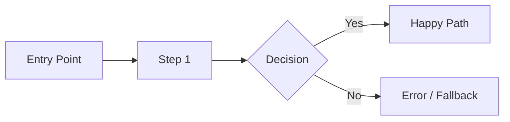

# Product Requirements Document

> *Copy this template into your project folder and replace all italicized guidance text with your content.*

---

## Overview

*Provide a brief summary of the product or feature (2–3 sentences). What is being built and why does it matter?*

## Problem Statement

*Describe the problem this product or feature solves. Who experiences it, how frequently, and what is the current impact? Ground this in data or user research where possible.*

## Target Users & Personas

*Identify the primary and secondary user segments. For each persona, include:*

| Persona | Role / Description | Key Need | Pain Point |
|---|---|---|---|
| *Persona 1* | *e.g., Enterprise developer* | *What they need* | *What frustrates them today* |
| *Persona 2* | | | |

## Goals & Success Criteria

*Define what success looks like. Include both qualitative and quantitative goals.*

| Goal | Success Metric | Target | Timeline |
|---|---|---|---|
| *e.g., Increase activation rate* | *T2FR (Time to First Report)* | *< 5 minutes* | *Q3 2025* |
| | | | |

## User Stories

### P0 — Must Have

- As a [user], I want [capability] so that [outcome].
- *...*

### P1 — Should Have

- As a [user], I want [capability] so that [outcome].
- *...*

### P2 — Nice to Have

- As a [user], I want [capability] so that [outcome].
- *...*

## User Experience Flows

*Describe the end-to-end user journey. Include key screens, decision points, and error states. Use numbered steps or a Mermaid diagram.*



*Walk through the primary flow in detail:*

1. *User does X...*
2. *System responds with Y...*
3. *...*

## Technical Architecture

*Outline the high-level architecture. Identify key components, services, and integrations. Note any new infrastructure required.*

```
┌─────────────┐     ┌─────────────┐     ┌─────────────┐
│   Client     │────▶│   API Layer │────▶│   Backend   │
└─────────────┘     └─────────────┘     └─────────────┘
```

*Key components:*

- *Component A — purpose*
- *Component B — purpose*

## Data Model

*Define the core data entities and their relationships. Include a table or ER diagram.*

| Entity | Key Fields | Relationships |
|---|---|---|
| *e.g., User* | *id, email, role* | *Has many Projects* |
| | | |

## Constraints & Assumptions

### Constraints

- *e.g., Must integrate with existing auth system*
- *e.g., Budget limited to $X/month for infrastructure*

### Assumptions

- *e.g., Users have a GitHub account*
- *e.g., Average payload size < 1 MB*

## Open Questions

| # | Question | Owner | Status | Resolution |
|---|---|---|---|---|
| 1 | *e.g., Which pricing tier includes this feature?* | *@name* | *Open* | |
| 2 | | | | |

## Appendix

*Include supporting materials: research links, competitive analysis, mock-ups, technical spikes, or related documents.*

- *[Link to user research findings]*
- *[Link to competitive analysis]*
- *[Link to design mock-ups]*
